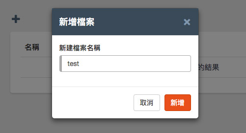
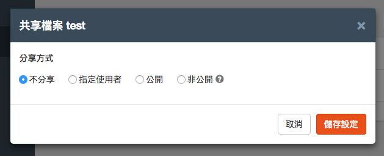
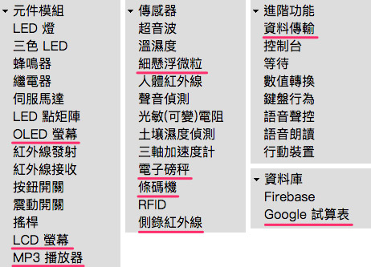

<!-- @@master  = ../../_layout.html-->

<!-- @@block  =  meta-->

<title>Blockly 程式積木 :::: Webduino = Web × Arduino</title>

<meta name="description" content="有別於目前「免註冊」的 Webduino Blockly，雲端平台的 Webduino Blockly 具備存檔與共享檔案的功能，並提供豐富的電子元件與傳感器模組 ( 空氣懸浮粒子 ( PM2.5 ) 偵測、電子磅秤、條碼機、OLED、LCD、MP3 播放器 )，此外，也可以透過 Google 試算表、線上繪製圖表...等網頁服務，完成進階的創意應用。">

<meta itemprop="description" content="有別於目前「免註冊」的 Webduino Blockly，雲端平台的 Webduino Blockly 具備存檔與共享檔案的功能，並提供豐富的電子元件與傳感器模組 ( 空氣懸浮粒子 ( PM2.5 ) 偵測、電子磅秤、條碼機、OLED、LCD、MP3 播放器 )，此外，也可以透過 Google 試算表、線上繪製圖表...等網頁服務，完成進階的創意應用。">

<meta property="og:description" content="有別於目前「免註冊」的 Webduino Blockly，雲端平台的 Webduino Blockly 具備存檔與共享檔案的功能，並提供豐富的電子元件與傳感器模組 ( 空氣懸浮粒子 ( PM2.5 ) 偵測、電子磅秤、條碼機、OLED、LCD、MP3 播放器 )，此外，也可以透過 Google 試算表、線上繪製圖表...等網頁服務，完成進階的創意應用。">

<meta property="og:title" content="Blockly 程式積木" >

<meta property="og:url" content="https://webduino.io/tutorials/cloud-03-webduino-blockly.html">

<meta property="og:image" content="https://webduino.io/img/tutorials/cloud-03-fb.jpg">

<meta itemprop="image" content="https://webduino.io/img/tutorials/cloud-03-01s.jpg">

<include src="../_include-tutorials.html"></include>

<!-- @@close-->

<!-- @@block  =  preAndNext-->

<include src="../_include-tutorials-content.html"></include>

<!-- @@close-->

<!-- @@block  =  tutorials-->
# Blockly 程式積木

有別於目前「免註冊」的 Webduino Blockly ( [https://blockly.webduino.io](https://blockly.webduino.io#_blank) )，雲端平台的 Webduino Blockly 具備存檔與共享檔案的功能，並提供豐富的電子元件與傳感器模組 ( 空氣懸浮粒子 ( PM2.5 ) 偵測、電子磅秤、條碼機、OLED、LCD、MP3 播放器 )，此外，也可以透過 Google 試算表、線上繪製圖表...等網頁服務，完成進階的創意應用。

## 建立新檔案

進入雲端平台首頁，點選 Webduino Blockly 程式積木，即可進入檔案管理畫面。

點選上方的「+」號，輸入檔名之後就可以建立新的編輯檔案。

新檔案建立完成後，點選檔案名稱，便可開始編輯檔案。

檔案編輯均會**自動儲存**，若尚未儲存完成，關閉檔案的時候會出現「尚未儲存完成」的提示訊息。

## 分享檔案

點選每個檔案後方的「分享」圖示，會打開檔案分享的設定。

分享功能有以下四個選項，透過這四種分享方式，不論是個人開發、團隊開發，甚至是應用在課程教學，都相當方便實用。

- **不分享**：只有自己能使用與瀏覽
- **指定使用者分享**：輸入指定使用者的 E-Mail，讓指定使用者可以瀏覽檔案
- **公開分享**：所有人可以在「公開的檔案」找到該檔案並進行瀏覽
- **非公開分享**：無法於公開的檔案找到該檔案，但只要知道檔案連結便可瀏覽檔案

## 操作與編輯介面

基本上 Webduino 雲端平台的 Blockly 和「免註冊」Webduino Blockly 在介面上大同小異，左邊是積木功能區，右上方則是所一些好用的輔助工具，而雲端平台 Blockly 因為具備了註冊和檔案管理的功能，因此在右上方額外多了「登出」和「檔案管理」的按鈕。

左側的積木功能也額外新增了「OLED 螢幕」、「LCD 螢幕」、「細懸浮微粒」、「Google 試算表」...等好用的積木模組。

## 技術支援

若在操作或檔案分享上遇到任何問題，可透過以下幾種方式聯繫技術人員，尋求技術協助：

- Webduino 粉絲團：[https://www.facebook.com/webduino](https://www.facebook.com/webduino#_blank)
- 技術討論社團：[https://www.facebook.com/groups/webduino](https://www.facebook.com/groups/webduino#_blank)
- 客服信箱：[webduino.io@gmail.com](mailto:webduino.io@gmail.com#_blank)
- 客服電話：886-7-3388511

<!-- @@close-->
