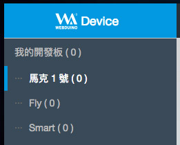
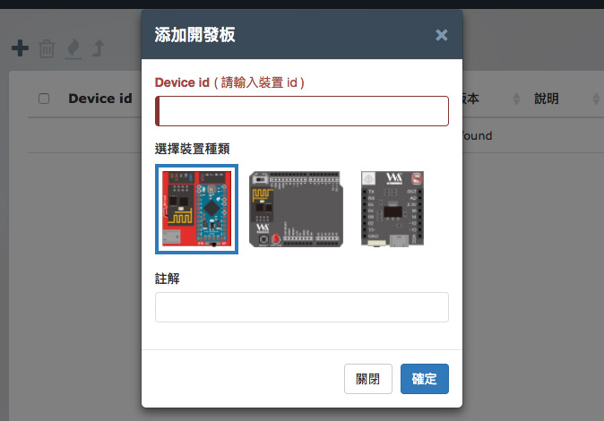
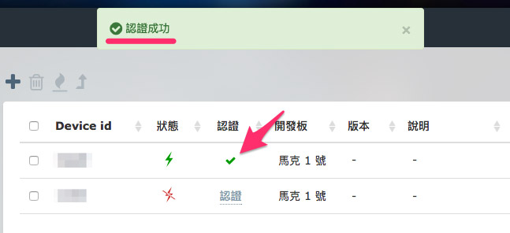

<!-- @@master  = ../../_layout.html-->

<!-- @@block  =  meta-->

<title>Device 裝置管理 ( 裝置認證 ) :::: Webduino = Web × Arduino</title>

<meta name="description" content="透過 Webduino Device 裝置管理的協助，不論手邊有多少物聯網的開發裝置，都可以在雲端平台上掌握裝置的上下線狀態、韌體版本以及安全性設定。">

<meta itemprop="description" content="透過 Webduino Device 裝置管理的協助，不論手邊有多少物聯網的開發裝置，都可以在雲端平台上掌握裝置的上下線狀態、韌體版本以及安全性設定。">

<meta property="og:description" content="透過 Webduino Device 裝置管理的協助，不論手邊有多少物聯網的開發裝置，都可以在雲端平台上掌握裝置的上下線狀態、韌體版本以及安全性設定。">

<meta property="og:title" content="Device 裝置管理 ( 裝置認證 )" >

<meta property="og:url" content="https://webduino.io/tutorials/cloud-04-webduino-device.html">

<meta property="og:image" content="https://webduino.io/img/tutorials/cloud-04-fb.jpg">

<meta itemprop="image" content="https://webduino.io/img/tutorials/cloud-04-01s.jpg">

<include src="../_include-tutorials.html"></include>

<!-- @@close-->

<!-- @@block  =  preAndNext-->

<include src="../_include-tutorials-content.html"></include>

<!-- @@close-->

<!-- @@block  =  tutorials-->
# Device 裝置管理 ( 裝置認證 )

透過 Webduino Device 裝置管理的協助，不論手邊有多少物聯網的開發裝置，都可以在雲端平台上掌握裝置的上下線狀態、韌體版本以及安全性設定。

## 新增裝置

有別於傳統物聯網的開發板，Webduino 可以在雲端平台上將裝置與帳號綁定，近一步提高物聯網操控的安全性與便利性，如果需要綁定裝置，首先在雲端平台的首頁，點選 Webduino Device 裝置管理進入管理畫面。 

畫面的左側除了列出目前支援 Webduino 雲端平台的開發板類型，當我們新增該類型的開發板，該分類就會以數字表示該類型開發板的數量，同時，選單也是一個簡單的「篩選器」，點選不同的類型，就只會列出該類型的開發板。

新增開發板很簡單，只要點選右上方的「+」號即可新增，一開始會詢問開發板的類型，如果選錯了，則必須刪除該開發板再重新新增。

新增完成後，就會在畫面中看到裝置的名稱、類型與版本，如果開發板處在「上線狀態」，則狀態會變成綠色閃電圖示，如果開發板處於「離線狀態」，則狀態會是斷線的紅色閃電圖示。

## 裝置認證

只有新增裝置還不夠，如果要進行「雲端更新」則必須進行裝置的「認證」，認證的步驟如下：

### 1.點選裝置「認證」連結

新增裝置後，在每個裝置後方都會有一個「認證」的連結，點選就會開始進行認證。

### 2.將開發板上線

一開始會先要求將開發板連線，目的在於確認開發板可以透過網路下載對應的更新檔案，若開發板一直處於上線狀態，則會直接進入下一個步驟。

### 3. 將開發板離線

為了確認裝置在為帳號註冊者所有，所以平台會先要求使用者將開發板離線，此時只要移除開發板電源即可，當平台確認後 ( 約 20 秒 )，便可以進行下一步。

> 目的在於確認裝置在平台用戶的手邊，如果裝置不在手邊，便無法在短時間內完成一系列認證步驟。

### 4. 按下「認證」按鈕後，15 秒內將開發板上線

點選下一步之後，保持開發板離線的狀態，接著按下「認證」按鈕，按完後將開發板接上電源連上網路，當平台確認開發板上線之後，確認開發板認證成功。

認證成功之後，原本的認證連結，就換更換為一個綠色的勾勾圖示，若移除了此塊開發板，再次添加同一塊開發板，仍必須重新認證。

## 技術支援

若雲端更新或添加裝置有遇到任何問題，可透過以下幾種方式聯繫技術人員，尋求技術協助：

- Webduino 粉絲團：[https://www.facebook.com/webduino](https://www.facebook.com/webduino#_blank)
- 技術討論社團：[https://www.facebook.com/groups/webduino](https://www.facebook.com/groups/webduino#_blank)
- 客服信箱：[webduino.io@gmail.com](mailto:webduino.io@gmail.com#_blank)
- 客服電話：886-7-3388511

<!-- @@close-->
