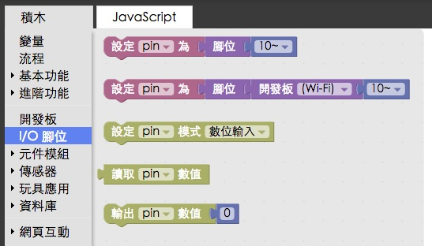
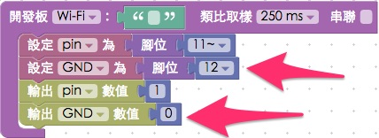

<!-- @@master  = ../../_layout.html-->

<!-- @@block  =  meta-->

<title>Webduino 腳位偵測與設定 :::: Webduino = Web × Arduino</title>

<meta name="description" content="「腳位偵測與設定」，是一塊開發板必須要有的功能，同樣的在 Webduino 也有提供這些設定方法，在 Webduino 開發板裡，如果使用「腳位」的積木，所有的數位腳 ( 2 ~ 13 ) 預設都是「數位輸出」，而所有的類比腳 ( A0 ~ A5 ) 預設都是「類比輸入」。">

<meta itemprop="description" content="「腳位偵測與設定」，是一塊開發板必須要有的功能，同樣的在 Webduino 也有提供這些設定方法，在 Webduino 開發板裡，如果使用「腳位」的積木，所有的數位腳 ( 2 ~ 13 ) 預設都是「數位輸出」，而所有的類比腳 ( A0 ~ A5 ) 預設都是「類比輸入」。">

<meta property="og:description" content="「腳位偵測與設定」，是一塊開發板必須要有的功能，同樣的在 Webduino 也有提供這些設定方法，在 Webduino 開發板裡，如果使用「腳位」的積木，所有的數位腳 ( 2 ~ 13 ) 預設都是「數位輸出」，而所有的類比腳 ( A0 ~ A5 ) 預設都是「類比輸入」。">

<meta property="og:title" content="Webduino 腳位偵測與設定" >

<meta property="og:url" content="https://webduino.io/tutorials/info-10-pin.html">

<meta property="og:image" content="https://webduino.io/img/tutorials/info-10-01s.jpg">

<meta itemprop="image" content="https://webduino.io/img/tutorials/info-10-01s.jpg">

<include src="../_include-tutorials.html"></include>

<!-- @@close-->

<!-- @@block  =  preAndNext-->

<include src="../_include-tutorials-content.html"></include>

<!-- @@close-->

<!-- @@block  =  tutorials-->
# Webduino 腳位偵測與設定

「腳位偵測與設定」，是一塊開發板必須要有的功能，同樣的在 Webduino 也有提供這些設定方法，在 Webduino 開發板裡，**如果使用「腳位」的積木，所有的數位腳 ( 2 ~ 13 ) 預設都是「數位輸出」，而所有的類比腳 ( A0 ~ A5 ) 預設都是「類比輸入」** ( 不過如果是已經元件化的積木，例如 LED、三色 LED...等，有些腳位就會是對應的 PWM 輸出 )，我們也可以透過一些設定，來將這些腳位的功能更換，但如果不支援 PWM 的腳位，就算改成 PWM 也是沒有作用的。( PWM 腳位的數字後方有「~」符號 )

## 如何使用：

打開 Webduino Blockly 編輯工具 ( [https://blockly.webduino.io/](https://blockly.webduino.io/) )，在左側的選單裡可以看到「I/O 腳位」的積木，在這邊我們可以指定變數為某個腳位，或是指定變數為某塊開發板上的腳位 ( 該塊開發板積木必須存在畫面中 )，也可以設定模式、輸出數值以及讀取數值。

一開始我們先用一個簡單的例子來測試，我們先把一顆 LED 燈接到開發板上，長腳接 11，短腳接 GND，然後積木我們設定 pin 為「腳位 11」( 一定要有「腳位」這塊積木，純粹接 11 只是宣告 pin = 11 而已 )，然後設定 pin 的輸出數值為 1，待開發板上線之後，點選右上方紅色執行按鈕，就會看到 LED 燈亮起來了。

如果要設定 PWM 腳位，我們就要先設定這個腳位是類比輸出 ( PWM )，如果沒有設定又使用了「腳位」的積木，不論我們數值如何調整，都還是只會有 0 和 1 的數位訊號，這裏我們可以設定 pin 的輸出數值為 0.01，待開發板上線之後，點選右上方紅色執行按鈕，就會看到 LED 燈亮起來了，但是亮度非常微弱。

至於類比輸入就是常見的光敏電阻、可變電阻...等可以使用，數位輸入可以接按鈕開關做測試，但基本上如果元件模組和傳感器已經有的積木，就可以直接使用，因為不少輸入的訊號需要透過韌體端進行演算和調整，出來的數值才會是我們要的。

## 腳位設定應用

由於我們可以透過腳位的數位輸出，設定高電位 1 和低電位 0，所以我們就可以用低電位來表示 GND 或是用高電位 1 來表示 5V 的輸出，舉例來說，剛剛我們把 LED 接在 11 和 GND，讓 11 的數位輸出數值為 1，所以 LED 就會亮起來，在這裡我們可以把 LED 長腳接 11，短腳接 12，然後把 12 的數位輸出設為 0，11 的數位輸出一樣設為 1，待開發板上線之後，點選右上方紅色執行按鈕，就會看到 LED 燈還是亮起來了。

如果我們要偵測每個開發板的腳位，就可以用到讀取腳位數值的積木，這裏我們「先使用 LED 的積木」，把 LED 接在 11 號腳，然後使用「腳位」的積木設定 11 ( 兩者不同，LED 的積木是封裝後的積木，腳位純粹就是腳位的控制 )，然後讓 LED 進行閃爍，每次閃爍的時候都會顯示腳位數值，待開發板上線之後，點選右上方紅色執行按鈕，就會看到 LED 開始閃爍，然後數值也會在 0 和 1 之間跳動。

當我們了解腳位如何輸出或輸入之後，就可以繼續來完成更多有趣的應用了。

<!-- @@close-->