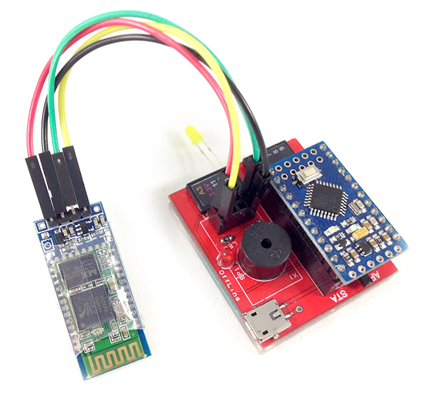
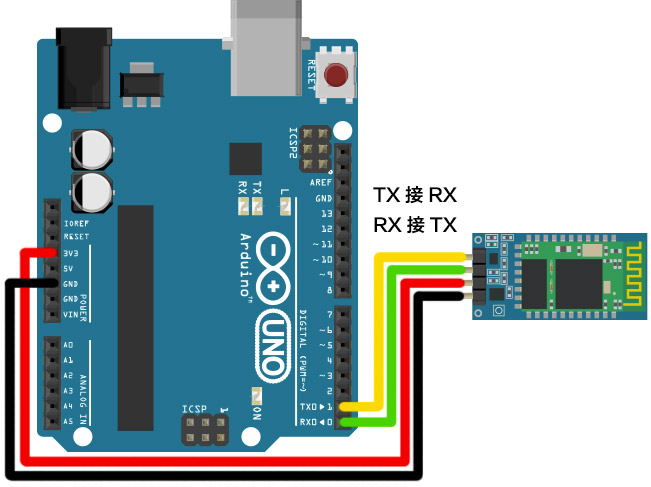
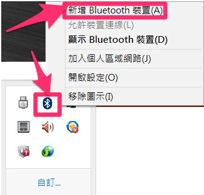
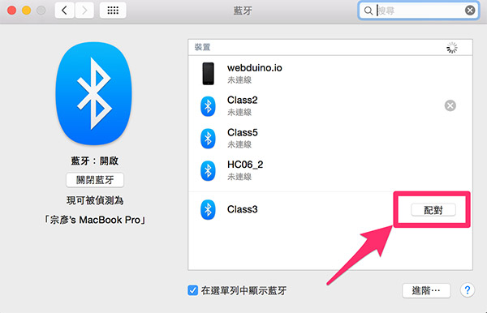
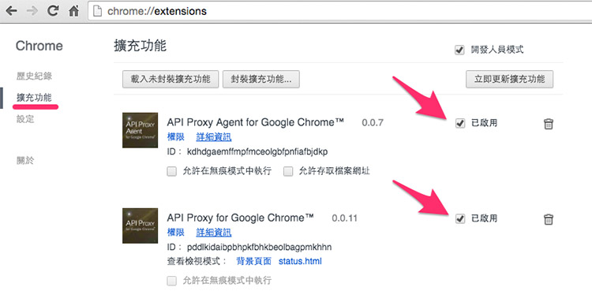
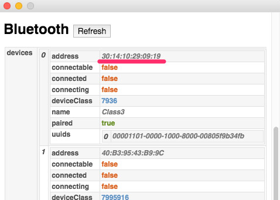

<!-- @@master  = ../../_layout.html-->

<!-- @@block  =  meta-->

<title>Webduino 使用藍芽操控 :::: Webduino = Web × Arduino</title>

<meta name="description" content="一直以來，「透過 Wi-Fi 操控」都是 Webduino 的獨門絕技，但其實 Webduino 也可以透過「藍芽」或「序列埠」的方式連線，並且一樣使用 Webduino Blockly 或 JavaScript 來操作，這篇文章將會介紹如何連接藍芽模組 ( HC05、HC06 )，以及相對應的設定、操控方式。">

<meta itemprop="description" content="一直以來，「透過 Wi-Fi 操控」都是 Webduino 的獨門絕技，但其實 Webduino 也可以透過「藍芽」或「序列埠」的方式連線，並且一樣使用 Webduino Blockly 或 JavaScript 來操作，這篇文章將會介紹如何連接藍芽模組 ( HC05、HC06 )，以及相對應的設定、操控方式。">

<meta property="og:description" content="一直以來，「透過 Wi-Fi 操控」都是 Webduino 的獨門絕技，但其實 Webduino 也可以透過「藍芽」或「序列埠」的方式連線，並且一樣使用 Webduino Blockly 或 JavaScript 來操作，這篇文章將會介紹如何連接藍芽模組 ( HC05、HC06 )，以及相對應的設定、操控方式。">

<link rel="canonical" href="https://tutorials.webduino.io/zh-tw/docs/basic/setting/bluetooth.html">

<meta property="og:title" content="Webduino 使用藍芽操控" >

<meta property="og:url" content="https://webduino.io/tutorials/info-12-bluetooth.html">

<meta property="og:image" content="https://webduino.io/img/tutorials/info-12-01s.jpg">

<meta itemprop="image" content="https://webduino.io/img/tutorials/info-12-01s.jpg">

<include src="../_include-tutorials.html"></include>

<!-- @@close-->

<!-- @@block  =  preAndNext-->

<include src="../_include-tutorials-content.html"></include>

<!-- @@close-->

<!-- @@block  =  tutorials-->
# Webduino 使用藍芽操控

一直以來，「透過 Wi-Fi 操控」都是 Webduino 的獨門絕技，但其實 Webduino 也可以透過「藍芽」或「序列埠」的方式連線，並且一樣使用 Webduino Blockly 或 JavaScript 來操作，這篇文章將會介紹如何連接藍芽模組 ( HC05、HC06 )，以及相對應的設定、操控方式。

如果學會了這個操作方法，就算手邊沒有 Wi-Fi，或是手邊只有 Arduino UNO，仍然可以快速體驗 Webduino 的方便與美好！

## 步驟一、接線

如果今天我們要把馬克一號改成走藍芽，就把 esp8266 的晶片取下，這時會看到有個八格的插孔，我們就將藍芽模組接在這邊。

透過杜邦線，將 **VCC 接在左上，GND 接右下，TXD 右上，RXD 左下**，中間四個孔不用連接，藍芽模組的背面會標示哪個腳位代表什麼意思。

如果你只有 Arduino UNO，你就把藍芽模組的 **VCC 接在 UNO 的 3.3V ( 不要接錯 )，GND 接 GND，RXD 接 TX ( 1 號腳 )，TXD 接 RX ( 0 號腳 )**。

如果你有疊了 Webduino Fly 在 UNO 上面，**Webduino Fly 要設定為 STA 模式**。

## 步驟二、藍芽設定

接完藍芽模組之後，把開發板接上電源，然後**要先讓電腦和藍芽模組配對**，不論你是用馬克一號、Arduino UNO 或 Webduino Fly + UNO，接上電源，使用支援藍芽的電腦，打開藍芽選項，偵測裝置，基本上就會看到藍芽裝置名稱，這裏我的藍芽裝置名稱為 class3，我們就先跟這個藍芽配對。

Windows 配對畫面：

Mac 配對畫面：

## 步驟三、修改 baud rate

如果你是第一次使用藍芽模組，**跟 Webduino 搭配的藍芽模組 baud rate ( 鮑率 ) 要設為 57600** ( 因為 Arduino 內韌體為 57600 )，如果不清楚如何設置，可以參考這篇網路文章，有相當精闢的介紹：[Arduino : HC-06 藍芽模組的設定](http://goo.gl/a8vl6H)。

## 步驟四、使用 Chrome Proxy API 

由於我們再來要透過跑在 Chrome 瀏覽器上的 Webduino Blockly 連結藍芽模組操控開發板，所以必須透過 Chrome Proxy API 來轉換程式指令，安裝過程可參考之前的教學文：[Chrome API Proxy 使用說明](https://webduino.io/tutorials/info-05-chrome-api-proxy.html)。

安裝完成後在擴充功能就會看到兩個已經啟用的程式。

然後進入 Chrome APP，打開 API Proxy for Google Chrome。

就會看到相對應的藍芽位址，把這段位址複製下來，待會操控的時候就會用到 ( API Proxy for Google Chrome 不要關閉，因它是用來通訊轉換程式碼使用 )。

## 步驟五、打開 Webduino Blockly 測試 

確認 API Proxy for Google Chrome 處於開啟狀態，將一顆 LED 燈長腳接 13，短腳接 GND ( 馬克一號可以接 10 與 GND )，打開 Webduino Blockly，放入開發板，**下拉選單選擇「藍芽」**，將剛剛複製的藍芽位址貼上，放入 LED 燈積木讓 LED 閃爍，點選執行，大約一兩秒藍芽配對後，就會看到 LED 開始閃爍了。

以上就是 Webduino 與藍芽模組配合操控的方法，如果手邊沒有 Wi-Fi，或是手邊只有 Arduino UNO，都可以用這個方式，快速體驗 Webduino 的方便與美好！

<!-- @@close-->