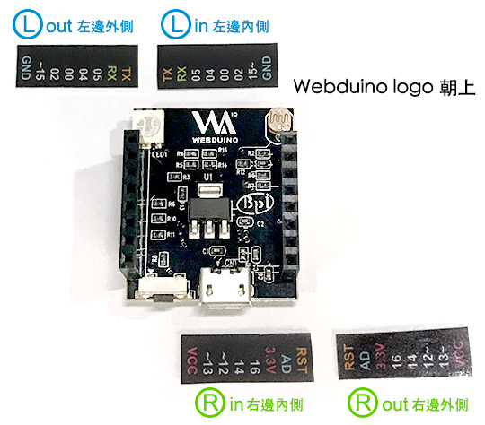
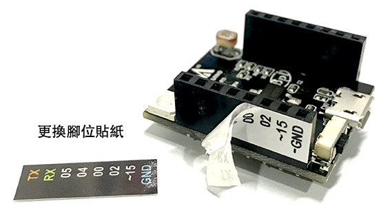

<!-- @@master  = ../../_layout.html-->

<!-- @@block  =  meta-->

<title>認識 Webduino Smart :::: Webduino = Web × Arduino</title>

<meta name="description" content="Webduino Smart 是 2016 年推出的物聯網開發板，有別於過去馬克 1 號和 Fly 需要搭配 Arduino 才能運作，Smart 可以自行獨立運作，同時也具備連上網際網路 (Internet) 和透過區域網路 ( WebSocket ) 操控的能力，相信更能有效地應用在物聯網的開發和各種創意上！">

<meta itemprop="description" content="Webduino Smart 是 2016 年推出的物聯網開發板，有別於過去馬克 1 號和 Fly 需要搭配 Arduino 才能運作，Smart 可以自行獨立運作，同時也具備連上網際網路 (Internet) 和透過區域網路 ( WebSocket ) 操控的能力，相信更能有效地應用在物聯網的開發和各種創意上！">

<meta property="og:description" content="Webduino Smart 是 2016 年推出的物聯網開發板，有別於過去馬克 1 號和 Fly 需要搭配 Arduino 才能運作，Smart 可以自行獨立運作，同時也具備連上網際網路 (Internet) 和透過區域網路 ( WebSocket ) 操控的能力，相信更能有效地應用在物聯網的開發和各種創意上！">

<meta property="og:title" content="認識 Webduino Smart" >

<meta property="og:url" content="https://webduino.io/tutorials/smart-01-information.html">

<meta property="og:image" content="https://webduino.io/img/tutorials/smart-01-information-s.jpg">

<meta itemprop="image" content="https://webduino.io/img/tutorials/smart-01-information-s.jpg">

<include src="../_include-tutorials.html"></include>

<!-- @@close-->

<!-- @@block  =  preAndNext-->

<include src="../_include-tutorials-content.html"></include>

<!-- @@close-->

<!-- @@block  =  tutorials-->
# 認識 Webduino Smart

Webduino Smart 是 2016 年推出的物聯網開發板，有別於過去馬克 1 號和 Fly 需要搭配 Arduino 才能運作，Smart 可以自行獨立運作，同時也具備連上網際網路 ( Internet ) 和透過區域網路 ( WebSocket ) 操控的能力，相信更能有效地應用在物聯網的開發和各種創意上！

 

## 預設元件和腳位介紹

Webduino Smart 是一塊長 3 公分寬 2.5 公分的開發板，重量約 85 公克，腳位有數位腳 0、2、4、5、14、16，PWM 腳位 12、13、15，類比腳 AD ( A0 )，其他腳位 TX、RX、3.3V、VCC、RST 和 GND 各 1 個。

開發板內建一個光敏電阻、一個三色燈和一個微型按鈕開關，其中 AD 腳位預設供給光敏電阻使用，三色 LED 燈的紅色使用 15 號腳、綠色使用 12 號腳、藍色使用 13 號腳 ( **三色 LED 燈為「共陰」，在官網其他範例外接的三色 LED 為「共陽」** )，而一個微型按鈕開關則使用了 4 號腳位，使用的時候要特別注意。

## 外觀介紹

大小對照 ( 左邊是四號電池和三號電池 )：

360 度照片：

 

## 更換 Smart 腳位貼紙

若覺得原本貼在 Smart 開發板上的貼紙比較不好看，可更換包裝內的腳位貼紙，腳位貼紙分為**「左邊外側 L in」、「左邊內側 L out」、「右邊內側 R in」和「右邊外側 R out」**，左右邊的識別**以 Smart 的 Webduino Logo 朝上做左右邊區分**，使用者可自行用剪刀剪開後黏貼。

若要更換貼紙，只需撕下原本的白色腳位貼紙，再將新的黑色貼紙貼上即可，**千萬要注意左右邊、內外側不要貼錯了！**

 

## Webdino 開發板差異對照表

<table class="chart">
    <tr>
      <th></th>
      <th>Smart</th>
      <th>馬克 1</th>
      <th>Fly</th>
  </tr>
    <tr>
      <td>照片</td>
      <td></td>
      <td></td>
      <td></td>
  </tr>
    <tr>
      <td>體積</td>
      <td>小</td>
      <td>略小</td>
      <td>中</td>
  </tr>
    <tr>
      <td>尺寸</td>
      <td>3cm x 2.5cm x 1cm</td>
      <td>4.5cm x 4cm x 2cm</td>
      <td>6.5cm x 5cm x 2cm</td>
  </tr>
    <tr>
      <td>價格</td>
      <td>預計小於 NT$ 300</td>
      <td>NT$ 840</td>
      <td>NT$ 840</td>
  </tr>
    <tr>
      <td>獨立運行</td>
      <td>O</td>
      <td>O</td>
      <td>需搭配 
Arduino UNO</td>
  </tr>
    <tr>
      <td>Webduino Blockly</td>
      <td>O</td>
      <td>O</td>
      <td>O</td>
  </tr>
    <tr>
      <td>雲端 ( 遠端 ) 更新</td>
      <td>O</td>
      <td>O</td>
      <td>O</td>
  </tr>
    <tr>
      <td>Internet</td>
      <td>O</td>
      <td>O</td>
      <td>O</td>
  </tr>
    <tr>
      <td>WebSocket</td>
      <td>O</td>
      <td>遠端更新後支援</td>
      <td>遠端更新後支援</td>
  </tr>
    <tr>
      <td>藍芽</td>
      <td>遠端更新後支援</td>
      <td>O</td>
      <td>O</td>
  </tr>
    <tr>
      <td>序列埠</td>
      <td>X</td>
      <td>X</td>
      <td>O</td>
  </tr>
    <tr>
      <td>韌體 OpenSource</td>
      <td>X</td>
      <td>Arduino 端</td>
      <td>Arduino 端</td>
  </tr>
    <tr>
      <td>內建元件</td>
      <td>三色 LED ( 共陰 ) 
光敏電阻 
微型按鈕開關</td>
      <td>X</td>
      <td>X</td>
  </tr>
    <tr>
      <td>LED 
三色 LED 
繼電器 
光敏電阻 
按鈕開關 
震動開關</td>
      <td>O</td>
      <td>O</td>
      <td>O</td>
  </tr>
    <tr>
      <td>溫濕度 
LED 點矩陣 
伺服馬達 
人體紅外線偵測 
聲音偵測 
超音波距離偵測 
蜂鳴器</td>
      <td>遠端更新後支援</td>
      <td>O</td>
      <td>O</td>
  </tr>
    <tr>
      <td>紅外線發射接收</td>
      <td>遠端更新後支援</td>
      <td>遠端更新後支援</td>
      <td>遠端更新後支援</td>
  </tr>
    <tr>
      <td>RFID 
三軸加速度計</td>
      <td>遠端更新後支援</td>
      <td>X</td>
      <td>遠端更新後支援</td>
  </tr>
    <tr>
      <td>土壤偵測 
可變電阻</td>
      <td>X</td>
      <td>O</td>
      <td>O</td>
  </tr>
    <tr>
      <td>搖桿</td>
      <td>X</td>
      <td>X</td>
      <td>遠端更新後支援</td>
  </tr>
  </table>

<!-- @@close-->