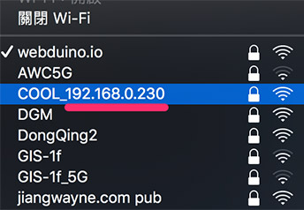
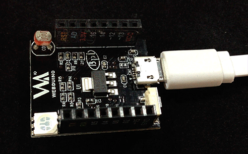
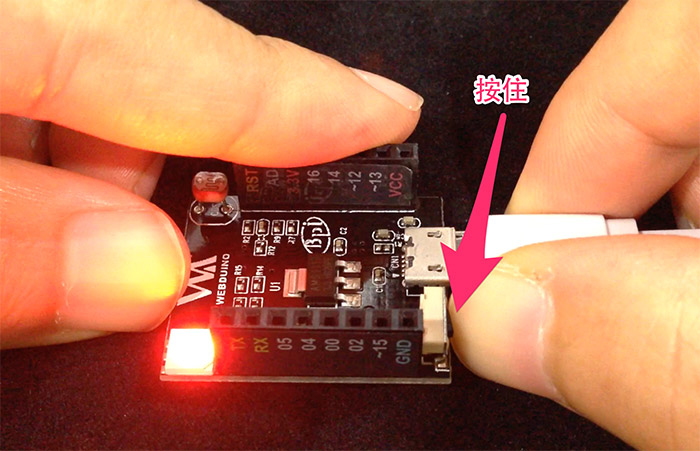
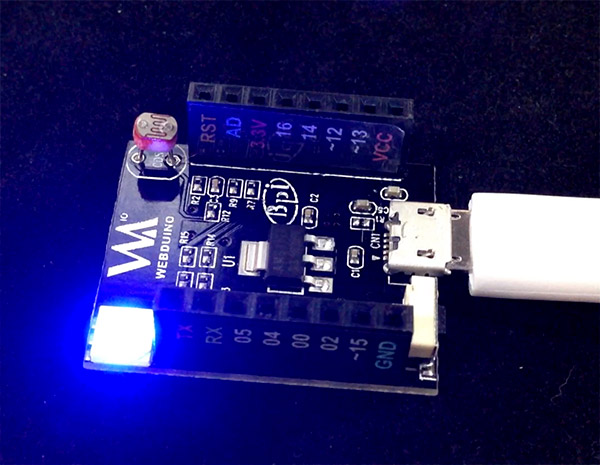
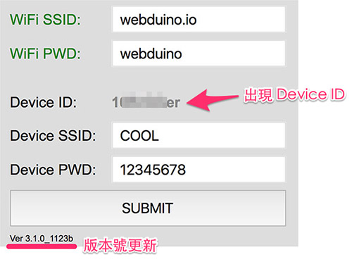

<!-- @@master  = ../../_layout.html-->

<!-- @@block  =  meta-->

<title>Webduino Smart 初始化設定 :::: Webduino = Web × Arduino</title>

<meta name="description" content="使用 Webduino Smart 之前，最重要的就是進行初始化設定，初始化設定的目的在於讓 Webduino 開發板可以自動上網 ( Internet )，或是在區域網路透過 WebSocket 連線，有了初始化設定，我們也能夠自訂開發板的顯示名稱和密碼，更可以連上 internet 進行遠端更新。">

<meta itemprop="description" content="使用 Webduino Smart 之前，最重要的就是進行初始化設定，初始化設定的目的在於讓 Webduino 開發板可以自動上網 ( Internet )，或是在區域網路透過 WebSocket 連線，有了初始化設定，我們也能夠自訂開發板的顯示名稱和密碼，更可以連上 internet 進行遠端更新。">

<meta property="og:description" content="使用 Webduino Smart 之前，最重要的就是進行初始化設定，初始化設定的目的在於讓 Webduino 開發板可以自動上網 ( Internet )，或是在區域網路透過 WebSocket 連線，有了初始化設定，我們也能夠自訂開發板的顯示名稱和密碼，更可以連上 internet 進行遠端更新。">

<meta property="og:title" content="Webduino Smart 初始化設定" >

<meta property="og:url" content="https://webduino.io/tutorials/smart-02-setup.html">

<meta property="og:image" content="https://webduino.io/img/tutorials/smart-02-setup-s.jpg">

<meta itemprop="image" content="https://webduino.io/img/tutorials/smart-02-setup-s.jpg">

<include src="../_include-tutorials.html"></include>

<!-- @@close-->

<!-- @@block  =  preAndNext-->

<include src="../_include-tutorials-content.html"></include>

<!-- @@close-->

<!-- @@block  =  tutorials-->
# Webduino Smart 初始化設定

使用 Webduino Smart 之前，最重要的就是進行初始化設定，初始化設定的目的在於讓 Webduino 開發板可以自動上網 ( Internet )，或是在區域網路透過 WebSocket 連線，有了初始化設定，我們也能夠自訂開發板的顯示名稱和密碼，更可以連上 internet 進行遠端更新。

## Webduino Smart 影片介紹

初始化設定步驟：

<iframe class="youtube" src="https://www.youtube.com/embed/b-7B5fljwG4" frameborder="0" allowfullscreen></iframe>

第一次雲端更新 + 取得 Device ID：

<iframe class="youtube" src="https://www.youtube.com/embed/UtY4O5T7JgE" frameborder="0" allowfullscreen></iframe>

 

## 步驟一、接上電源，輸入 Wi-Fi 帳號密碼連線

和馬克一號與 Fly 同樣的第一步驟，就是設定 Wi-Fi 的帳號密碼，不過不同的是，設定完帳號密碼後，我們就可以讓 Smart 純粹透過 WebSocket 走區域網路連線，不需要連到外部的網路環境也能運作，如果想要連線到外部網路環境 ( Internet )，也因為設定了 Wi-Fi 帳密，就可以順利連接到網際網路了。

第一步就是接上電源，這時候在具備 Wi-Fi 功能的電腦、筆電或行動裝置的 Wi-Fi 搜尋裡，就可以看到有個名為「Smart」的裝置，此時**開發板會閃紅燈，接著紅燈恆亮**，這是**正常的狀況**，因為開發板尚未連線至區域網路。( 不過如果你已經照著接下來的步驟設定完成，還是一樣紅燈恆亮應該就是設定錯誤或不正常了 )

點選後輸入預設**密碼 12345678**，進行連線。 

 

## 步驟二、設定 Wi-Fi 帳號密碼與顯示名稱

連線後打開瀏覽器 ( 建議使用 Chrome )，**網址列輸入 192.168.4.1**，就可以連線到 Smart 開發板的設定畫面，上面除了「一定要」設定的**所在場所的 Wi-Fi SSID 與 PWD**，接著也可以設定裝置在 Wi-Fi 搜尋中所顯示的名稱和密碼 ( 避免別人用 12345678 也可以連結到你的裝置 )，Device ID 的部分會在進行第一次韌體更新後配發 ( 下面的步驟會介紹 )，每塊 Smart 會配發唯一的一個 ID，因此您無法填寫與修改。

設定完成後就可以按下 SUBMIT 儲存，出現 SAVE OK 的字樣表示儲存成功，此時 Smart 開發板**會重啟並閃爍紅燈，當紅燈熄滅，且綠燈亮起一次之後**，表示 Smart 開發板已經成功連結上家裡或環境內的 Wi-Fi 基地台。( 若紅燈持續閃爍或恆亮，請移除電源，重新操作步驟一與步驟二 )

 

## 步驟三、獲得區域網路 IP

設定儲存完成後，移除開發板電源，重新接上開發板電源，這時開發板會開始閃紅燈，和區域網路連線後就會亮起綠燈，一秒後綠燈會消失 ( 若紅燈持續閃爍或亮紅燈，請返回步驟一重新設定 )，此時我們可以在電腦或行動裝置的 Wi-Fi 搜尋裡，看到「**我們自訂的名稱_192.168.XXX.XXX**」，以下方的例子來說就是「COOL_192.168.0.230」，記下後面這個 IP 數字，透過這個 IP 我們就可以用 WebSocket 來連線控制了。

 

## 步驟四、打開 Webduino Blockly 進行測試

打開 Webudino Blockly ( [http://blockly.webduino.io](http://blockly.webduino.io)，如果是使用 WebSocket 連線，**網址開頭必須為 http 不能是 https**，要特別注意！)，放入開發板的積木，種類選擇 Smart，連線方式選擇 WebSocket，然後填入剛剛的 IP，接著放入三色 LED 燈的積木 ( 使用**三色共陰** )，紅色設定 15，綠色 12，藍色 13，並設定三色 LED 燈的顏色為紅色。( 欲使用 Device ID 控制請看步驟五與步驟六 )

點選執行，就可以看到 Smart 開發板上頭的三色燈發出紅色光了。( 解答：[http://blockly.webduino.io/#-KakpX0SGynCkVVmT57z](http://blockly.webduino.io/#-KakpX0SGynCkVVmT57z) )

 

## 步驟五、連線 Internet 更新韌體

Webduino Smart 有個很方便的特色功能，當我們透過步驟一到步驟三初始化設定成功後，就可以連上 Internet 進行遠端更新，方便大家獲取最新的韌體功能，更新的方式很簡單，在步驟三接上電源後，**按住 Micro USB 旁的微型按鈕開關 ( 按住不放 )**。

按住**直到綠燈亮起後，再放開按鈕開關，此時藍色燈會亮起 ，表示開始下載更新檔**，下載完成後完成後藍色燈會熄滅，開始進行更新 ( 約 5~10 秒 )，更新完成後紅色燈會亮起，接著會閃紅燈進行連線，連線成功後綠色燈會亮起，當綠燈熄滅，表示我們可以重新開始控制開發板。
( **注意！進行更新的 5~10 秒請勿移除電源，否則可能會造成更新失敗而無法啟用開發板的狀況** )

更新完成後可再參考「步驟一」，透過 192.168.4.1 進入設定頁面，就可以看到版本號已經更新，同時也出現 Device ID 了。

 

## 步驟六、使用 Device ID 控制

當我們已經透過步驟五的遠端更新取得 Device ID，如果不想用 WebSocket 操控，亦可用這組 Device ID 來控制，控制的方法就和 Webduino 馬克一號與 Webduino Fly 一樣，連線方式選擇 Wi-Fi，填入 Deivce ID 就可以操控。

<!-- @@close-->