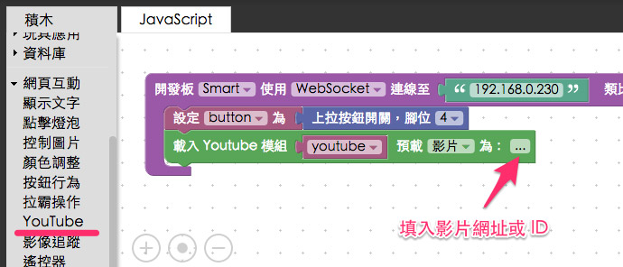
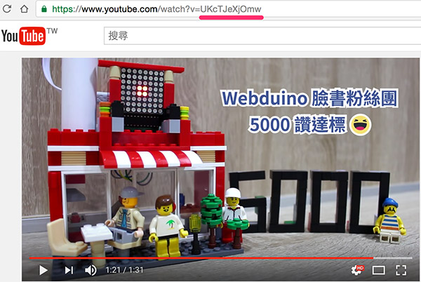
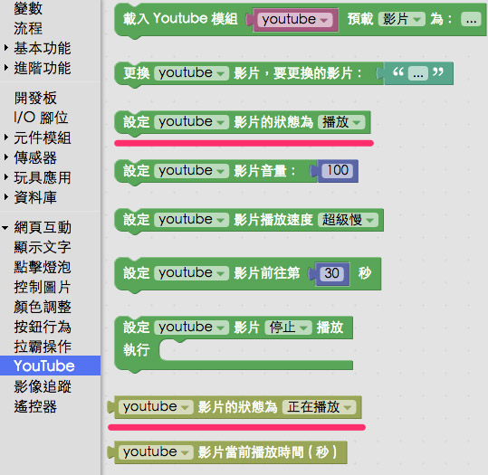
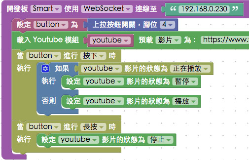
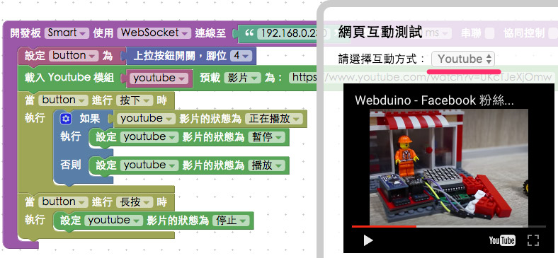

<!-- @@master  = ../../_layout.html-->

<!-- @@block  =  meta-->

<title>Smart 按鈕開關控制 Youtube :::: Webduino = Web × Arduino</title>

<meta name="description" content="上一篇認識了 Webduino Smart 的按鈕開關，但如果只是按個按鈕顯示一下文字，功能實在是太陽春了，因此這一篇將介紹如何透過開關的行為，操控 Youtube 的影片播放，如此一來只要動動手指，就可以控制影片囉。">

<meta itemprop="description" content="上一篇認識了 Webduino Smart 的按鈕開關，但如果只是按個按鈕顯示一下文字，功能實在是太陽春了，因此這一篇將介紹如何透過開關的行為，操控 Youtube 的影片播放，如此一來只要動動手指，就可以控制影片囉。">

<meta property="og:description" content="上一篇認識了 Webduino Smart 的按鈕開關，但如果只是按個按鈕顯示一下文字，功能實在是太陽春了，因此這一篇將介紹如何透過開關的行為，操控 Youtube 的影片播放，如此一來只要動動手指，就可以控制影片囉。">

<meta property="og:title" content="Smart 按鈕開關控制 Youtube" >

<meta property="og:url" content="https://webduino.io/tutorials/smart-07-button-youtube.html">

<meta property="og:image" content="https://webduino.io/img/tutorials/smart-07-button-youtube-s.jpg">

<meta itemprop="image" content="https://webduino.io/img/tutorials/smart-07-button-youtube-s.jpg">

<include src="../_include-tutorials.html"></include>

<!-- @@close-->

<!-- @@block  =  preAndNext-->

<include src="../_include-tutorials-content.html"></include>

<!-- @@close-->

<!-- @@block  =  tutorials-->
# Smart 按鈕開關控制 Youtube

上一篇認識了 Webduino Smart 的按鈕開關，但如果只是按個按鈕顯示一下文字，功能實在是太陽春了，因此這一篇將介紹如何透過開關的行為，操控 Youtube 的影片播放，如此一來只要動動手指，就可以控制影片囉。

	按鈕開關相關套件：<a href="https://webduino.io/buy/webduino-package-plus.html" target="_blank">Webduino 基本套件 Plus ( 支援馬克 1 號、Fly )</a>
	Webduino 開發板：<a href="https://webduino.io/buy/component-webduino-smart.html" target="_blank">Webduino Smart</a>、<a href="https://webduino.io/buy/component-webduino-v1.html" target="_blank">Webduino 馬克一號</a>、<a href="https://webduino.io/buy/component-webduino-fly.html" target="_blank">Webduino Fly</a>

## Webduino Blockly 操作解析

打開 Webduino Blockly 編輯器 ( [http://blockly.webduino.io/?tags=smart](http://blockly.webduino.io/?tags=smart) )，首先我們放入開發板的積木，下拉選單選擇 WebSocket ( **注意，使用 WebSocket 的工具網址必須是 http 開頭** )，填入開發板的 ip 位址，接著放入按鈕開關的積木，腳位預設為 4 ( 因為 Smart 的按鈕開關為「上拉按鈕」，所以要使用「上拉按鈕開關」 )。  

因為我們要使用 Youtube 的功能，所以我們要從左側積木功能選單選擇「載入 Youtube 模組」，拖拉進入編輯區域當中，這個功能會載入 Youtube 模組，記得「只需要載入一次」，如果要換影片則是使用「更換影片」的積木方塊。   

不過只有放入載入模組的積木還不夠，還要填入 Youtube 影片的 id 或網址 才可以正確載入，獲取影片 id 的方法很簡單，只要打開 Youtube 影片，看到網址列，最後面 ?v= 接續的這串代碼就是影片 id。( 不包含 ?v= )

 

將網址或 id 填入積木欄位。

放入按鈕的積木，這邊我們只需要兩個動作，一個是「按下」，另一個是「長按」。

接著我們要透過「設定影片狀態」( 更換影片目前的狀態為播放、暫停、停止...等 ) 以及「當下影片狀態」( 獲取影片當下的狀態 )的積木，來做一些邏輯的判斷。

邏輯的判斷很簡單，只需要在按下按鈕的當下，判斷影片的狀態是否為「正在播放」，只要是正在播放的狀態就把影片「暫停」，除此之外都是讓影片「播放」( 包含停止、播放結束、暫停、尚未開始 )

網頁互動區選擇 Youtube，點選右上方紅色按鈕執行，就可以看到 Youtube 影片載入並開始播放，這時候我們就可以按壓按鈕，控制 Youtube 的影片播放了。( ip 記得換成自己的開發板 ip )
( 解答：[http://blockly.webduino.io/#-KbJYhqQUV_jUUCJRhMp](http://blockly.webduino.io/#-KbJYhqQUV_jUUCJRhMp) )

 

## 範例解析

HTML 的 header 引入 `webduino-all.min.js`，目的在讓瀏覽器可以支援 WebComponents 以及 Webduino 所有的元件，如果是用 Blockly 編輯工具產生的程式碼，則要額外引入 `webduino-blockly.js`。

	
	

首先看到 HTML 的部分，必須要有一個 id 為 youtube 的 div，作為 Youtube 模組使用。

	

JavaScript 的程式碼比較多一點，不過`boardReady`開頭的程式碼基本上都是一樣，所以我們直接從裡面的幾個分段開始看，這一段主要是 Youtube 模組的載入，使用 Youtube 官方的程式碼，包含了影片的高度、寬度、自動播放和控制項...等內容，而`events`則是一些影片的事件處理，例如載入的影片 id...等，`onPlayerStateChange`則是當 Youtube 狀態改變時要做些什麼行為的判斷。

	var youtubePlay, youtubeStop, youtubePause;
	await new Promise(function (resolve) {
	  var tag = document.createElement("script");
	  tag.src = "https://www.youtube.com/iframe_api";
	  var scptTag = document.getElementsByTagName("script")[0];
	  scptTag.parentNode.insertBefore(tag, scptTag);
	  window.onYouTubeIframeAPIReady = function () {
	    youtube = new YT.Player("player", {
	      height: "240",
	      width: "96%",
	      playerVars: {
	        autoplay: 1,
	        controls: 1
	      },
	      events: {
	        onReady: function (evt) {
	          youtube.loadVideoById({
	            videoId:"UKcTJeXjOmw"
	          });
	          resolve();
	        },
	        onStateChange: onPlayerStateChange
	      }
	    });
	  };
	});

	function onPlayerStateChange(event) {
	  if(event.data == youtubeStop) {
	    youtubeStopCallback();
	  }else if(event.data == youtubePlay){
	    youtubePlayCallback();
	  }else if(event.data == youtubePause){
	    youtubePauseCallback();
	  }
	};

接下來就是按鈕的方法，這裏可以看到當按下按鈕的時候，會判斷`youtube.getPlayerState()`是否為對應的數字，因此就可以決定影片要播放、暫停還是停止...等動作，而按鈕長按的事件，就直接將影片停下來，並將影片時間歸零。

	button.on("pressed", async function(){
	  console.log("pressed");
	    if (youtube.getPlayerState() == 1) {
	    youtube.pauseVideo();
	  } else {
	    youtube.playVideo();
	  }

	});
	button.on("longPress", async function(){
	  console.log("longPress");
	    youtube.seekTo(0);
	  youtube.stopVideo();

	});

以上就是使用 Smart 的微型按鈕開關，控制 Youtube 的操作介紹。
完整程式碼：[http://bin.webduino.io/fopag/1/edit?html,js,output](http://bin.webduino.io/fopag/1/edit?html,js,output)
解答：[http://blockly.webduino.io/#-KbJYhqQUV_jUUCJRhMp](http://blockly.webduino.io/#-KbJYhqQUV_jUUCJRhMp)

	按鈕開關相關套件：<a href="https://webduino.io/buy/webduino-package-plus.html" target="_blank">Webduino 基本套件 Plus ( 支援馬克 1 號、Fly )</a>
	Webduino 開發板：<a href="https://webduino.io/buy/component-webduino-smart.html" target="_blank">Webduino Smart</a>、<a href="https://webduino.io/buy/component-webduino-v1.html" target="_blank">Webduino 馬克一號</a>、<a href="https://webduino.io/buy/component-webduino-fly.html" target="_blank">Webduino Fly</a>

<!-- @@close-->