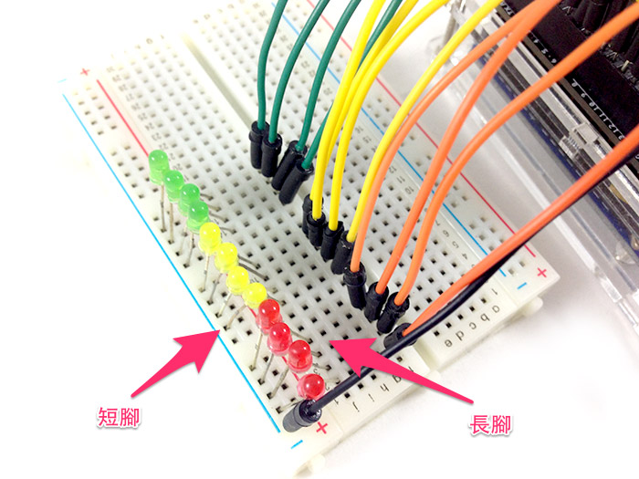
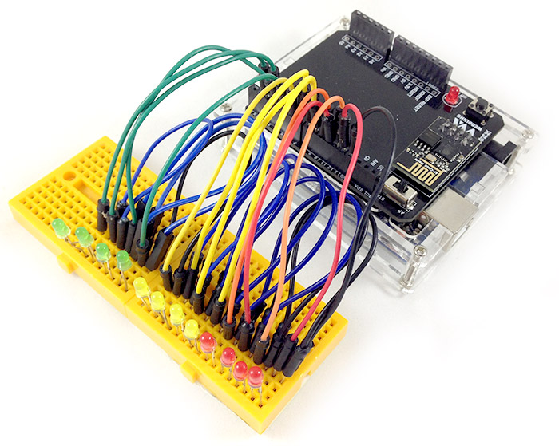
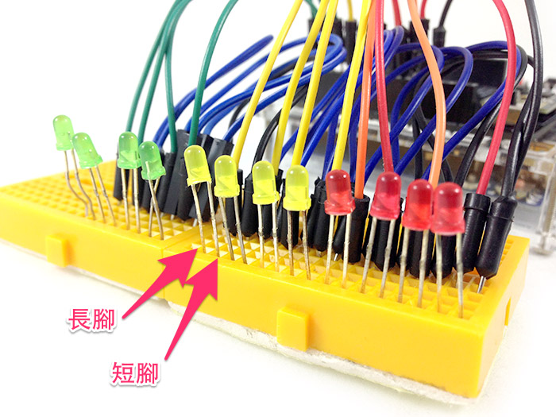
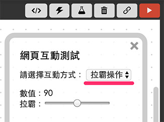
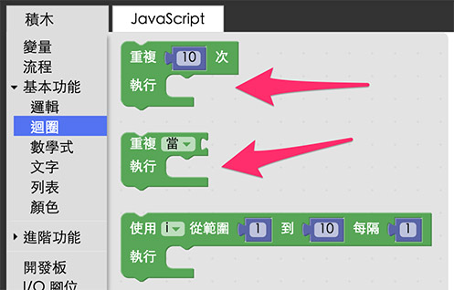
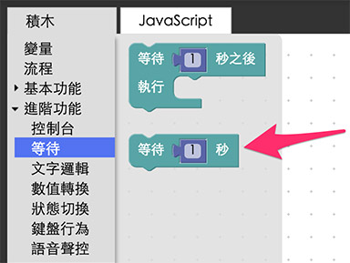
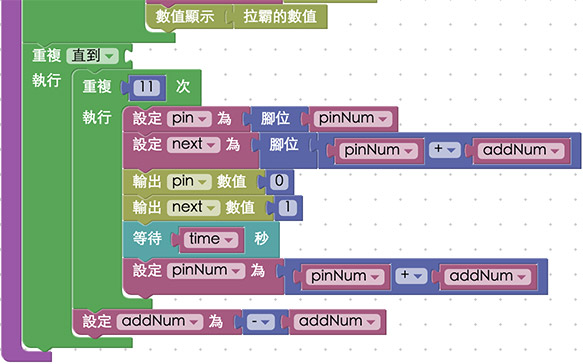

<!-- @@master  = ../../_layout.html-->

<!-- @@block  =  meta-->

<title>教學範例 28：霹靂燈 ( 12 顆 LED + 迴圈 ) :::: Webduino = Web × Arduino</title>

<meta name="description" content="在程式邏輯的世界裡，「迴圈」是很重要也是必備的程式之一，在這個範例中，我們將會用迴圈的方式，讓 12 顆 LED 燈交互閃爍，同時也可以控制交互閃爍的速度，實際做出一個超酷的霹靂燈效果。">

<meta itemprop="description" content="在程式邏輯的世界裡，「迴圈」是很重要也是必備的程式之一，在這個範例中，我們將會用迴圈的方式，讓 12 顆 LED 燈交互閃爍，同時也可以控制交互閃爍的速度，實際做出一個超酷的霹靂燈效果。">

<meta property="og:description" content="在程式邏輯的世界裡，「迴圈」是很重要也是必備的程式之一，在這個範例中，我們將會用迴圈的方式，讓 12 顆 LED 燈交互閃爍，同時也可以控制交互閃爍的速度，實際做出一個超酷的霹靂燈效果。">

<meta property="og:title" content="教學範例 28：霹靂燈 ( 12 顆 LED + 迴圈 )" >

<meta property="og:url" content="https://webduino.io/tutorials/tutorial-28-dancing-leds.html">

<meta property="og:image" content="https://webduino.io/img/tutorials/tutorial-28-01s.jpg">

<meta itemprop="image" content="https://webduino.io/img/tutorials/tutorial-28-01s.jpg">

<include src="../_include-tutorials.html"></include>

<!-- @@close-->

<!-- @@block  =  preAndNext-->

<include src="../_include-tutorials-content.html"></include>

<!-- @@close-->

<!-- @@block  =  tutorials-->

# 教學範例 28：霹靂燈 ( 12 顆 LED + 迴圈 )

在程式邏輯的世界裡，「迴圈」是很重要也是必備的程式之一，在這個範例中，我們將會用迴圈的方式，讓 12 顆 LED 燈交互閃爍，同時也可以控制交互閃爍的速度，實際做出一個超酷的霹靂燈效果。

## 範例影片展示

<iframe class="youtube" src="https://www.youtube.com/embed/wwnmfd5Mc-Y" frameborder="0" allowfullscreen></iframe>

## 接線與實作

因為這個範例需要用到 12 顆 LED 燈，所以我們就直接接在 2 ~ 13 號腳，如果麵包板有共地端的話就直接用其接 GND，不然就是分別用單心線共地。

實際接線照片：

## Webduino Blockly 操作解析

打開 Webduino Blockly 編輯工具 ( [https://blockly.webduino.io](https://blockly.webduino.io) )，因為這個範例會用網頁「拉霸」來顯控制速度並顯示速度數值，所以要先點選右上方「網頁互動測試」的按鈕，打開內嵌測試的網頁，用下拉選單選擇「拉霸操作」。

把開發板放到編輯畫面裡，填入對應的 Webduino 開發板名稱，開發板內先放入三個變數，第一個 pinNum 表示一開始的腳位號碼，addNum 則是每次腳位變換要增加多少，如果設定 1，就表示 2 亮完就會變 3 亮，3 亮完就會變 4 亮，第三個變數是 time，就是我們的切換速度 ( 0.1 秒做切換 )，這裏要特別注意，**這邊我們所設定的變數，尚未與各個腳位或 LED 燈綁定，而是待會要綁定的時候，會用到這些變數** ( 換句話說因為要從 2 變到 13，我們要用一個變數來裝載這些會變化的數字 )。

再來先設定拉霸的行為，拉霸調整的時候，最主要會改變 time 的數值 ( 這也是為什麼要把 time 設為變數，這樣才可以動態更改 )，一開始我們先顯示 time，然後設定拉霸最小值為 0.02 秒，最大值 0.2 秒，間距 0.01 秒，預設值就是 time。

接著將會用到迴圈，迴圈的積木在「基本功能」裡面。

除了迴圈，還會用到「等待」，等待的積木在「進階功能」裡面。

先看到最外層的迴圈，在缺口前的「直到」，表示「直到發生什麼事情，這個迴圈就會停下來」，如果我們不做設定，就會是一個無窮迴圈，因為這裡我們要讓霹靂燈一直跑，所以就不做設定，而第二層的迴圈有個數字 11，表示這個迴圈會執行 11 次，11 次結束之後會把 addNum 變成負的 addNum，也就是從每次加 1 變成每次減 1，這樣霹靂燈才會從 2 跑到 13 之後再由 13 跑回 2，當變成正或負完成後，就會再度執行外層的迴圈，就會又跑一次 11 次的這個內層迴圈。

接著看到第二層迴圈的內容，這裏就用到了「I/O 腳位」的積木：「設定 pin 腳」，這裏我們指定 pin 這個變數為 pinNum 這個腳位 ( 注意 pinNum 是會變的數字，剛剛我們已經預設為 2 )，然後再設定一個 next 腳位是 pinNum + addNum，接著我們把 pin 的輸出變成 0，next 的輸出設為 1，這就表示 2 號燈熄滅 3 號燈亮，最後我們把 pinNum 再加一次 addNum，如此的設定，就表示當這次迴圈之後，下次一迴圈執行就會是 3 號燈熄滅，4 號燈亮起。

如果對於腳位積木不了解的，可以參考：[Webduino 腳位偵測與設定](info-10-pin.html)

到這邊就已經完成了用拉霸控制霹靂燈的程式，確認開發板上線 ( 點選「[檢查連線狀態](https://webduino.io/device.html)」查詢 )，點選紅色的執行按鈕，就會看到霹靂燈開始左右跑來跑去，同時我們也可以用拉霸控制速度了。( 解答：[http://blockly.webduino.io/#-KE6wtNh5PXDjosOGkwU](http://blockly.webduino.io/#-KE6wtNh5PXDjosOGkwU) )

##範例解析 ( [完整程式碼](https://bin.webduino.io/mibim/1/edit?html,css,js,output)、[檢查連線狀態](https://webduino.io/device.html) )

HTML 的 header 引入 `webduino-all.min.js`，目的在讓瀏覽器可以支援 WebComponents 以及 Webduino 所有的元件，如果是用 Blockly 編輯工具產生的程式碼，則要額外引入 `webduino-blockly.js`，因為這裡有用到同步處理的迴圈，為了讓其他瀏覽器也支援，記得再引入 `runtime.min.js`。

	
	
	

HTML 裏頭有一個 span 顯示拉霸數值，還有一個 range 拉霸。

	數值：90 
	拉霸：<input type="range" min="0" max="180" step="5" value="90" id="demo-area-06-input">

JavaScript 使用了 while 和 for 迴圈來進行剛剛的同步迴圈處理，如果要運行在自己的電腦或裝置上頭，記得在我們程式編輯工具的 ES6/Babel 最上方下拉選單，選擇 JavaScript，就會看到可以實際運行的程式碼了。	

	(async function () {

	var pinNum;
	var addNum;
	var time;
	var pin;
	var next;

	boardReady('', async function (board) {
	  board.samplingInterval = 250;
	  pinNum = 2;
	  addNum = 1;
	  time = 0.1;
	  document.getElementById("demo-area-06-input-value").innerHTML = time;
	  document.getElementById("demo-area-06-input").setAttribute("min",0.02);
	  document.getElementById("demo-area-06-input").setAttribute("max",0.2);
	  document.getElementById("demo-area-06-input").setAttribute("step",0.01);
	  document.getElementById("demo-area-06-input").setAttribute("value",time);
	  document.getElementById("demo-area-06-input").oninput = async function(_value){
	    _value = this.value;
	    time = _value;
	    document.getElementById("demo-area-06-input-value").innerHTML = _value;
	  };
	  while (!false) {
	    for (var count = 0; count < 11; count++) {
	      pin = getPin(board, pinNum);
	      next = getPin(board, (pinNum + addNum));
	      pin.write(0);
	      next.write(1);
	      await delay(time);
	      pinNum = pinNum + addNum;
	    }
	    addNum = -addNum;
	  }
	});

	}());

以上就是用拉霸控制 12 顆 LED 產生的霹靂燈效果。   
完整程式碼：[https://bin.webduino.io/mibim/1/edit?html,css,js,output](https://bin.webduino.io/mibim/1/edit?html,css,js,output)  
解答：[http://blockly.webduino.io/#-KE6wtNh5PXDjosOGkwU](http://blockly.webduino.io/#-KE6wtNh5PXDjosOGkwU)

<!-- @@close-->