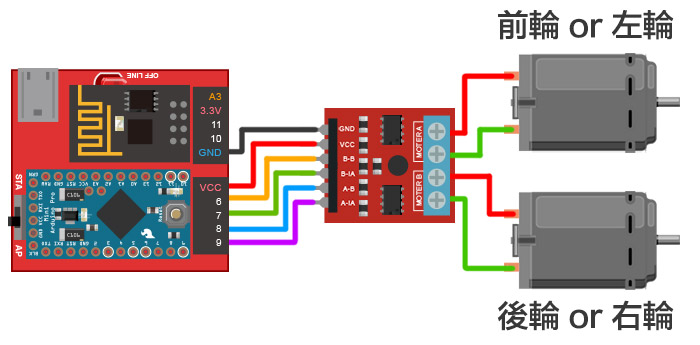
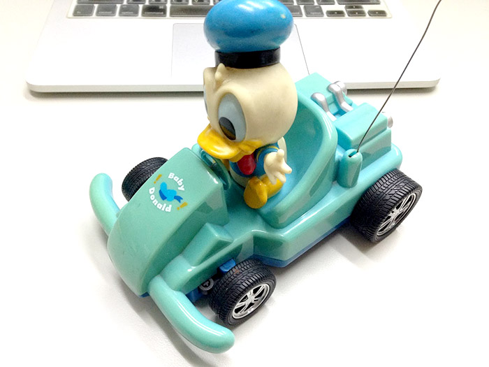
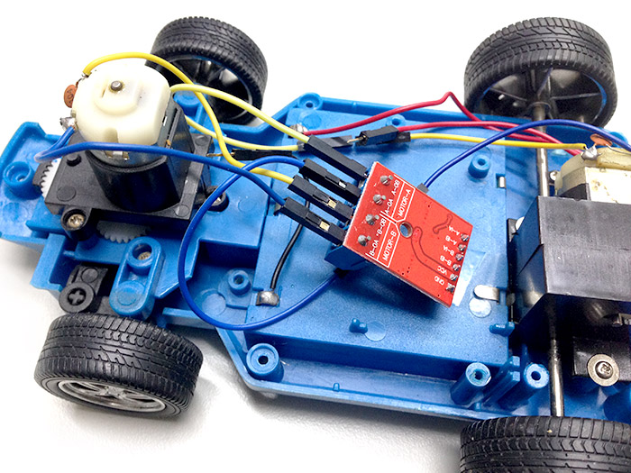
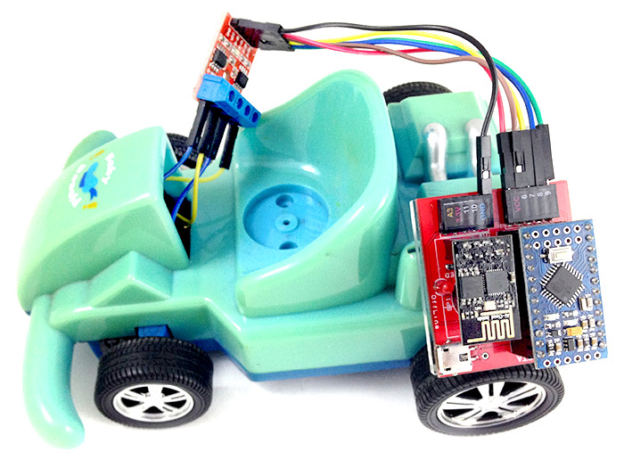
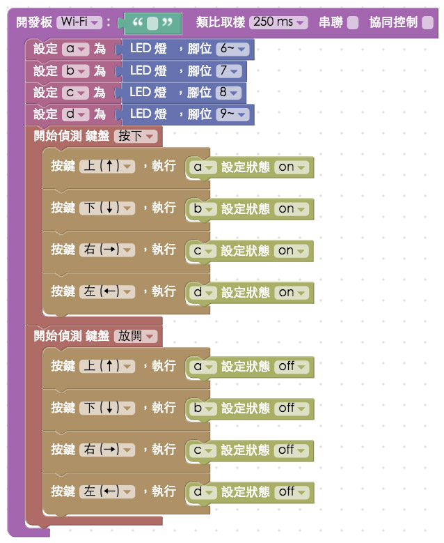
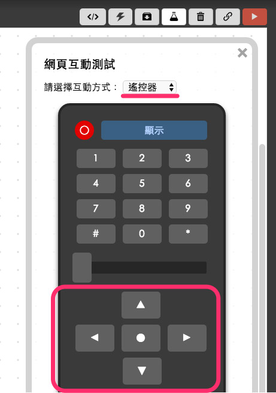

<!-- @@master  = ../../_layout.html-->

<!-- @@block  =  meta-->

<title>教學範例 30：雙馬達驅動模組改造玩具車 :::: Webduino = Web × Arduino</title>

<meta name="description" content="透過「馬達驅動模組」的輔助，我們可以讓一般家用玩具車連接上 Webduino 開發板，進一步使用 Wi-Fi 來操控玩具車，簡簡單單幾個步驟，百元玩具車也可以透過手機、電腦操作，甚至做到遠端遙控、多台連動...等動輒數千元的智慧玩具的功能。">

<meta itemprop="description" content="透過「馬達驅動模組」的輔助，我們可以讓一般家用玩具車連接上 Webduino 開發板，進一步使用 Wi-Fi 來操控玩具車，簡簡單單幾個步驟，百元玩具車也可以透過手機、電腦操作，甚至做到遠端遙控、多台連動...等動輒數千元的智慧玩具的功能。">

<meta property="og:description" content="透過「馬達驅動模組」的輔助，我們可以讓一般家用玩具車連接上 Webduino 開發板，進一步使用 Wi-Fi 來操控玩具車，簡簡單單幾個步驟，百元玩具車也可以透過手機、電腦操作，甚至做到遠端遙控、多台連動...等動輒數千元的智慧玩具的功能。">

<link rel="canonical" href="https://tutorials.webduino.io/zh-tw/docs/useful/example/toycar-motor-ic.html">

<meta property="og:title" content="教學範例 30：雙馬達驅動模組改造玩具車" >

<meta property="og:url" content="https://webduino.io/tutorials/tutorial-30-motor-ic.html">

<meta property="og:image" content="https://webduino.io/img/tutorials/tutorial-30-01s.jpg">

<meta itemprop="image" content="https://webduino.io/img/tutorials/tutorial-30-01s.jpg">

<include src="../_include-tutorials.html"></include>

<!-- @@close-->

<!-- @@block  =  preAndNext-->

<include src="../_include-tutorials-content.html"></include>

<!-- @@close-->

<!-- @@block  =  tutorials-->

# 教學範例 30：雙馬達驅動模組改造玩具車

透過「L9110S 雙馬達驅動模組」的輔助，我們可以讓一般家用玩具車連接上 Webduino 開發板，進一步使用 Wi-Fi 來操控玩具車，簡簡單單幾個步驟，百元玩具車也可以透過手機、電腦操作，甚至做到遠端遙控、多台連動...等動輒數千元的智慧玩具的功能 ( 只要是兩顆馬達控制的玩具都可以改造 )。 

	L9110S 馬達驅動模組：<a href="https://webduino.io/buy/webduino-expansion-m.html" target="_blank">Webduino 擴充套件 M ( 支援馬克 1 號、Fly )</a>
	Webduino 開發板：<a href="https://webduino.io/buy/component-webduino-v1.html" target="_blank">Webduino 馬克一號</a>

## 範例影片展示

<iframe class="youtube" src="https://www.youtube.com/embed/twdVMSYF4rQ" frameborder="0" allowfullscreen></iframe>

## 接線示意圖

「L9110S 雙馬達驅動模組」有兩端，一端有四個需要用十字或一字螺絲起子鎖定的接孔，上方標示 MOTOR A 和 MOTOR B，分別接上兩顆馬達，另外一端有六個針腳，要使用公母杜邦線來和 Webduino 開發板連接，GND 接 GND，VCC 接 VCC 或 5V，MOTER A 的馬達對應到 A-B 和 A-IA 的針腳，MOTER B 的馬達對應到 B-B 和 B-IA 的針腳。

## 實際接線與玩具改造

這是一台陳年古董的百元唐老鴨玩具車。

把玩具車打開，內部構造就是兩顆馬達，前面的馬達用齒輪控制左右轉，後面的馬達則是用齒輪控制往前或往後，然後因為玩具車本身是無線電遙控，所以內部有一塊無線電的晶片。

毫不留情地把線剪斷 ( 注意，連接車體的電線要留長一點，方便後續接線使用 )。

使用電子材料行購買的「杜邦端子」( 公公、公母 )。

將剛剛剪斷的電線改造成杜邦線 ( 這樣就不用焊接，很容易地和開發板串接，不過如果只是要鎖到驅動模組上，也是可以不用杜邦線 )。

把馬達和雙馬達驅動模組組合。

把外殼裝上去，想辦法把馬達驅動模組放到外面，如果車體內放得下也是可以，不過因為後續要接線，還是放到車體外比較方便。

和 Webduino 開發板組合 ( 這裏組合 Webduino 馬克 1 號 )，GND 接 GND，VCC 接 VCC 或 5V，MOTER A 的馬達對應到 A-B 和 A-IA 的針腳，MOTER B 的馬達對應到 B-B 和 B-IA 的針腳。

完成後接上行動電源，用黏土或膠帶固定在玩具車上，就完成了一台 Wi-Fi 遙控的玩具車囉！

	L9110S 馬達驅動模組：<a href="https://webduino.io/buy/webduino-expansion-m.html" target="_blank">Webduino 擴充套件 M ( 支援馬克 1 號、Fly )</a>
	Webduino 開發板：<a href="https://webduino.io/buy/component-webduino-v1.html" target="_blank">Webduino 馬克一號</a>

## Webduino Blockly 操作解析

打開 Webduino Blockly 編輯工具 ( [https://blockly.webduino.io](https://blockly.webduino.io) )，把開發板放到編輯畫面裡，填入對應的 Webduino 開發板名稱，因為這裡純粹要控制腳位 1 或 0，最簡單的方法就是用 LED 的積木來實作，因為兩顆馬達總共有四條線，所以要放入四個 LED 的積木。

再來我們使用「偵測鍵盤按下」的積木，把上下左右的事件對應進去積木裡，按下「上」的時候就讓 a 的狀態為 on，按下「下」的時候就讓 b 的狀態為 on，依此類推。

接著放入「偵測鍵盤放開」的積木，把上下左右的事件對應進去積木裡，這裏就再放開的時候，把狀態設為 off 即可。為什麼要這麼做呢？因為當第一顆馬達一條線為 on，一條線為 off，就可以當作我們把電池正極接在 on 的地方，負極接在 off 的地方，馬達會正轉，如果反接，馬達就會反轉，透過正轉反轉的原理，我們就可以控制車子左右轉或是前後跑。

到這邊就已經完成了，確認開發板上線 ( 點選「[檢查連線狀態](https://webduino.io/device.html)」查詢 )，點選紅色的執行按鈕，就可以開始用鍵盤操控玩具車了，如果跑起來方向不同，只要在程式裡調整，或把線對調就可以了。

( 解答：[https://blockly.webduino.io/#-KKmaDVfUAoDrcxGHLpg](https://blockly.webduino.io/#-KKmaDVfUAoDrcxGHLpg) )

如果想要用手機操控，可以打開「網頁互動區」，下拉選單選擇「遙控器」，就可以把事件綁定到上下左右的按鍵裡頭，如果要在手機上控制，可以參考「[Webduino Blockly 的十個操作密技](https://webduino.io/tutorials/info-11-feature.html)」，裏頭有詳細介紹。

##範例解析 ( [完整程式碼](https://bin.webduino.io/vohen/1/edit?html,css,js,output)、[檢查連線狀態](https://webduino.io/device.html) )

HTML 的 header 引入 `webduino-all.min.js`，目的在讓瀏覽器可以支援 WebComponents 以及 Webduino 所有的元件，如果是用 Blockly 編輯工具產生的程式碼，則要額外引入 `webduino-blockly.js`。

	
	

JavaScript 讀取 `onkeydown` 和 `onkeyup` 來判斷鍵盤按下還是放開，透過不同的 `keycode`，綁定不同的事件，就可以做出用鍵盤遙控的功能了。	

	var a;
	var b;
	var c;
	var d;

	boardReady('', function (board) {
	  board.systemReset();
	  board.samplingInterval = 250;
	  a = getLed(board, 6);
	  b = getLed(board, 7);
	  c = getLed(board, 8);
	  d = getLed(board, 9);
	  document.onkeydown = function(e){
	    console.log(e.keyCode);
	    if(e.keyCode == 38){
	        a.on();
	    }
	    if(e.keyCode == 40){
	        b.on();
	    }
	    if(e.keyCode == 39){
	        c.on();
	    }
	    if(e.keyCode == 37){
	        d.on();
	    }
	  };
	  document.onkeyup = function(e){
	    console.log(e.keyCode);
	    if(e.keyCode == 38){
	        a.off();
	    }
	    if(e.keyCode == 40){
	        b.off();
	    }
	    if(e.keyCode == 39){
	        c.off();
	    }
	    if(e.keyCode == 37){
	        d.off();
	    }
	  };
	});

以上就是用 L9110S 雙馬達驅動模組來操控玩具車。   
完整程式碼：[https://bin.webduino.io/nibud/edit?html,css,js,output](https://bin.webduino.io/nibud/edit?html,css,js,output)  
解答：[https://blockly.webduino.io/#-KKmaDVfUAoDrcxGHLpg](https://blockly.webduino.io/#-KKmaDVfUAoDrcxGHLpg)

	L9110S 馬達驅動模組：<a href="https://webduino.io/buy/webduino-expansion-m.html" target="_blank">Webduino 擴充套件 M ( 支援馬克 1 號、Fly )</a>
	Webduino 開發板：<a href="https://webduino.io/buy/component-webduino-v1.html" target="_blank">Webduino 馬克一號</a>

<!-- @@close-->