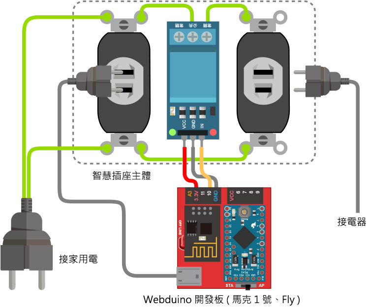
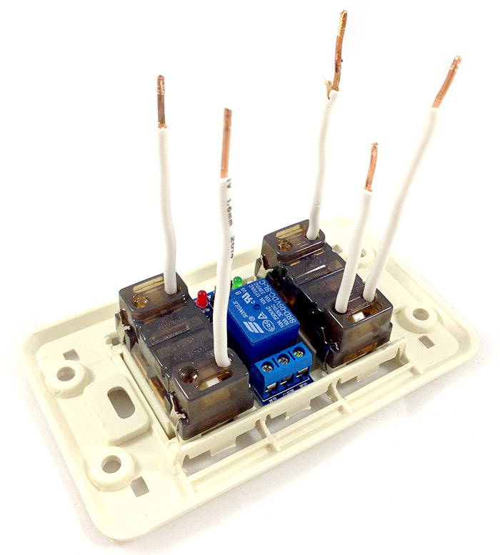
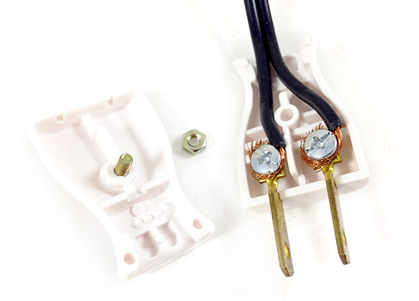
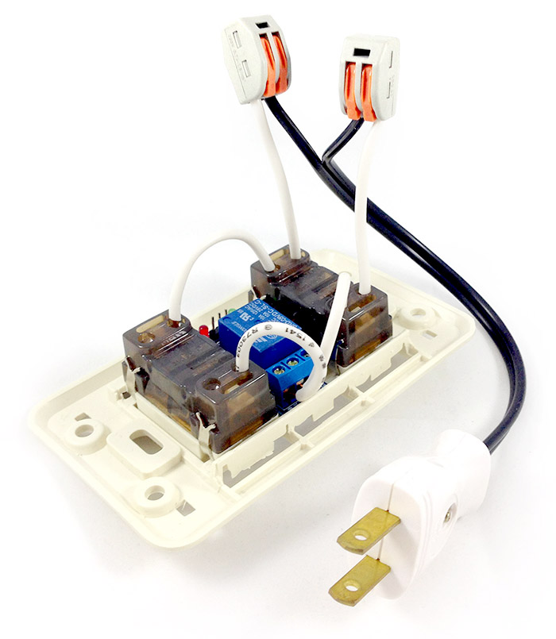
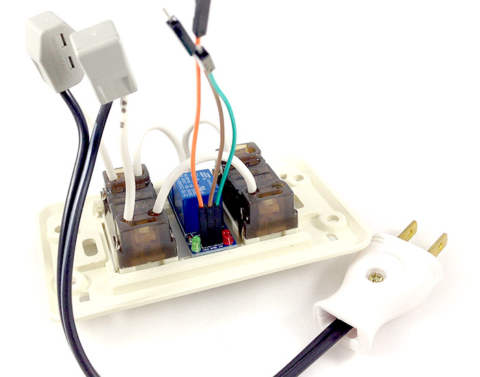
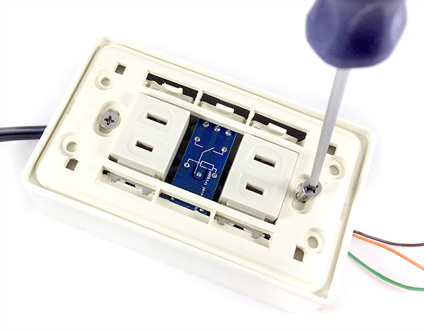
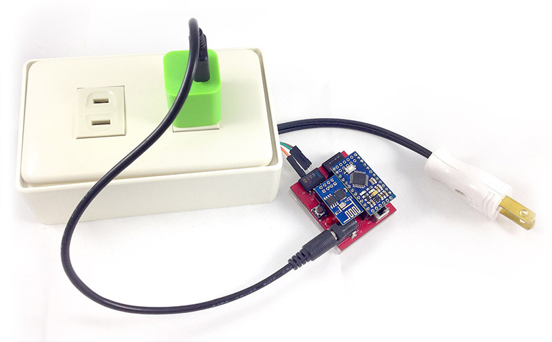
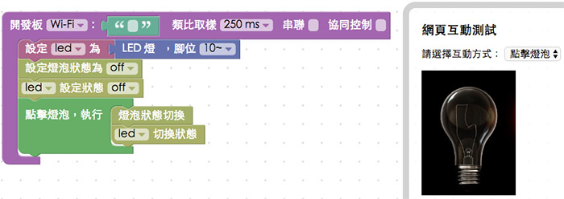
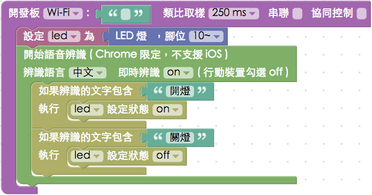

<!-- @@master  = ../../_layout.html-->

<!-- @@block  =  meta-->

<title>教學範例 32：智慧插座 DIY :::: Webduino = Web × Arduino</title>

<meta name="description" content="之前在「教學範例 14：繼電器控制風扇旋轉」有介紹過繼電器的應用，如果我們將繼電器和日常生活中的插座結合，就可以利用 Wi-Fi 來操控，將平凡無奇的插座升級成為可以光感、聲控、遠端遙控的智慧插座囉！">

<meta itemprop="description" content="之前在「教學範例 14：繼電器控制風扇旋轉」有介紹過繼電器的應用，如果我們將繼電器和日常生活中的插座結合，就可以利用 Wi-Fi 來操控，將平凡無奇的插座升級成為可以光感、聲控、遠端遙控的智慧插座囉！">

<meta property="og:description" content="之前在「教學範例 14：繼電器控制風扇旋轉」有介紹過繼電器的應用，如果我們將繼電器和日常生活中的插座結合，就可以利用 Wi-Fi 來操控，將平凡無奇的插座升級成為可以光感、聲控、遠端遙控的智慧插座囉！">

<meta property="og:title" content="教學範例 32：智慧插座 DIY" >

<meta property="og:url" content="https://webduino.io/tutorials/tutorial-32-smart-socket.html">

<meta property="og:image" content="https://webduino.io/img/tutorials/tutorial-32-01s.jpg">

<meta itemprop="image" content="https://webduino.io/img/tutorials/tutorial-32-01s.jpg">

<include src="../_include-tutorials.html"></include>

<!-- @@close-->

<!-- @@block  =  preAndNext-->

<include src="../_include-tutorials-content.html"></include>

<!-- @@close-->

<!-- @@block  =  tutorials-->

# 教學範例 32：智慧插座 DIY

之前在「[教學範例 14：繼電器控制風扇旋轉](https://webduino.io/tutorials/tutorial-14-relay.html)」有介紹過繼電器的應用，如果我們將繼電器和日常生活中的插座結合，就可以利用 Wi-Fi 來操控，將平凡無奇的插座升級成為可以光感、聲控、遠端遙控的智慧插座囉！ 

	智慧插座套件：<a href="https://webduino.io/buy/webduino-package-socket.html" target="_blank">Webduino 智慧插座套件 ( 電子材料包 )</a>
	Webduino 開發板：<a href="https://webduino.io/buy/component-webduino-v1.html" target="_blank">Webduino 馬克一號</a>、<a href="https://webduino.io/buy/component-webduino-fly.html" target="_blank">Webduino Fly</a>、<a href="https://webduino.io/buy/component-webduino-uno-fly.html" target="_blank">Webduino Fly + Arduino UNO</a>

## 範例影片展示

<iframe class="youtube" src="https://www.youtube.com/embed/nFEY_k_2zxQ" frameborder="0" allowfullscreen></iframe>

## 接線與實作

我們使用的插座有兩個插孔，其中一個插孔會接上家用電，同時這個插孔會提供 Webduino 開發板電源，然後透過繼電器來控制另外一個插孔的供電與否，因此我們會把接在插孔上的單心線，接到繼電器的「公共」與「常開」端，然後繼電器的 VCC 接在開發板的 5V 或 3.3V，GND 接在 GND，Vin 訊號腳可以接在 2 ~ 13。

所需材料列表：

一開始先把插座和插座背板結合，插座有卡榫，直接裝上去就可以。

中間的空間剛好可以放入繼電器，可以直接卡進去或是用熱熔膠固定，插座則看照片放入五根單心線，單心線很硬，直接塞進去插座的接孔內就可以 ( 內有金屬夾片會自動卡住 )

組合插頭與電線，直接把電線的頭去皮，分別鎖到插頭上即可。

把單心線和電線，用快速接頭連接，同時也把單心線接到繼電器上面 ( **公共端 與 常開端** )。

繼電器的另一側用杜邦線接出來。

組合外殼。

上蓋用螺絲固定 ( 若螺絲太小可用墊片與螺帽輔助 )。

和開發板連線就完成囉！插座上有兩個插孔，一個是固定供電給開發板，透過 Wi-Fi 來控制另外一個插孔有沒有電。

	智慧插座套件：<a href="https://webduino.io/buy/webduino-package-socket.html" target="_blank">Webduino 智慧插座套件 ( 電子材料包 )</a>
	Webduino 開發板：<a href="https://webduino.io/buy/component-webduino-v1.html" target="_blank">Webduino 馬克一號</a>、<a href="https://webduino.io/buy/component-webduino-fly.html" target="_blank">Webduino Fly</a>、<a href="https://webduino.io/buy/component-webduino-uno-fly.html" target="_blank">Webduino Fly + Arduino UNO</a>

## Webduino Blockly 操作解析

打開 Webduino Blockly 編輯工具 ( [https://blockly.webduino.io](https://blockly.webduino.io) )，把開發板放到編輯畫面裡，填入對應的 Webduino 開發板名稱，然後放入繼電器或是 LED 的積木 ( 這裏我們使用 LED 的積木 )，按照上面的接線圖是接開發板的 10 號腳，這裏腳位我們設定為 10。

這裏我們要來使用網頁互動測試區域裡的燈泡控制插座供電與否，一開始先放入設定燈泡裝態 off 以及 LED 狀態 off 的積木，讓兩者狀態一致，接著放入點擊燈泡的積木，點擊時候的行為就是切換 on 與 off 的狀態。

確認開發板上線 ( 點選「[檢查連線狀態](https://webduino.io/device.html)」查詢 )，點選右上方紅色按鈕執行，在智慧插座上接個電燈或電扇，電燈或電扇的開關先打開 ( 此時是不會亮或不會動的 )，點選網頁的燈泡，就會看到可以透過網頁控制了。

( 解答：[https://blockly.webduino.io/#-KLFXif-dpr6cgel5YHi](https://blockly.webduino.io/#-KLFXif-dpr6cgel5YHi) )

既然已經可以用網頁透過 Wi-Fi 操控，我們就可以來做個聲控智慧插座，將剛剛燈泡的積木換成語音辨識的積木，辨識開燈關燈的文字，聲控電燈就完成了。

##範例解析 ( [完整程式碼](https://bin.webduino.io/basop/edit?html,css,js,output)、[檢查連線狀態](https://webduino.io/device.html) )

HTML 的 header 引入 `webduino-all.min.js`，目的在讓瀏覽器可以支援 WebComponents 以及 Webduino 所有的元件，如果是用 Blockly 編輯工具產生的程式碼，則要額外引入 `webduino-blockly.js`。

	
	

JavaScript 基本上就是 LED 的控制程式，非常的簡單 ( 可參考 [教學範例 1：控制單顆 LED 燈](https://webduino.io/tutorials/tutorial-01-led.html) )。	

	var led;

	boardReady('', function (board) {
	  board.systemReset();
	  board.samplingInterval = 250;
	  led = getLed(board, 10);
	  document.getElementById("demo-area-02-light").className = "off";
	  led.off();
	  document.getElementById("demo-area-02-light").addEventListener("click", function(){
	    if (document.getElementById("demo-area-02-light").className == "on") {
	       document.getElementById("demo-area-02-light").className = "off";
	    } else {
	      document.getElementById("demo-area-02-light").className = "on";
	    }
	    led.toggle();
	  });
	});

以上就是智慧插座 DIY 以及相關的控制方式。   
完整程式碼：[https://bin.webduino.io/basop/edit?html,css,js,output](https://bin.webduino.io/basop/edit?html,css,js,output)  
解答：[https://blockly.webduino.io/#-KLFXif-dpr6cgel5YHi](https://blockly.webduino.io/#-KLFXif-dpr6cgel5YHi)

	智慧插座套件：<a href="https://webduino.io/buy/webduino-package-socket.html" target="_blank">Webduino 智慧插座套件 ( 電子材料包 )</a>
	Webduino 開發板：<a href="https://webduino.io/buy/component-webduino-v1.html" target="_blank">Webduino 馬克一號</a>、<a href="https://webduino.io/buy/component-webduino-fly.html" target="_blank">Webduino Fly</a>、<a href="https://webduino.io/buy/component-webduino-uno-fly.html" target="_blank">Webduino Fly + Arduino UNO</a>

<!-- @@close-->