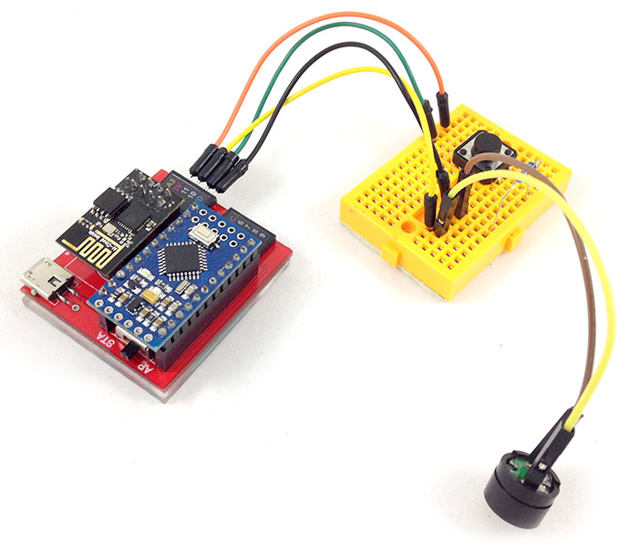
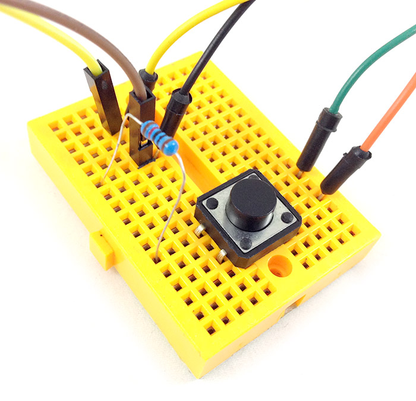
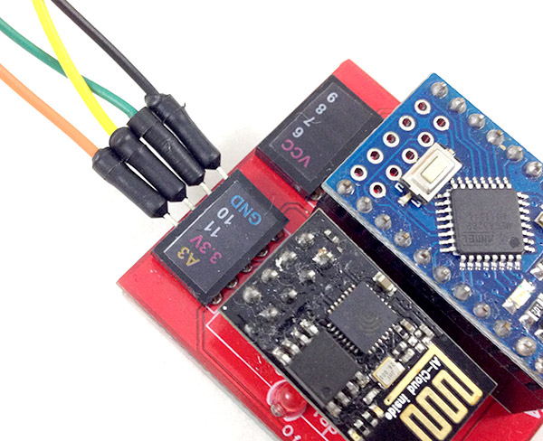
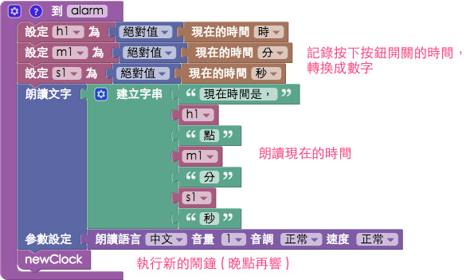
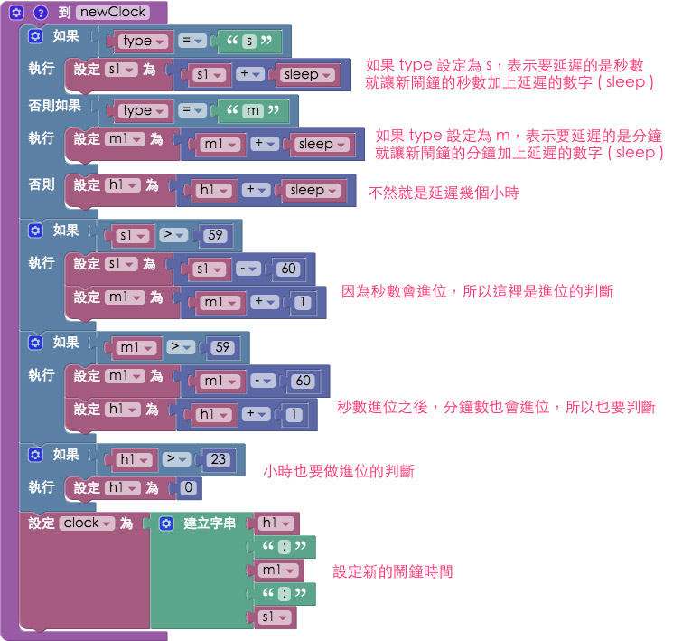

<!-- @@master  = ../../_layout.html-->

<!-- @@block  =  meta-->

<title>教學範例 33：會說話的鬧鐘 ( 貪睡、蜂鳴器 ) :::: Webduino = Web × Arduino</title>

<meta name="description" content="過去的範例分別有介紹過按鈕開關和蜂鳴器的用法，在這個範例裡面，我們會把按鈕開關和蜂鳴器結合，實際做出一個具備貪睡功能的鬧鐘，也就是按下按鈕開關之後，會過個幾分鐘再叫，同時，按下開關的時候電腦還會發音報時喔！">

<meta itemprop="description" content="過去的範例分別有介紹過按鈕開關和蜂鳴器的用法，在這個範例裡面，我們會把按鈕開關和蜂鳴器結合，實際做出一個具備貪睡功能的鬧鐘，也就是按下按鈕開關之後，會過個幾分鐘再叫，同時，按下開關的時候電腦還會發音報時喔！">

<meta property="og:description" content="過去的範例分別有介紹過按鈕開關和蜂鳴器的用法，在這個範例裡面，我們會把按鈕開關和蜂鳴器結合，實際做出一個具備貪睡功能的鬧鐘，也就是按下按鈕開關之後，會過個幾分鐘再叫，同時，按下開關的時候電腦還會發音報時喔！">

<meta property="og:title" content="教學範例 33：會說話的鬧鐘 ( 貪睡、蜂鳴器 )" >

<meta property="og:url" content="https://webduino.io/tutorials/tutorial-33-clock.html">

<meta property="og:image" content="https://webduino.io/img/tutorials/tutorial-33-01s.jpg">

<meta itemprop="image" content="https://webduino.io/img/tutorials/tutorial-33-01s.jpg">

<include src="../_include-tutorials.html"></include>

<!-- @@close-->

<!-- @@block  =  preAndNext-->

<include src="../_include-tutorials-content.html"></include>

<!-- @@close-->

<!-- @@block  =  tutorials-->

# 教學範例 33：會說話的鬧鐘 ( 貪睡、蜂鳴器 )

過去的範例「[教學範例 9：按鈕開關](https://webduino.io/tutorials/tutorial-09-button-led.html)」和「[教學範例 13：蜂鳴器播放自製音樂](https://webduino.io/tutorials/tutorial-13-buzzer.html)」分別有介紹過按鈕開關和蜂鳴器的用法，在這個範例裡面，我們會把按鈕開關和蜂鳴器結合，實際做出一個具備貪睡功能的鬧鐘 也就是按下按鈕開關之後，會過個幾分鐘再叫，同時，按下開關的時候電腦還會發音報時喔！ 

	蜂鳴器、按鈕：<a href="https://webduino.io/buy/webduino-package-plus.html" target="_blank">Webduino 基本套件 Plus ( 支援馬克 1 號、Fly )</a>
	Webduino 開發板：<a href="https://webduino.io/buy/component-webduino-v1.html" target="_blank">Webduino 馬克一號</a>、<a href="https://webduino.io/buy/component-webduino-fly.html" target="_blank">Webduino Fly</a>、<a href="https://webduino.io/buy/component-webduino-uno-fly.html" target="_blank">Webduino Fly + Arduino UNO</a>

## 範例影片展示

<iframe class="youtube" src="https://www.youtube.com/embed/BEDgC5iAnCo" frameborder="0" allowfullscreen></iframe>

## 接線與實作

如果使用馬克一號，因為只有一個 GND，所以我們用麵包板共地，如果是用 Fly 就可以接不同的 GND 即可，這裏按鈕開關的訊號腳接 10，蜂鳴器則是接 11。

馬克一號接線示意圖：

Fly 接線示意圖：

實際接線圖：

	蜂鳴器、按鈕：<a href="https://webduino.io/buy/webduino-package-plus.html" target="_blank">Webduino 基本套件 Plus ( 支援馬克 1 號、Fly )</a>
	Webduino 開發板：<a href="https://webduino.io/buy/component-webduino-v1.html" target="_blank">Webduino 馬克一號</a>、<a href="https://webduino.io/buy/component-webduino-fly.html" target="_blank">Webduino Fly</a>、<a href="https://webduino.io/buy/component-webduino-uno-fly.html" target="_blank">Webduino Fly + Arduino UNO</a>

## Webduino Blockly 操作解析

打開 Webduino Blockly 編輯工具 ( [https://blockly.webduino.io](https://blockly.webduino.io) )，把開發板放到編輯畫面裡，填入對應的 Webduino 開發板名稱，然後放入按鈕開關和蜂鳴器的積木，按鈕開關設定 10 號腳，蜂鳴器為 11 號腳。

設定四個變數，**clock 表示鬧鐘的時間，check 用來判斷按鈕開關是否壓下，type 如果設定為 m，延遲的就是分鐘，如果是 s 就是秒，sleep 則是要延遲多久**，然後我們要讓時間顯示在網頁裡，因為字體比較大，所以我們透過設定字體大小和行高的積木來進行設定，完成後就執行鬧鐘的流程，這裏流程名稱設定為 f。( 注意，如果是時間個位數，前面不要補 0，例如 01 就寫 1，00 就寫 0 )

來看一下 f 流程的內容，一開始我們先用三個變數 h、m 和 s 來裝載當前時間的時、分、秒，然後再透過字串組合成我們要比對的文字格式，然後將這串文字指定給另外一個變數 now，在下面的判斷式我們就會比對 now 和 clock 的內容是否相同，如果相同的話，就讓蜂鳴器播放超級瑪莉的音樂，同時也會把文字的顏色改成紅色。

此外，我們利用「顯示」的積木，把當前的時間和鬧鐘時間秀在網頁互動區域裡頭 ( ` `是換行的符號 )，然後再流程的最後使用了「等待」，就可以每隔一秒執行一次這段流程，就可以在網頁互動區裡看到時間一秒一秒的跳動了。

接著我們在開發板的積木裡，放入按鈕開關的積木，這裏我們讓按鈕開關有兩種行為，「按下」的時候會把蜂鳴器停下來，並把文字顏色改成黑色，同時啟動「貪睡流程 alarm」，如果是「長按」，則把鬧鐘關閉。( 這裡 check 等於 1 就很重要了，**因為 check 只有在鬧鐘啟動的時候才會等於 1**，這也可以避免在鬧鐘還沒響的時候，按下按鈕開關會觸發貪睡的功能 )

來看到貪睡的流程，這裏我們先用 h1、m1 和 s1 三個變數來紀錄按下按鈕開關的時、分、秒，然後我們就使用「語音朗讀」來唸出當前的時間，接著觸發一個新的鬧鐘 ( 這樣才是「貪睡」，也就是說按下按鈕開關的同時，產生一個新的鬧鐘時間，時間到就會叫 )

新的鬧鐘流程裡頭放入三個判斷式，因為我們對時間加總的時候，不論是小時、分鐘或是秒，都會有「進位」的可能，所以要連續做三個判斷，又因為秒的進位會影響到分鐘的進位，分鐘的進位又會影響到小時的進位，所以順序必須是秒、分鐘、小時，最後就把新的時間指定給 clock 這個變數。

確認開發板上線 ( 點選「[檢查連線狀態](https://webduino.io/device.html)」查詢 )，點選右上方紅色按鈕執行，時間到了的時候蜂鳴器就會播放超級瑪莉的音樂，同時喇叭也會有人聲報時，文字也會變成紅色，這時候按下按鈕開關，就會產生一個新的鬧鐘時間，如果長按按鈕開關，就會把鬧鐘關起來。

( 解答：[https://blockly.webduino.io/#-KLMkPWH4stuxpbr7sEs](https://blockly.webduino.io/#-KLMkPWH4stuxpbr7sEs) )

	蜂鳴器、按鈕：<a href="https://webduino.io/buy/webduino-package-plus.html" target="_blank">Webduino 基本套件 Plus ( 支援馬克 1 號、Fly )</a>
	Webduino 開發板：<a href="https://webduino.io/buy/component-webduino-v1.html" target="_blank">Webduino 馬克一號</a>、<a href="https://webduino.io/buy/component-webduino-fly.html" target="_blank">Webduino Fly</a>、<a href="https://webduino.io/buy/component-webduino-uno-fly.html" target="_blank">Webduino Fly + Arduino UNO</a>

<!-- @@close-->