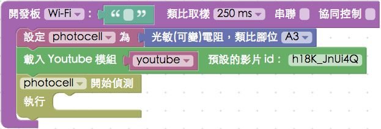
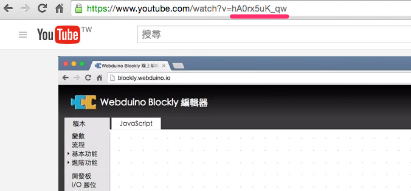
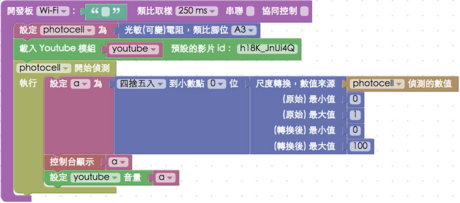

<!-- @@master  = ../../_layout.html-->

<!-- @@block  =  meta-->

<title>教學範例 35：可變電阻改變 Youtube 音量大小 :::: Webduino = Web × Arduino</title>

<meta name="description" content="上一篇「教學範例 34：可變電阻改變圖片位置」介紹了利用可變電阻改變圖片位置，這篇我們將功能再升級，透過可變電阻來改變 Youtube 影片的音量大小，實作出來就像是實際的旋鈕控制音響喇叭音量一樣。">

<meta itemprop="description" content="上一篇「教學範例 34：可變電阻改變圖片位置」介紹了利用可變電阻改變圖片位置，這篇我們將功能再升級，透過可變電阻來改變 Youtube 影片的音量大小，實作出來就像是實際的旋鈕控制音響喇叭音量一樣。">

<meta property="og:description" content="上一篇「教學範例 34：可變電阻改變圖片位置」介紹了利用可變電阻改變圖片位置，這篇我們將功能再升級，透過可變電阻來改變 Youtube 影片的音量大小，實作出來就像是實際的旋鈕控制音響喇叭音量一樣。">

<meta property="og:title" content="教學範例 35：可變電阻改變 Youtube 音量大小" >

<meta property="og:url" content="https://webduino.io/tutorials/tutorial-35-vr-youtube.html">

<meta property="og:image" content="https://webduino.io/img/tutorials/tutorial-35-01s.jpg">

<meta itemprop="image" content="https://webduino.io/img/tutorials/tutorial-35-01s.jpg">

<include src="../_include-tutorials.html"></include>

<!-- @@close-->

<!-- @@block  =  preAndNext-->

<include src="../_include-tutorials-content.html"></include>

<!-- @@close-->

<!-- @@block  =  tutorials-->

# 教學範例 35：可變電阻改變 Youtube 音量大小

上一篇「[教學範例 34：可變電阻改變圖片位置](https://webduino.io/tutorials/tutorial-34-vr-image.html)」介紹了利用可變電阻改變圖片位置，這篇我們將功能再升級，透過可變電阻來改變 Youtube 影片的音量大小，實作出來就像是實際的旋鈕控制音響喇叭音量一樣。

	可變電阻旋鈕：<a href="https://webduino.io/buy/webduino-expansion-m.html" target="_blank">Webduino 擴充套件 M ( 支援馬克 1 號、Fly )</a>
	Webduino 開發板：<a href="https://webduino.io/buy/component-webduino-v1.html" target="_blank">Webduino 馬克一號</a>、<a href="https://webduino.io/buy/component-webduino-fly.html" target="_blank">Webduino Fly</a>、<a href="https://webduino.io/buy/component-webduino-uno-fly.html" target="_blank">Webduino Fly + Arduino UNO</a>

## 範例影片展示

<iframe class="youtube" src="https://www.youtube.com/embed/hA0rx5uK_qw" frameborder="0" allowfullscreen></iframe>

## 接線與實作

可變電阻有三支接腳，左右分別接 3.3V 和 GND，記得使用電阻保護，避免當可變電阻過小的時候發生短路，中間的腳位為類比訊號腳，我們接在 A3 的位置。( 如果你的 3.3V 與 GND 顛倒，會發現出來的數值和旋轉的方向相反 )

實際接線圖：

	可變電阻旋鈕：<a href="https://webduino.io/buy/webduino-expansion-m.html" target="_blank">Webduino 擴充套件 M ( 支援馬克 1 號、Fly )</a>
	Webduino 開發板：<a href="https://webduino.io/buy/component-webduino-v1.html" target="_blank">Webduino 馬克一號</a>、<a href="https://webduino.io/buy/component-webduino-fly.html" target="_blank">Webduino Fly</a>、<a href="https://webduino.io/buy/component-webduino-uno-fly.html" target="_blank">Webduino Fly + Arduino UNO</a>

## Webduino Blockly 操作解析

打開 Webduino Blockly 編輯工具 ( [https://blockly.webduino.io](https://blockly.webduino.io) )，把開發板放到編輯畫面裡，填入對應的 Webduino 開發板名稱，然後放入可變電阻的積木，設定為 A3 腳位。

放入 Youtube 以及開始偵測的積木，填入 Youtube 的影片 id。

如果不知道 Youtube 影片 id，可以打開 Youtube 影片，影片網址後面 `v=` 接的一串代碼就是影片 id。

開始偵測的時候，我們先用一個變數裝載數值 ( 因為會重複用到，用變數裝載就只需要指定一次 )，因為可變電阻的數值是 0 到 1 的浮點數，而 Youtube 的音量是 0 到 100 的整數，所以這裡要使用四捨五入以及尺度轉換，然後我們可以打開 Chrome 開發者工具的 console 來接收數值。( 在網頁上方按滑鼠右鍵，點選檢視 )

確認開發板上線 ( 點選「[檢查連線狀態](https://webduino.io/device.html)」查詢 )，點選右上方紅色按鈕執行，Youtube 載入之後，旋轉可變電阻，就會看到音量發生變化了。

( 解答：[http://blockly.webduino.io/#-KLpGunMdNSQ-MW_LLKi](http://blockly.webduino.io/#-KLpGunMdNSQ-MW_LLKi) )

如果覺得想要把左右旋轉的方向顛倒 ( 原本往右轉變大聲，現在要改成往左轉變大聲 )，我們可以直接修改尺度轉換的數值，把 0 改成 1，把 1 改成 0 就可以，或者由接線著手，把接 3.3V 的位置換成接 GND，把 GND 換成接 3.3V，數值也會顛倒過來

##範例解析 ( [完整程式碼](https://bin.webduino.io/qazu/edit?html,css,js,output)、[檢查連線狀態](https://webduino.io/device.html) )

HTML 的 header 引入 `webduino-all.min.js`，目的在讓瀏覽器可以支援 WebComponents 以及 Webduino 所有的元件，如果是用 Blockly 編輯工具產生的程式碼，則要額外引入 `webduino-blockly.js`。

	
	

HTML 的部分會放入一個 div 來載入 Youtube 影片。

	

圖片位置會改變主要是因為我們的圖片 position 屬性是絕對的 ( absolute )，所以在這邊 CSS 要設定一下。

	#demo-area-03-container {
	  position: relative;
	  width: 150px;
	  height: 150px;
	}

	#demo-area-03-image {
	  position: absolute;
	  top: 0;
	  left: 0;
	  width: 150px;
	  height: 150px;
	  transition: .3s;
	  -webkit-transition: .3s;
	  -moz-transition: .3s;
	  transform-origin: 75px 75px;
	  -webkit-transform-origin: 75px 75px;
	  -moz-transform-origin: 75px 75px;
	}

主程式一開始載入 Youtube 模組，然後透過可變電阻的 `on` 來接收訊號，訊號值回傳在 val 裡頭，我們就透過尺度與四捨五入的公式轉換數值，把數值拋給 Youtube 音量的音量，為了避免音量大於 100 會發生錯誤，在這裏有用一個大於一百的時候就等於一百的判斷式作為保護。	

	var photocell;
	var youtube;
	var a;

	boardReady('', async function (board) {
	  board.systemReset();
	  board.samplingInterval = 250;
	  photocell = getPhotocell(board, 3);
	  await new Promise(function (resolve) {
	    var tag = document.createElement("script");
	    tag.src = "https://www.youtube.com/iframe_api";
	    var scptTag = document.getElementsByTagName("script")[0];
	    scptTag.parentNode.insertBefore(tag, scptTag);
	    window.onYouTubeIframeAPIReady = function () {
	      youtube = new YT.Player("player", {
	        height: "240",
	        width: "96%",
	        videoId: "h18K_JnUi4Q",
	        playerVars: {
	          autoplay: 1,
	          controls: 1
	        },
	        events: {
	          onReady: function (evt) {
	            resolve();
	          }
	        }
	      });
	    };
	  });
	  photocell.on(async function(val){
	    photocell.detectedVal = val;
	    a = Math.round(((photocell.detectedVal - (0)) * (1/((1)-(0)))) * ((100)-(0)) + (0));
	    console.log(a);
	    var varA = a;
	    if (varA >= 100) {
	      varA = 100;
	    }
	    youtube.setVolume(varA);
	  });
	});

以上就是透過可變電阻旋鈕，改變 Youtube 音量大小。   
完整程式碼：[https://bin.webduino.io/qazu/edit?html,css,js,output](https://bin.webduino.io/qazu/edit?html,css,js,output)  
解答：[http://blockly.webduino.io/#-KLpGunMdNSQ-MW_LLKi](http://blockly.webduino.io/#-KLpGunMdNSQ-MW_LLKi)

	可變電阻旋鈕：<a href="https://webduino.io/buy/webduino-expansion-m.html" target="_blank">Webduino 擴充套件 M ( 支援馬克 1 號、Fly )</a>
	Webduino 開發板：<a href="https://webduino.io/buy/component-webduino-v1.html" target="_blank">Webduino 馬克一號</a>、<a href="https://webduino.io/buy/component-webduino-fly.html" target="_blank">Webduino Fly</a>、<a href="https://webduino.io/buy/component-webduino-uno-fly.html" target="_blank">Webduino Fly + Arduino UNO</a>

<!-- @@close-->