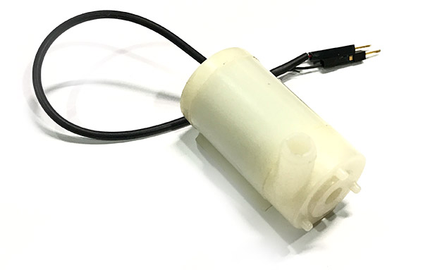
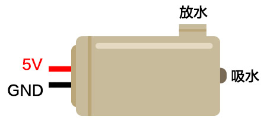
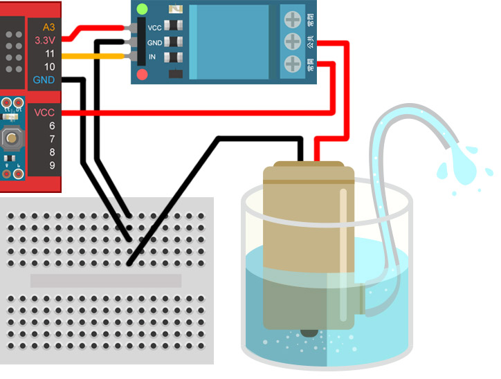
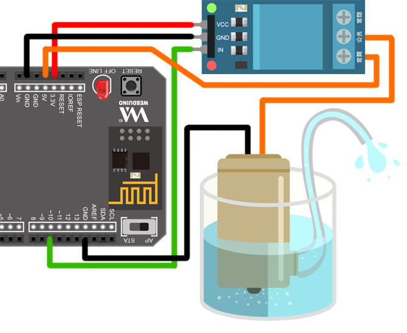
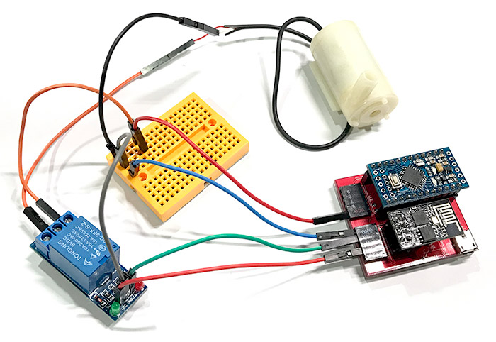
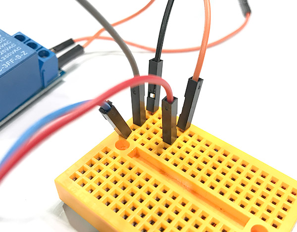
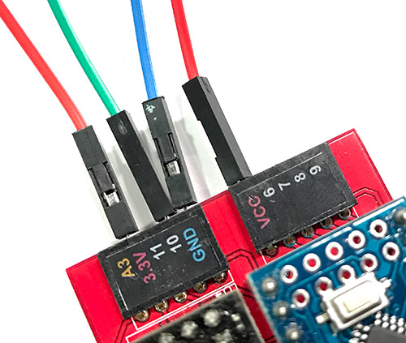
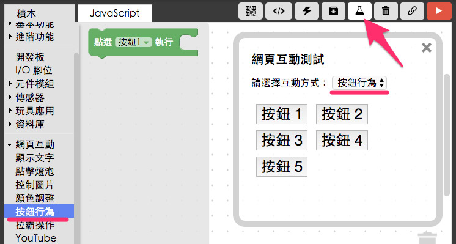
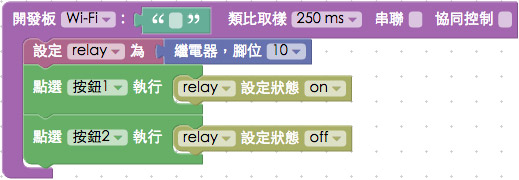

<!-- @@master  = ../../_layout.html-->

<!-- @@block  =  meta-->

<title>教學範例 36：網頁操控水泵 :::: Webduino = Web × Arduino</title>

<meta name="description" content="泵讀音「ㄅㄥˋ」，是一種用以增加液體或氣體的壓力，使之輸送流動的機械，我們亦可稱之為「幫浦」，透過馬達的加壓，可以做到一個管子抽水，然後從另外一個管子放水的動作，這篇我們將透過「繼電器」來控制水泵的啟動，進一步就可以實現從網頁操控水泵了。">

<meta itemprop="description" content="泵讀音「ㄅㄥˋ」，是一種用以增加液體或氣體的壓力，使之輸送流動的機械，我們亦可稱之為「幫浦」，透過馬達的加壓，可以做到一個管子抽水，然後從另外一個管子放水的動作，這篇我們將透過「繼電器」來控制水泵的啟動，進一步就可以實現從網頁操控水泵了。">

<meta property="og:description" content="泵讀音「ㄅㄥˋ」，是一種用以增加液體或氣體的壓力，使之輸送流動的機械，我們亦可稱之為「幫浦」，透過馬達的加壓，可以做到一個管子抽水，然後從另外一個管子放水的動作，這篇我們將透過「繼電器」來控制水泵的啟動，進一步就可以實現從網頁操控水泵了。">

<link rel="canonical" href="https://tutorials.webduino.io/zh-tw/docs/useful/example/smart-plant-pump.html">

<meta property="og:title" content="教學範例 36：網頁操控水泵" >

<meta property="og:url" content="https://webduino.io/tutorials/tutorial-36-pump.html">

<meta property="og:image" content="https://webduino.io/img/tutorials/tutorial-36-01s.jpg">

<meta itemprop="image" content="https://webduino.io/img/tutorials/tutorial-36-01s.jpg">

<include src="../_include-tutorials.html"></include>

<!-- @@close-->

<!-- @@block  =  preAndNext-->

<include src="../_include-tutorials-content.html"></include>

<!-- @@close-->

<!-- @@block  =  tutorials-->

# 教學範例 36：網頁操控水泵

泵讀音「ㄅㄥˋ」，是一種用以增加液體或氣體的壓力，使之輸送流動的機械，我們亦可稱之為「幫浦」，透過馬達的加壓，可以做到一個管子抽水，然後從另外一個管子放水的動作，這篇我們將透過「繼電器」來控制水泵的啟動，進一步就可以實現從網頁操控水泵了。

	繼電器相關套件：<a href="https://webduino.io/buy/webduino-expansion-m.html" target="_blank">Webduino 擴充套件 M ( 支援馬克 1 號、Fly )</a>
	水泵套件：<a href="https://webduino.io/buy/webduino-package-plant.html" target="_blank">Webduino 智慧植栽套件 ( 支援馬克 1 號、Fly )</a>
	Webduino 開發板：<a href="https://webduino.io/buy/component-webduino-v1.html" target="_blank">Webduino 馬克一號</a>、<a href="https://webduino.io/buy/component-webduino-fly.html" target="_blank">Webduino Fly</a>、<a href="https://webduino.io/buy/component-webduino-uno-fly.html" target="_blank">Webduino Fly + Arduino UNO</a>

## 接線與實作

水泵的長相如下圖，水泵本身一定會有兩個開口，一個負責吸水而另外一個就是負責放水。

水泵只有兩條電線，一條接 5V 一條接 GND，通電之後就會啟動內部的馬達開始抽水，所以在電路上使用一個繼電器作為開關，透過網頁控制繼電器，就可以啟動水泵或關閉水泵。( 可以參考 [教學範例 14：繼電器控制風扇旋轉](https://webduino.io/tutorials/tutorial-14-relay.html) )

水泵、繼電器、馬克一號接線示意圖：

水泵、繼電器、Fly 接線示意圖：

實際接線圖：

	繼電器相關套件：<a href="https://webduino.io/buy/webduino-expansion-m.html" target="_blank">Webduino 擴充套件 M ( 支援馬克 1 號、Fly )</a>
	水泵套件：<a href="https://webduino.io/buy/webduino-package-plant.html" target="_blank">Webduino 智慧植栽套件 ( 支援馬克 1 號、Fly )</a>
	Webduino 開發板：<a href="https://webduino.io/buy/component-webduino-v1.html" target="_blank">Webduino 馬克一號</a>、<a href="https://webduino.io/buy/component-webduino-fly.html" target="_blank">Webduino Fly</a>、<a href="https://webduino.io/buy/component-webduino-uno-fly.html" target="_blank">Webduino Fly + Arduino UNO</a>

## Webduino Blockly 操作解析

打開 Webduino Blockly 編輯工具 ( [https://blockly.webduino.io](https://blockly.webduino.io) )，把開發板放到編輯畫面裡，填入對應的 Webduino 開發板名稱，然後放入「繼電器」的積木，設定為 10 腳位。

打開內嵌的網頁，下拉選單選擇「按鈕行為」，對應到左側選單的「網頁互動」裡的「按鈕行為」積木。

設定點選按鈕 1 的時候讓繼電器的狀態為「on」( 水泵通電開始吸水放水 )，點選按鈕 2 的時候繼電器狀態為「off」，水泵關閉。

確認開發板上線 ( 點選「[檢查連線狀態](https://webduino.io/device.html)」查詢 )，點選右上方紅色按鈕執行，點選按鈕，就可以看到水泵開始吸水了。

( 解答：[http://bin.webduino.io/keleb/edit?html,css,js,output](http://bin.webduino.io/keleb/edit?html,css,js,output) )

如果覺得想要把左右旋轉的方向顛倒 ( 原本往右轉變大聲，現在要改成往左轉變大聲 )，我們可以直接修改尺度轉換的數值，把 0 改成 1，把 1 改成 0 就可以，或者由接線著手，把接 3.3V 的位置換成接 GND，把 GND 換成接 3.3V，數值也會顛倒過來

##範例解析 ( [完整程式碼](https://bin.webduino.io/qazu/edit?html,css,js,output)、[檢查連線狀態](https://webduino.io/device.html) )

HTML 的 header 引入 `webduino-all.min.js`，目的在讓瀏覽器可以支援 WebComponents 以及 Webduino 所有的元件，如果是用 Blockly 編輯工具產生的程式碼，則要額外引入 `webduino-blockly.js`。

	
	

HTML 的部分會放入一些按鈕。

	<button id="demo-area-05-btn1" class="db5">按鈕 1</button>
	<button id="demo-area-05-btn2" class="db5">按鈕 2</button>
	<button id="demo-area-05-btn3" class="db5">按鈕 3</button>
	<button id="demo-area-05-btn4" class="db5">按鈕 4</button>
	<button id="demo-area-05-btn5" class="db5">按鈕 5</button>

透過 `getRelay`，然後透過可變電阻的 `on` 來接收訊號，訊號值回傳在 val 裡頭，我們就透過尺度與四捨五入的公式轉換數值，把數值拋給 Youtube 音量的音量，為了避免音量大於 100 會發生錯誤，在這裏有用一個大於一百的時候就等於一百的判斷式作為保護。	

	var relay;

	boardReady('', function (board) {
	  board.systemReset();
	  board.samplingInterval = 250;
	  relay = getRelay(board, 10);
	  document.getElementById("demo-area-05-btn1").addEventListener("click",function(){
	    relay.on();
	  });
	  document.getElementById("demo-area-05-btn2").addEventListener("click",function(){
	    relay.off();
	  });
	});

以上就是透過網頁操水泵的原理。   
完整程式碼：[http://bin.webduino.io/keleb/edit?html,css,js,output](http://bin.webduino.io/keleb/edit?html,css,js,output)  
解答：[http://blockly.webduino.io/#-KZ_bMKQA1W1RZIBf5VH](http://blockly.webduino.io/#-KZ_bMKQA1W1RZIBf5VH)

	繼電器相關套件：<a href="https://webduino.io/buy/webduino-expansion-m.html" target="_blank">Webduino 擴充套件 M ( 支援馬克 1 號、Fly )</a>
	水泵套件：<a href="https://webduino.io/buy/webduino-package-plant.html" target="_blank">Webduino 智慧植栽套件 ( 支援馬克 1 號、Fly )</a>
	Webduino 開發板：<a href="https://webduino.io/buy/component-webduino-v1.html" target="_blank">Webduino 馬克一號</a>、<a href="https://webduino.io/buy/component-webduino-fly.html" target="_blank">Webduino Fly</a>、<a href="https://webduino.io/buy/component-webduino-uno-fly.html" target="_blank">Webduino Fly + Arduino UNO</a>

<!-- @@close-->