<!-- @@master  = ../../_layout.html-->

<!-- @@block  =  meta-->

<title>教學範例 37：循跡自走車 :::: Webduino = Web × Arduino</title>

<meta name="description" content="這篇範例將為自走車加上「循跡」的功能，使自走車在一般操作之外，也能透過「循跡控制板」，輕鬆跟隨地上的軌跡移動，最後甚至可藉由雲端資料庫的輔助，實現紀錄路徑軌跡並重複播放的功能。">

<meta itemprop="description" content="這篇範例將為自走車加上「循跡」的功能，使自走車在一般操作之外，也能透過「循跡控制板」，輕鬆跟隨地上的軌跡移動，最後甚至可藉由雲端資料庫的輔助，實現紀錄路徑軌跡並重複播放的功能。">

<meta property="og:description" content="這篇範例將為自走車加上「循跡」的功能，使自走車在一般操作之外，也能透過「循跡控制板」，輕鬆跟隨地上的軌跡移動，最後甚至可藉由雲端資料庫的輔助，實現紀錄路徑軌跡並重複播放的功能。">

<meta property="og:title" content="教學範例 37：循跡自走車" >

<meta property="og:url" content="https://webduino.io/tutorials/tutorial-37-line-following-robot.html">

<meta property="og:image" content="https://webduino.io/img/tutorials/tutorial-37-01s.jpg">

<meta itemprop="image" content="https://webduino.io/img/tutorials/tutorial-37-01s.jpg">

<include src="../_include-tutorials.html"></include>

<!-- @@close-->

<!-- @@block  =  preAndNext-->

<include src="../_include-tutorials-content.html"></include>

<!-- @@close-->

<!-- @@block  =  tutorials-->

# 教學範例 37：循跡自走車

在之前「公仔自走車」的範例中，已經了解基本的操作方式，這篇範例將利用「自走車循跡升級套件」，為自走車加上「循跡」的功能，讓我們在一般操作控制之外，也能跟隨地上的軌跡移動，甚至可藉由雲端資料庫的輔助，紀錄軌跡並重複行進同樣的路徑。

	自走車套件：<a href="../buy/webduino-package-toycar.html" target="_blank">Webduino 公仔自走車 ( 支援馬克 1 號 )</a>
	循跡套件：<a href="../buy/webduino-package-line-following.html" target="_blank">Webduino 自走車循跡升級套件 ( 需搭配公仔自走車 )</a>
	Webduino 開發板：<a href="../buy/component-webduino-v1.html" target="_blank">Webduino 馬克一號</a>、<a href=".//buy/component-webduino-fly.html" target="_blank">Webduino Fly</a>、<a href="../buy/component-webduino-smart.html" target="_blank">Webduino Smart</a>

## 範例影片展示

<iframe class="youtube" src="https://www.youtube.com/embed/vnazkVchsp4" frameborder="0" allowfullscreen></iframe>

## 接線與實作

要使用循跡的功能，必須在自走車的機構安裝「循跡控制板」，如果您手邊的 Webduino 自走車為「白色的」萬向輪支架，則必須更換為 3D 列印的支架，如此一來才可以順利組合循跡控制板，若自走車上頭「已經是 3D 列印支架則不用更換」。

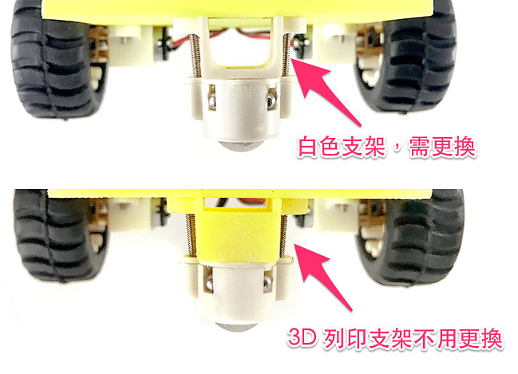

更換的方式很簡單 ( 已是 3D 列印支架可略過組裝教學 )，首先用螺絲起子鬆開支架的小螺絲，取下支架和萬向輪，萬向輪內有四顆小鋼珠和一顆大鋼珠，千萬要注意不要弄丟了 ( 建議可用磁鐵放在旁邊吸附著 )。

將 3D 列印的支架用原本的螺絲螺帽鎖到車體上，和車體並不會垂直，是正常的現象。

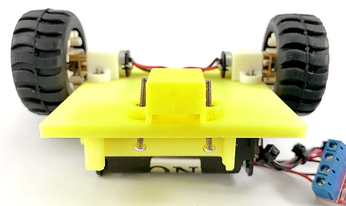

將萬向輪鎖上，車體的改造就完成了。

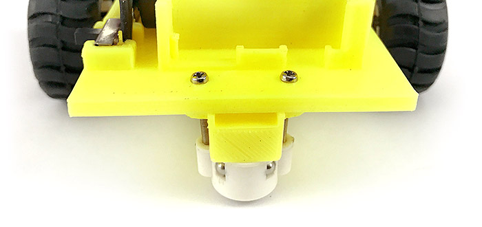

接著移除 Webduino 馬克一號原本的 Arduino Pro mini，換上循跡自走車的 Arduino Pro mini。

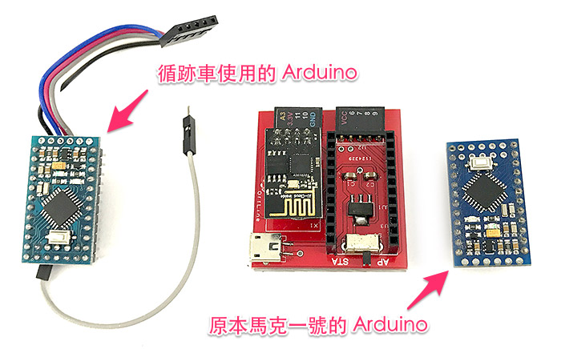

循跡車 Arduino 背面的接線照片如下，如果不小心把線拔除了就按照顏色位置接回去即可。

注意換完的方向要正確，五條線的接頭朝下，灰色線接頭朝上。

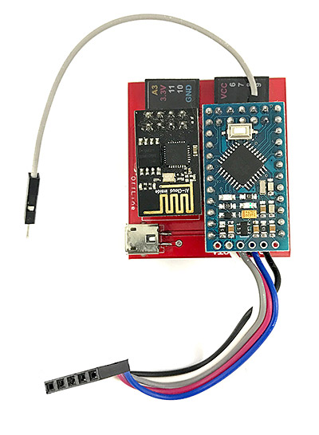

將馬克一號與自走車組合，五條線街頭插入3D 列印支架的孔洞當中，目的在於要組合循跡控制板。

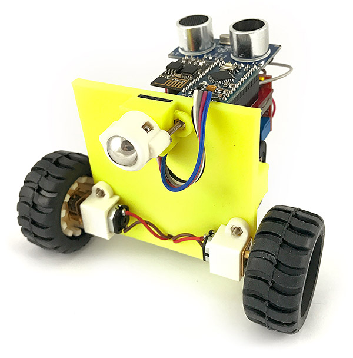

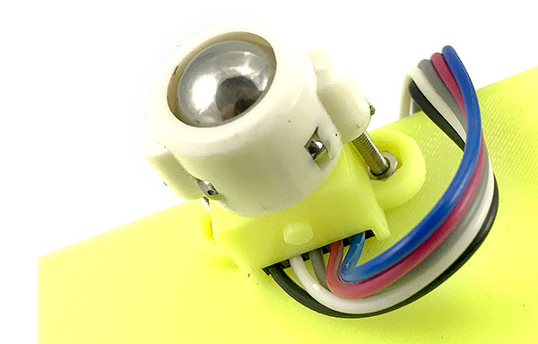

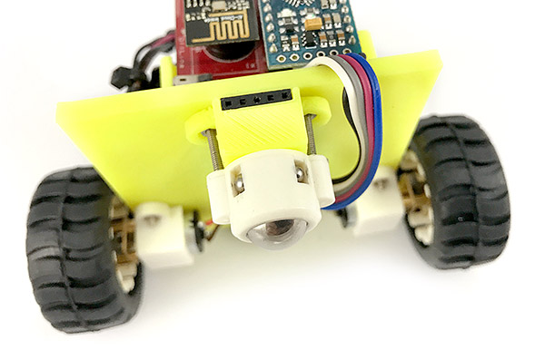

灰色的線則向上和馬克一號 A3 的腳位連接。

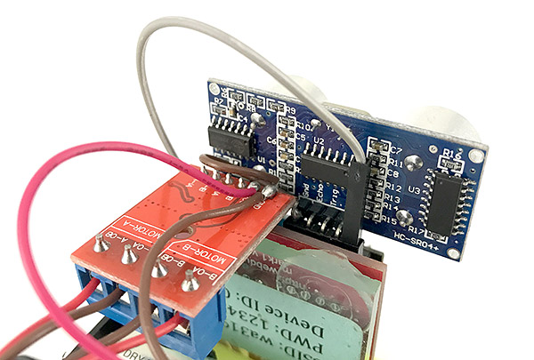

將循跡控制板插入五條線的接頭，如果在運行的時候發現偵測狀況不理想，可使用十字螺絲起子，調整循跡偵測的靈敏度。

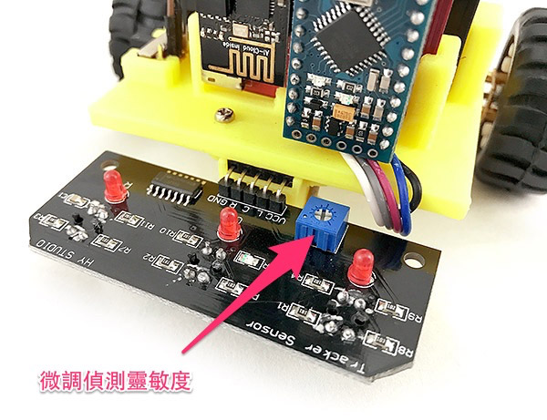

最後放入四顆 3 號電池，就完成了 Webduino 循跡自走車的升級改造。

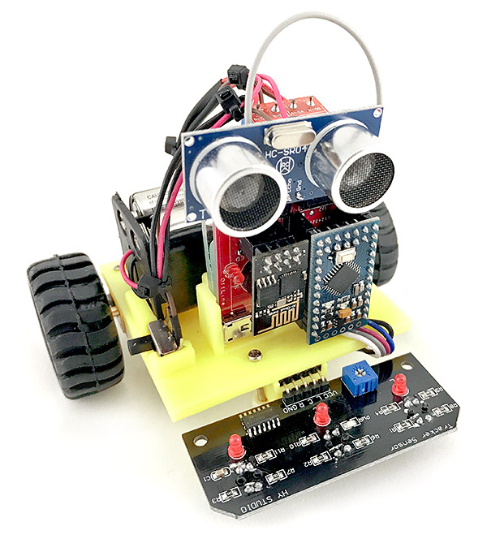

	自走車套件：<a href="../buy/webduino-package-toycar.html" target="_blank">Webduino 公仔自走車 ( 支援馬克 1 號 )</a>
	循跡套件：<a href="../buy/webduino-package-line-following.html" target="_blank">Webduino 自走車循跡升級套件 ( 需搭配公仔自走車 )</a>
	Webduino 開發板：<a href="../buy/component-webduino-v1.html" target="_blank">Webduino 馬克一號</a>、<a href=".//buy/component-webduino-fly.html" target="_blank">Webduino Fly</a>、<a href="../buy/component-webduino-smart.html" target="_blank">Webduino Smart</a>

## 體驗 Webduino 循跡功能

打開 Webduino 循跡自走車操控頁面，在上方填入自走車馬克一號的 Device ID，按下 Connect 連線，連線成功之後，就可以開始使用下方的遙控器循跡與記錄功能。

**循跡自走車操控頁面：**[https://goo.gl/NrTrLb](https://goo.gl/NrTrLb)

遙控器第一個部分有三個按鈕，第一個按鈕是「循跡與紀錄軌跡」的功能，點選之後就會啟動循跡功能，只要地上有黑色的線 ( 寬度需大於四公分 )，就會跟隨著黑線移動，同時也會開始記錄移動的軌跡；第二個按鈕是「停止」，除了會停止自走車的動作，同時也停止軌跡的紀錄；最後一個按鈕是「播放」，點選之後自走車就會開始運行上一次紀錄的路徑。

遙控器的第二個部分為「軌跡控制板」，當我們在上面繪製線條圖案，自走車就會跑出我們所繪製的形狀。

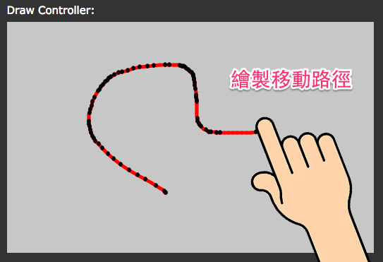

由於每輛自走車的馬達轉速不見得相同 ( 相同型號的馬達轉速也都會有誤差 )，電池的電量也都會有差異，所以在遙控器最後一個部分提供了「設定」功能，拉霸 Around 在修正左右偏移量，如果自走車在跑的時候一直向左偏，就往右調整一些，拉霸 speed 表示速度，速度 100% 表示全速行進，拉霸 Raidal 是微調校正速度，假設在 100% 的速度下 150ms 會跑 50px，但實際上卻只跑了 40px，就必須透過 Radial 修正，拉霸 Degree 則是微調修正轉的角度，原理和 Raidal 相同。

## Webduino Blockly 操作

如果不想要用遙控器操作，亦可使用 Webduino Blockly 編輯工具 ( [https://blockly.webduino.io](https://blockly.webduino.io) ) 實現循跡功能，打開下方的範例網頁，會帶出對應的循跡自走車程式，填入 Device ID，點選右上方的執行按鈕，就會看到自走車沿著黑色路線行進了。

**範例程式：**[https://goo.gl/8XYAam](https://goo.gl/8XYAam)

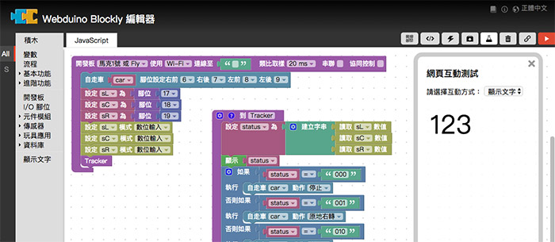

以上就是 2017 Webduino 循跡自走車的組裝與基本操控。   

	自走車套件：<a href="../buy/webduino-package-toycar.html" target="_blank">Webduino 公仔自走車 ( 支援馬克 1 號 )</a>
	循跡套件：<a href="../buy/webduino-package-line-following.html" target="_blank">Webduino 自走車循跡升級套件 ( 需搭配公仔自走車 )</a>
	Webduino 開發板：<a href="../buy/component-webduino-v1.html" target="_blank">Webduino 馬克一號</a>、<a href=".//buy/component-webduino-fly.html" target="_blank">Webduino Fly</a>、<a href="../buy/component-webduino-smart.html" target="_blank">Webduino Smart</a>

<!-- @@close-->