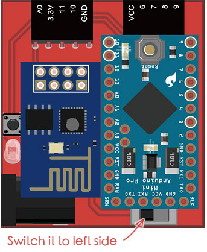
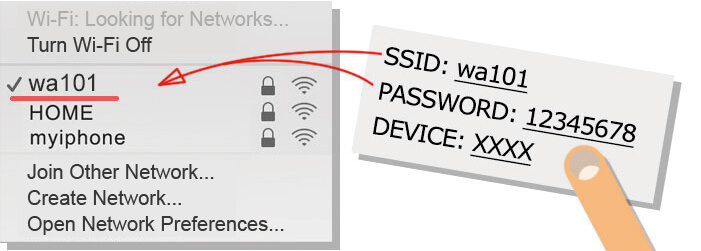
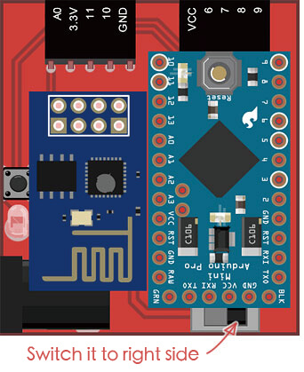
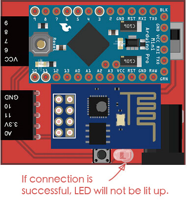
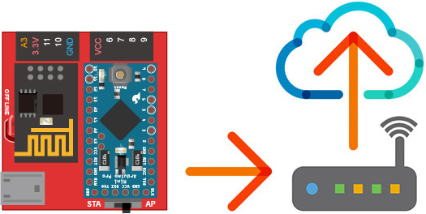

<!-- @@master  = ../../_layout.html-->

<!-- @@block  =  meta-->

<title>Webduino Board Wi-Fi Setup :::: Webduino = Web × Arduino</title>

<meta name="description" content="The most important thing before you begin using the Webduino is setting up the Wi-Fi. The purpose of the setup is to make the Webduino Development Kit connect to the internet automatically. It's the same thing we do for a new mobile phone, the phone needs to be set-up to browse the internet via Wi-Fi.">

<meta itemprop="description" content="The most important thing before you begin using the Webduino is setting up the Wi-Fi. The purpose of the setup is to make the Webduino Development Kit connect to the internet automatically. It's the same thing we do for a new mobile phone, the phone needs to be set-up to browse the internet via Wi-Fi.">

<meta property="og:description" content="The most important thing before you begin using the Webduino is setting up the Wi-Fi. The purpose of the setup is to make the Webduino Development Kit connect to the internet automatically. It's the same thing we do for a new mobile phone, the phone needs to be set-up to browse the internet via Wi-Fi.">

<meta property="og:title" content="Webduino Board Wi-Fi Setup" >

<meta property="og:url" content="https://webduino.io/tutorials/info-02-setup.html">

<meta property="og:image" content="https://webduino.io/img/tutorials/info-02-01s.jpg">

<meta itemprop="image" content="https://webduino.io/img/tutorials/info-02-01s.jpg">

<include src="../_include-tutorials.html"></include>

<!-- @@close-->

<!-- @@block  =  preAndNext-->

<include src="../_include-tutorials-content.html"></include>

<!-- @@close-->

<!-- @@block  =  tutorials-->
#Webduino Board Wi-Fi Setup

The most important thing before you begin using the Webduino is setting up the Wi-Fi. The purpose of the setup is to make the Webduino Development Kit connect to the internet automatically. It's the same thing we do for a new mobile phone, the phone needs to be set-up to browse the internet via Wi-Fi. 

##Webduino Board Wi-Fi Setup Step by Step

- ###1. Start Setup

	Move the switch on the Webduino development board to the STA position, turn the power on and start the setup.

	

- ###2. Search Webduino Development Kit

	Using the Wi-Fi on your computer or portable device search for the Webduino Development Kit's SSID and key in the password (the default is 12345678). The SSID of the Webduino Development Kit will start with "wa…"" (such as wa101). Then, your computer or portable device will be able to connect to the Webduino.

	

- ###3. Connect and Set Up the Webduino Development Kit 

	Use Chrome or Safari internet browsers to type in the web address http://192.168.4.1. There you will see the configuration page for the Webduino Development Kit. Type in the SSID and PASSWORD of your Wi-Fi router or portable device (the SSID for the Wi-Fi router has a max length of 14 alphanumeric characters)

	

- ###4. Reboot the Webduino Development Kit

	After you type in your router SSID and PASSWORD, press "submit". When "OK" shows on the screen, the Webduino is configured and can be connected to your Wi-Fi router or portable device. Remove the power from the Webduino and move the switch to the AP pattern. Then reconnect power and reboot the Webduino. If no "OK" shows, remove the power and repeat the setup again from Step 2.  

	

- ###5. Confirm the Connection 

	Once you reboot the Webduino Development Kit and your screen shows "OK", switch your computer or portable device to your regular internet connection. Go to the page https://webduino.io/device.html and type in the name of your Webduino to check the connection. If the connection is successful, it will show "OK".  **If "OK" shows, you can start working with the Webduino**. If no "OK" shows, you need to reboot the Webduino Development Kit again or restart the setup from Step 2.

	

	Another way to know if your **connection is successful** is the red LED on the Webduino will **not be lit up**. However, if the LED is blinking, the connection has failed. Reboot the Webduino and/or start the setup again from Step 2.
	
	

- ###6. Connect the Webduino Development Kit to Wi-Fi Router

	Webduino can now connect to a shared Wi-Fi router or to a portable device. It will also connect to cloud servers automatically. Now, let's try to control the Webduino via Wi-Fi. (Let's try our [First Tutorial](tutorial-01-led.html))

		

<!-- @@close-->