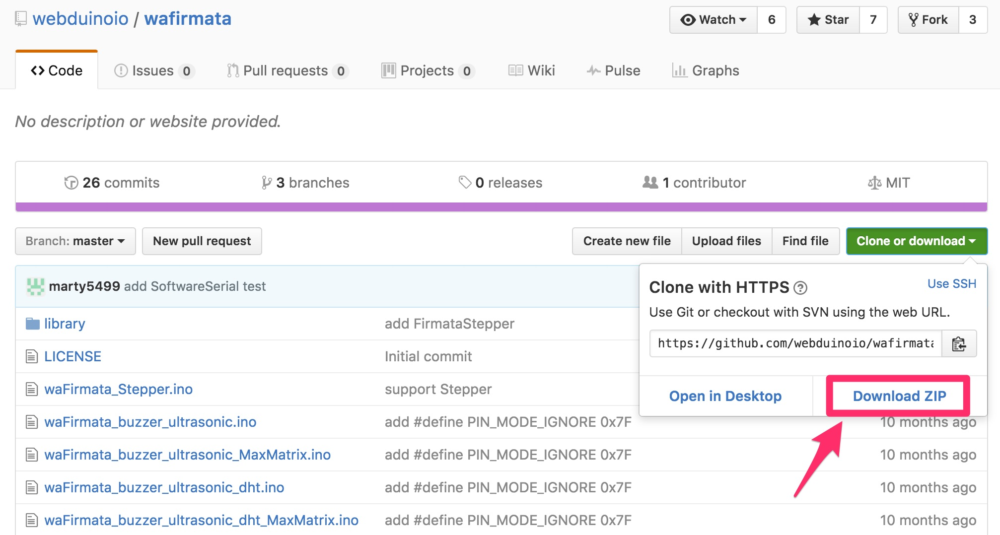
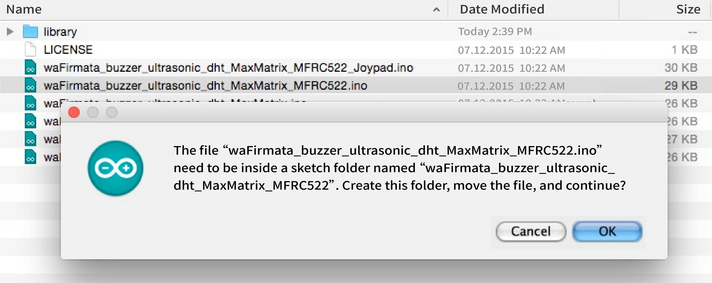
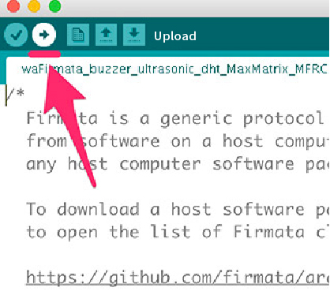
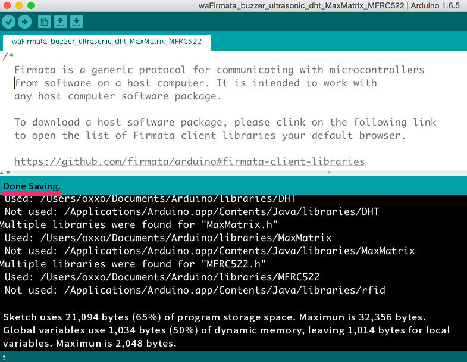

<!-- @@master  = ../../_layout.html-->

<!-- @@block  =  meta-->

<title>Arduino Firmware Download / Burn :::: Webduino = Web × Arduino</title>

<meta name="description" content="In this tutorial, you will learn how to burn firmware on your development boards. All Webduino boards follow the Arduino Firmata protocol, so you will have to burn the standard firmware on them. We will also introduce you to the Webduino firmware that provides control for all sensors and components.You can download it from our Github repository. ">

<meta itemprop="description" content="In this tutorial, you will learn how to burn firmware on your development boards. All Webduino boards follow the Arduino Firmata protocol, so you will have to burn the standard firmware on them. We will also introduce you to the Webduino firmware that provides control for all sensors and components.You can download it from our Github repository. ">

<meta property="og:description" content="In this tutorial, you will learn how to burn firmware on your development boards. All Webduino boards follow the Arduino Firmata protocol, so you will have to burn the standard firmware on them. We will also introduce you to the Webduino firmware that provides control for all sensors and components.You can download it from our Github repository. ">

<meta property="og:title" content="Arduino Firmware Download / Burn" >

<meta property="og:url" content="https://webduino.io/tutorials/info-07-arduino-ino.html">

<meta property="og:image" content="https://webduino.io/img/tutorials/info-07-01s.jpg">

<meta itemprop="image" content="https://webduino.io/img/tutorials/info-07-01s.jpg">

<include src="../_include-tutorials.html"></include>

<!-- @@close-->

<!-- @@block  =  preAndNext-->

<include src="../_include-tutorials-content.html"></include>

<!-- @@close-->

<!-- @@block  =  tutorials-->
# Arduino Firmware Download / Burn

In this tutorial, you will learn how to burn firmware on your development boards. **All Webduino boards follow the Arduino Firmata protocol, so you will have to burn the standard firmware on them.** We will also introduce you to the Webduino firmware that provides control for all sensors and components.You can download it from our Github repository.

If you are interested in Webduino Fly Wi-Fi extension, serial port, or Bluetooth, please check out the tutorials as follow.

(1) [Webduino Fly Wi-Fi Setup](info-04-uno-setup.html)  
(2) [Chrome API Proxy Setup](info-05-chrome-api-proxy.html)

## Notice

If your Webduino Wi-Fi extension is combined with Arduino UNO while burning firmware, **please make sure your Webduino Fly is in STA mode**. You will only need to burn the firmware on the Arduno board. Therefore, you can burn the firmware directly to your Arduino UNO through a USB cable connection.

## Downlod firmware

We uploaded the firmware and the libraries onto our Github repositary, so you can either clone or fork this project. For those who are not familiar with Gtihub, you can click on "Clone or download" and then choose "Download Zip" on the Github page. See the following links;

Github: [https://github.com/webduinoio/wafirmata](https://github.com/webduinoio/wafirmata)  
Download: [https://github.com/webduinoio/wafirmata/archive/master.zip](https://github.com/webduinoio/wafirmata/archive/master.zip)

You will see the firmware and the libraries after decompressing the .ZIP file.

## Include Library

If you need more libraries than the Arduino provides, you will have to add external libraries. First, use Arduino IDE for burning firmware, please make sure you install IDE from the [Arduino official website](https://www.arduino.cc/). Then, open Arduino IDE, choose "Sketch" from top menu, and then click **Add .ZIP Library** under "Include Library".

Include the .ZIP files from the folder "Library", which you just decompressed.

Check if the following .ZIP files are inclued;

(1) DHT.zip: DHT Sensor
(2) Joypad.zip: Joystick
(3) MaxMatrix.zip: LED Matrix
(4) MFRC522.zip: RFID
(5) IRremote.zip: IR Sender / Receiver
(6) G3.zip: PM 2.5 Sensor
(7) wa_GY291.zip: Triple Axis Accelerometer 

## Burn Firmware

Now we can open the .INO file to burn the firmware. Double click the .INO file and a popup window with "The file...needs to be inside a sketch folder..."" will appear, then click on "OK".

Once you finished the last step, please connect your Arduino board to your PC with a USB cable.You will have to check if your board is on the list of serial ports. To do this, go to "Serial port" under "Tools". Then make sure you are connected to the right serial port. If you did not install the driver for the Arduino UNO properly, it might fail to connect to the right serial port.

Now, you can start burning firmware on your Arduino board by clicking "Upload".

You will see the message "Done uploading" when the uploading succeeds. Now, you can start using all the functions that Webduino offers.

## List of Firmwares

The following list is the open source firmwares that have been released by Webduino. Webduino keeps adding to its list of sensors and components that are supported, so please pay attenetion to our projects on Github. Fork it! (The name of the file may include more than one sensor or component, this shows everything that is supported by that file.)

(1) buzzer: Buzzer
(2) ultrasonic: Ultrasonic
(3) MaxMatrix: LED Matrix
(4) dht: DHT sensor
(5) MFRC522: RFID
(6) Joypad: Joystick
(7) IR: IR Sender / Receiver
(8) GPS: GPS 
(9) GY291: Triple Axis Accelerometer
(10) G3: PM2.5 Sensor

## Compiling Errors for the Arduino IDE 1.6.7

Some users have met compiling errors when using Arduino IDE 1.6.7 because of incompatibilities between Firmata versions 2.4.4 and 2.5.1. If you have these versions, you can reinstall the older versions 1.6.6 or 1.6.5, (Download it here: [https://www.arduino.cc/en/Main/OldSoftwareReleases#previous](https://www.arduino.cc/en/Main/OldSoftwareReleases#previous)) or **reinstall Firmata 2.4.4 or 2.4.3 though the following steps**.

Step 1: Open Library Manager (Sketch > Include Library > Manage Libraries)

Step 2: Search for "Firmata", check if your version is 2.5.1.

Step 3: Choose Firmata version **2.4.4 or 2.4.3**, and then press "Install". Now you can reinstall the older version, and begin burning firmwares!

<!-- @@close-->