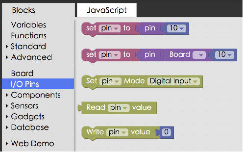

<!-- @@master  = ../../_layout.html-->

<!-- @@block  =  meta-->

<title>Webduino Board Pin Manipulation :::: Webduino = Web × Arduino</title>

<meta name="description" content="Webduino boards can detect and set pin states just like any other board. When using the “I/O pins” blocks in Blockly, by default, all of the pins (2~13) are set to be “digital output”. All of the analog pins (A0~A5) are set to “analog input”. For modularized blocks, such as LED and RGB LED, some pins correspond to their PWM (pulse-width modulated) outputs. We can change the pin mode ourselves, but if you set a pin to PWM mode on an unsupported pin it will not work. (PWM pin numbers have the suffix “~”).">

<meta itemprop="description" content="Webduino boards can detect and set pin states just like any other board. When using the “I/O pins” blocks in Blockly, by default, all of the pins (2~13) are set to be “digital output”. All of the analog pins (A0~A5) are set to “analog input”. For modularized blocks, such as LED and RGB LED, some pins correspond to their PWM (pulse-width modulated) outputs. We can change the pin mode ourselves, but if you set a pin to PWM mode on an unsupported pin it will not work. (PWM pin numbers have the suffix “~”).">

<meta property="og:description" content="Webduino boards can detect and set pin states just like any other board. When using the “I/O pins” blocks in Blockly, by default, all of the pins (2~13) are set to be “digital output”. All of the analog pins (A0~A5) are set to “analog input”. For modularized blocks, such as LED and RGB LED, some pins correspond to their PWM (pulse-width modulated) outputs. We can change the pin mode ourselves, but if you set a pin to PWM mode on an unsupported pin it will not work. (PWM pin numbers have the suffix “~”).">

<meta property="og:title" content="Webduino Board Pin Manipulation" >

<meta property="og:url" content="https://webduino.io/tutorials/info-10-pin.html">

<meta property="og:image" content="https://webduino.io/img/tutorials/info-10-01s.jpg">

<meta itemprop="image" content="https://webduino.io/img/tutorials/info-10-01s.jpg">

<include src="../_include-tutorials.html"></include>

<!-- @@close-->

<!-- @@block  =  preAndNext-->

<include src="../_include-tutorials-content.html"></include>

<!-- @@close-->

<!-- @@block  =  tutorials-->
# Webduino Board Pin Manipulation

Webduino boards can detect and set pin states just like any other board. **When using the "I/O pins" blocks in Blockly, by default, all of the pins (2~13) are set to be "digital output". All of the analog pins (A0~A5) are set to "analog input".** For modularized blocks, such as LED and RGB LED, some pins correspond to their PWM (pulse-width modulated) outputs. We can change the pin mode ourselves, but if you set a pin to PWM mode on an unsupported pin it will not work. (PWM pin numbers have the suffix "~").

## How to use?

Heading to [Webduino Blockly](https://blockly.webduino.io/?lang=en), you will see "I/O pins" on the side menu. We can assign a pin to a variable, or a variable to pin on another board that is also on the workspace. The mode, output, and input can also be set with these blocks.

Let's start with a simple example. Plug an LED on Webduino board. Connect the long leg to pin 11 and the short one to GND. Then, set the pin to 11 and output to 1. Click the red "Run blocks" button  on the top-right. Once you finish all the steps, if the board is online, the LED will light up.

With PWM we can adjust the brightness to whatever you desire, not just on and off. In this tutorial we set the pin output to 0.01, after running the stack we should see the LED light up with faint light. If we use PWM without the correct settings it will result in the output always being 1 or 0.

For input, we usually use a photocell or a potentiometer to test analog signals, and a switch button to test digital signals. However, we tend to use blocks residing in the "Components" or "Sensors" categories that have encapsulated all of the functions we need. For that, some values may have to be adjusted before we can use them.

## Applications for pin setting

We can see low electric potential as GND and high electric potential as a 5V output, since we can set digital output to 1 or 0. For example, if we just plug an LED into pin 11 and GND, with pin 11 being output 1, the LED will light up. And if we plug LED's long leg into 11 and the short one into 12, then set the output for pin 12 to 0, and pin 11 to 1, the LED will still light up when we run the stack by clicking the red "Run Blocks" button.

What if we want to know value of a pin? This time we use an "LED" block,which is different from "I/O Pins" block. The "LED" block is a encapsulated block whereas the "I/O Pins" block controls a pin directly. If we try to make it blink and show us the value of a pin, plug the LED into pin 11 just like before and run the stack. We'll see that the value change between 0 and 1.

Once we understand input and output, we can create and play with much more creative applications!

<!-- @@close-->