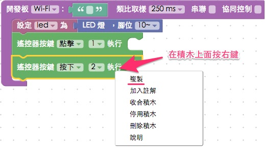
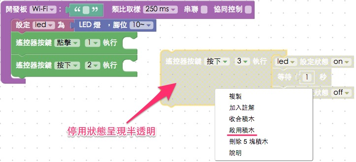
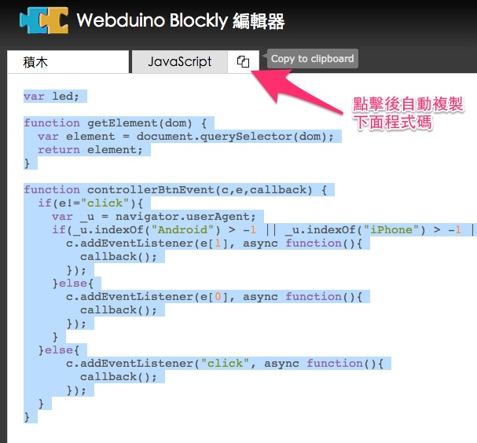
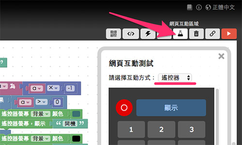
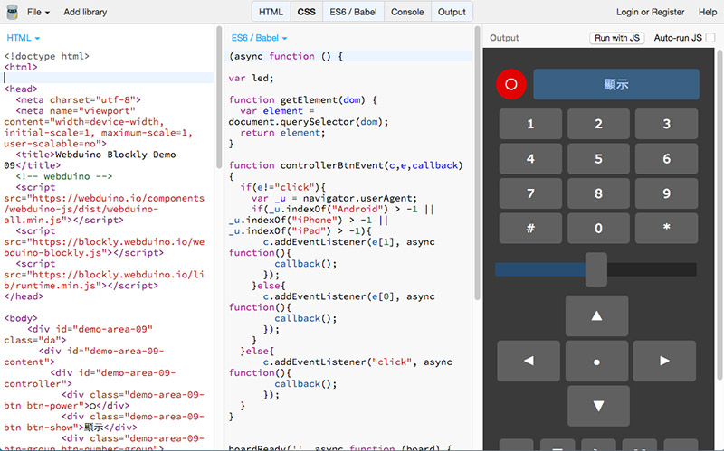
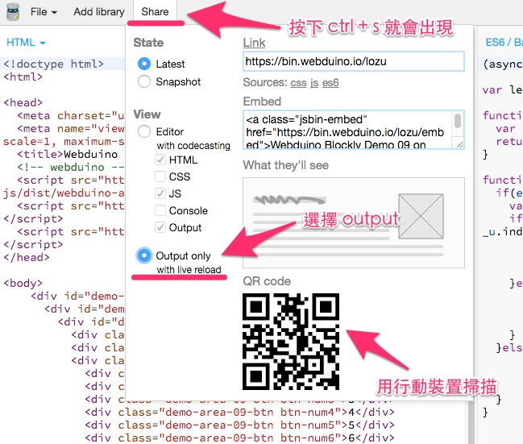

<!-- @@master  = ../../_layout.html-->

<!-- @@block  =  meta-->

<title>The 10 Most Useful Features of Webduino Blockly :::: Webduino = Web × Arduino</title>

<meta name="description" content="Webduino has been popular and widely enjoyed by all users since it's launch. Therefore, we are introducing the most useful features that we have yet to mention in the tutorials. This article will help you use the functions of Webduino Blockly better.">

<meta itemprop="description" content="Webduino has been popular and widely enjoyed by all users since it's launch. Therefore, we are introducing the most useful features that we have yet to mention in the tutorials. This article will help you use the functions of Webduino Blockly better.">

<meta property="og:description" content="Webduino has been popular and widely enjoyed by all users since it's launch. Therefore, we are introducing the most useful features that we have yet to mention in the tutorials. This article will help you use the functions of Webduino Blockly better.">

<meta property="og:title" content="The 10 Most Useful Features of Webduino Blockly" >

<meta property="og:url" content="https://webduino.io/tutorials/info-11-feature.html">

<meta property="og:image" content="https://webduino.io/img/tutorials/info-11-01s.jpg">

<meta itemprop="image" content="https://webduino.io/img/tutorials/info-11-01s.jpg">

<include src="../_include-tutorials.html"></include>

<!-- @@close-->

<!-- @@block  =  preAndNext-->

<include src="../_include-tutorials-content.html"></include>

<!-- @@close-->

<!-- @@block  =  tutorials-->
# The 10 Most Useful Features of Webduino Blockly

Webduino has been popular and widely enjoyed by all users since it's launch. Therefore, we are introducing the most useful features that we have yet to mention in the tutorials. This article will help you use the functions of Webduino Blockly better.

## 1. Shortcut Keys 

**Ctrl+Z (Undo)**: Undo the previous command.
**Ctrl+Shift+Z (Redo)**: Reverse the undo command.
**Ctrl+X (Cut)** : Remove the selected item and copy it to the clipboard.
**Ctrl+C (Copy)**: Copy the selected item to the clipboard.
**Ctrl+V (Paste)**: Paste the contents of the clipboard into the current page.
Note, if you are using a Mac operating system, you should replace Ctrl with Command.

## 2. Pause Blocks

You can pause some of the blocks on the current page without deleting them. While in development sometimes you need to delete blocks before testing. However, you can choose not to delete them but to right-click them and select "**Disable Block**". Just right-click and select "Enable block" to resume the block's function.

## 3. Save and Share File

Click the tab "Save and Link to Blocks" on the up-right hand side of the workspace and **the site URL will generate automatically**. Save the link to your bookmarks/favorite folder or share it with others. You will see the current page next time you open the browser. 

## 4. Convert Blocks to .PNG

You can **convert blocks to .PNG** by right-clicking in the workspace and choose "Download Image".

## 5. Copy All Codes 

You can **export all of your blocks to JavaScript** by clicking the tab "JavaScript". This is one of the most practical features of Webduino Blockly. And if you wish to edit codes in other editors, click "Copy to Clipboard". It is that easy to transport your work.

## 6. Web Demo Features 

Click "**Web Demo Area**"" on the up-right hand side of the workspace, and you can interact with your web browser. Each feature in the "Web Demo Area" drop-down list refers to a distinct block on the side menu. You can also find other examples for using remotes in the "Web Demo Area".

## 7. Check Device Status

There is a simple way to check the status of your device. Type in the name of your device in the upper right-hand button, and it will show it's status. Green means that device is online. Red means device is offline. 

## 8. Open Code Editor

Click "Open Code Editor" on the upper right-hand side of the workspace, and you can edit the code directly in the default code editor. This feature benefits advanced developers for editing codes easily.

## 9. Seamlessly Connect to Your Mobile Devices

Open the code editor, click "Share" on the upper left-hand side of the workspace, and choose "Output". (If you can't see "Share" on the menu, press Ctrl+S to make it appear.) Then scan the QRcode with your mobile device, and your device will become a remote control.

## 10. Support Node JS

Webduino Blockly is not only support by front-end operation but also by the NodeJS envirnment. You can also run Webduino Blockly in back-end operation by including the respective packages. 

Once you are familiar with all these features and the "Webduino Blockly Practice Examples", you will be an IoT expert!

<!-- @@close-->