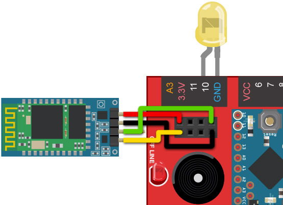
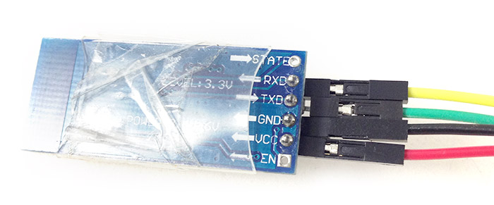
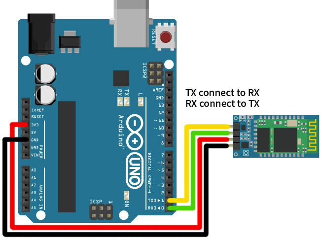
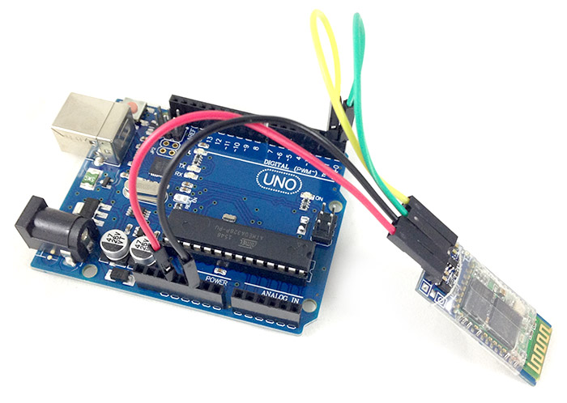
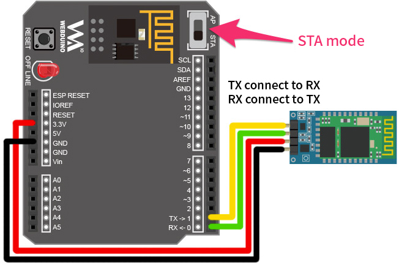
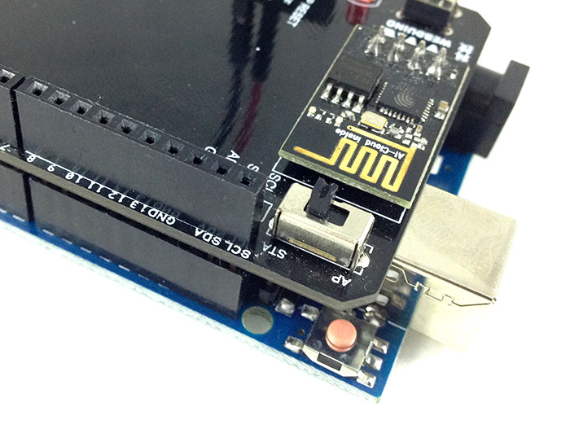
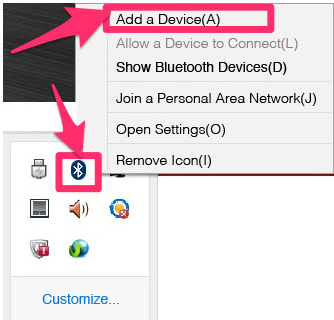
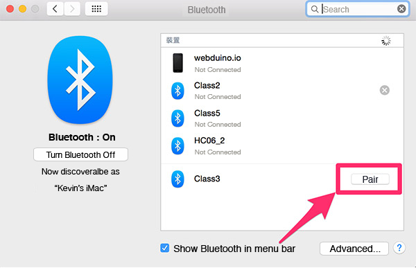
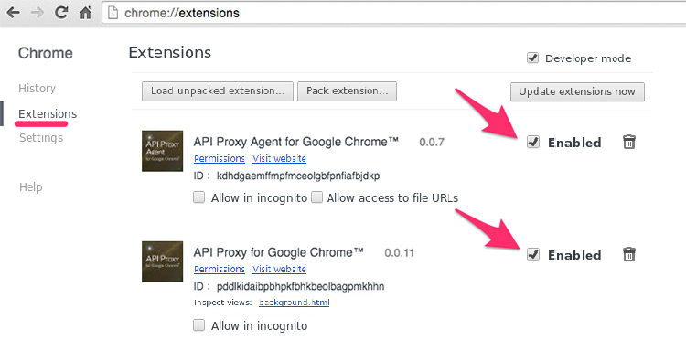
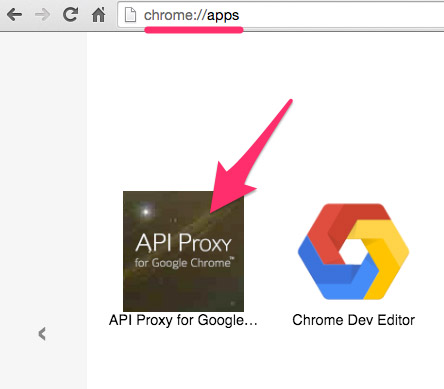

<!-- @@master  = ../../_layout.html-->

<!-- @@block  =  meta-->

<title>Webduino Bluetooth Control :::: Webduino = Web × Arduino</title>

<meta name="description" content="The Webduino development boards have been known for their “Wi-Fi control”, but they can also be connected via Bluetooth or Serial Port and still be operated by Webduino Blockly or JavaScript.  This tutorial demonstrates how to connect bluetooth modules (HC05, HC06) to the Webduino, and each of their individual setup and operation processes.">

<meta itemprop="description" content="The Webduino development boards have been known for their “Wi-Fi control”, but they can also be connected via Bluetooth or Serial Port and still be operated by Webduino Blockly or JavaScript.  This tutorial demonstrates how to connect bluetooth modules (HC05, HC06) to the Webduino, and each of their individual setup and operation processes.">

<meta property="og:description" content="The Webduino development boards have been known for their “Wi-Fi control”, but they can also be connected via Bluetooth or Serial Port and still be operated by Webduino Blockly or JavaScript.  This tutorial demonstrates how to connect bluetooth modules (HC05, HC06) to the Webduino, and each of their individual setup and operation processes.">

<meta property="og:title" content="Webduino Bluetooth Control" >

<meta property="og:url" content="https://webduino.io/tutorials/info-12-bluetooth.html">

<meta property="og:image" content="https://webduino.io/img/tutorials/info-12-01s.jpg">

<meta itemprop="image" content="https://webduino.io/img/tutorials/info-12-01s.jpg">

<include src="../_include-tutorials.html"></include>

<!-- @@close-->

<!-- @@block  =  preAndNext-->

<include src="../_include-tutorials-content.html"></include>

<!-- @@close-->

<!-- @@block  =  tutorials-->
# Webduino Bluetooth Control

The Webduino development boards have been known for their "Wi-Fi control", but they can also be connected via Bluetooth or Serial Port and still be operated by Webduino Blockly or JavaScript. This tutorial demonstrates how to connect bluetooth modules (HC05, HC06) to the Webduino, and each of their individual setup and operation processes.

Once you realize how to use it, you will experience the convenience and wonderful uses of Webduino, even without Wi-Fi, or with only the Arduino UNO on hand!

## Step 1. The Circuit

If we were to switch the Mark 1 board from using Wi-Fi to Bluetooth, first we would remove the esp8266 chip. Then you will see an 8-pin connector socket on the board, where the bluetooth module should be connected.

Using Dupont Lines, **connect VCC to the upper-left pin, GND to the lower-right one, TXD to the upper-right one, and RXD to the lower-left one**; do not connect the remaining 4 pins in the middle. Each pin is labeled for a particular function at the back of the bluetooth module.

If you only have the Arduino UNO board, **connect VCC on the bluetooth module to 3.3V on UNO, then connect GND to GND, RXD to TX (pin 1), and TXD to RX (pin 0).**

If you place the Webduino Fly onto the UNO, you need to **switch Webduino Fly to STA mode.**

## Step 2. Bluetooth Setup

After the bluetooth module connection is established, connect the power supply to a development board. To get started using Bluetooth, you'll **need to pair your bluetooth module with your Bluetooh-compatible computer**. Whether you are using the Mark 1, Arduino UNO, or Webduino Fly+UNO, connect the power supply and click the Bluetooth icon on the screen for detecting devices. If everything is setup correctly, you'll see a Bluetooth device name on the screen. For instance, the Bluetooth device name on my computer is "class3".

Bluetooth Pairing on Windows:

Bluetooth Pairing on Mac:

## Step 3. Changing Baud Rates

If this is the first time you are using the Bluetooth module, you will need to **set the baud rate of the module to 57600** (because the firmware of the Arduino is 57600).

## Step 4. Using Chrome Proxy API 

We are going to connect bluetooth modules and manipulate development boards through Webduino Blockly. These are delivered via Chrome Browser, so we will need to convert programming commands by means of Chrome Proxy API. Refer to the previous tutorial for setup: [Chrome API Proxy Installation Guide](info-05-chrome-api-proxy.html)

After finishing the setup, you'll see two activated programs in your Chrome Extensions.

Then, go to Chrome Apps and click the icon "API Proxy for Google Chrome".

You'll see the corresponding bluetooth address. Copy the address, which will be helpful for Bluetooth control later. Do not close API Proxy for Google Chrome, because it supports the communication conversion code.

## Step 5. Opening and Testing Webduino Blockly 

Make sure API Proxy for Google Chrome is open, then connect the long leg of an LED to pin 13, the short leg to GND (for the Mark 1 you can use pin 10 and GND). Then, open Webduino Blockly, and drop a development board into the work area. **Select "Bluetooth" in the drop-down menu**, paste the bluetooth address you copied earlier, and put LED blocks inside set to LED. Run the Blocks. After one or two seconds of bluetooth pairing, you'll see LED start to flash.

This tutorial has described how the Webduino board is controlled using bluetooth modules.  If you don't have Wi-Fi, or if you are only using the Arduino UNO, using this tutorial you can immediately experience the convenience and ease of Webduino!

<!-- @@close-->