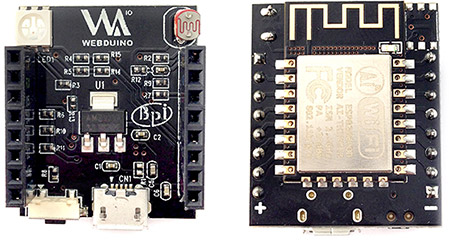
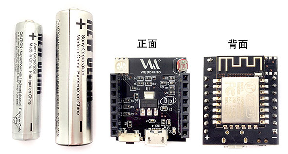
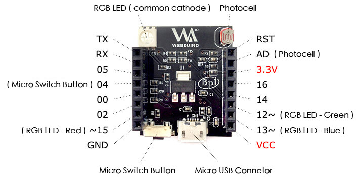

<!-- @@master  = ../../_layout.html-->

<!-- @@block  =  meta-->

<title>Introduction to Webduino Smart :::: Webduino = Web × Arduino</title>

<meta name="description" content="Webduino Smart is a ground-breaking development board. Unlike Webduino Mark 1 and Webduino Fly, which need to combine with Arduino boards, Webduino Smart can function with the Internet and WebSocket independantly. It will be a path to lead an efficient and effective development of IoT.">

<meta itemprop="description" content="Webduino Smart is a ground-breaking development board. Unlike Webduino Mark 1 and Webduino Fly, which need to combine with Arduino boards, Webduino Smart can function with the Internet and WebSocket independantly. It will be a path to lead an efficient and effective development of IoT.">

<meta property="og:description" content="Webduino Smart is a ground-breaking development board. Unlike Webduino Mark 1 and Webduino Fly, which need to combine with Arduino boards, Webduino Smart can function with the Internet and WebSocket independantly. It will be a path to lead an efficient and effective development of IoT.">

<meta property="og:title" content="Introduction to Webduino Smart" >

<meta property="og:url" content="https://webduino.io/tutorials/smart-01-information.html">

<meta property="og:image" content="https://webduino.io/img/tutorials/smart-01-information-s.jpg">

<meta itemprop="image" content="https://webduino.io/img/tutorials/smart-01-information-s.jpg">

<include src="../_include-tutorials.html"></include>

<!-- @@close-->

<!-- @@block  =  preAndNext-->

<include src="../_include-tutorials-content.html"></include>

<!-- @@close-->

<!-- @@block  =  tutorials-->
# Introduction to Webduino Smart

Webduino Smart is a ground-breaking development board. Unlike Webduino Mark 1 and Webduino Fly, which need to combine with Arduino boards, Webduino Smart can function with the Internet and WebSocket independantly. It will be a path to lead an efficient and effective development of IoT.

## The Appearence

Board dimensions: 3cm in length, 2.5cm in width, 1.3cm in height, and a weight of 85 grams. Digital pins: 0, 2, 4, 5, 14, and 16. 
PWM pins: 12, 13, 15. Analog Pin: AD (A0). 
Other pins: TX, RX, 3.3V, VCC, RST, and GRD.

The front and back images:

360 degree overview:

Reference with AA & AAA batteries:

 

## On-board Components and Pins

Webduino Smart has a photocell sensor, a RGB LED, and a micro switch button onboard. The photocell is connected to the AD pin, and the RGB (Red, Geen, Blue) LED is connected to pins 15, 12, and 13 respectively **(The LED is a common cathode, whereas most of the examples on this site use common anode RGB LED.)** And the micro switch button is connected to pin 4. Please take note when you use these pins.

 

## Webduino Series

From the left, Webduino Smart, Webduino Mark 1, and Webduino Fly.

<!-- @@close-->