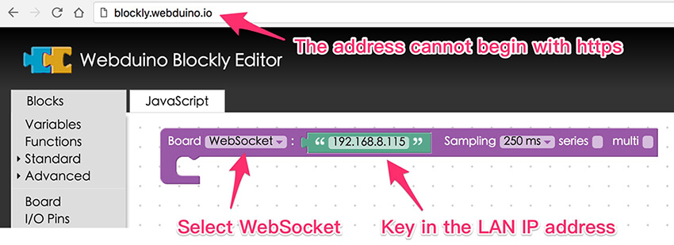

<!-- @@master  = ../../_layout.html-->

<!-- @@block  =  meta-->

<title>Using RGB LED with the Webduino Smart :::: Webduino = Web × Arduino</title>

<meta name="description" content="The Webduino Smart development board has a built-in micro RGB (red, green and blue) LED (common cathode). The default pin numbers for red, green, and blue are 15, 12, and 13 respectively. Therefore, Webduino Smart is able to create lights with various colors directly.">

<meta itemprop="description" content="The Webduino Smart development board has a built-in micro RGB (red, green and blue) LED (common cathode). The default pin numbers for red, green, and blue are 15, 12, and 13 respectively. Therefore, Webduino Smart is able to create lights with various colors directly.">

<meta property="og:description" content="The Webduino Smart development board has a built-in micro RGB (red, green and blue) LED (common cathode). The default pin numbers for red, green, and blue are 15, 12, and 13 respectively. Therefore, Webduino Smart is able to create lights with various colors directly.">

<meta property="og:title" content="Using RGB LED with the Webduino Smart" >

<meta property="og:url" content="https://webduino.io/tutorials/smart-03-rgbled.html">

<meta property="og:image" content="https://webduino.io/img/tutorials/smart-03-rgbled-s.jpg">

<meta itemprop="image" content="https://webduino.io/img/tutorials/smart-03-rgbled-s.jpg">

<include src="../_include-tutorials.html"></include>

<!-- @@close-->

<!-- @@block  =  preAndNext-->

<include src="../_include-tutorials-content.html"></include>

<!-- @@close-->

<!-- @@block  =  tutorials-->
# Using RGB LED with the Webduino Smart

The Webduino Smart development board has a built-in micro RGB (red, green and blue) LED (common cathode). The default pin numbers for red, green, and blue are 15, 12, and 13 respectively. Therefore, Webduino Smart is able to create lights with various colors directly.

	Kits with RGB LED: <a href="https://webduino.io/buy/webduino-package-plus.html" target="_blank">Webduino kit Plus (with support for the Mark 1 and Webduino Fly)</a>
	Webduino development board: <a href="https://webduino.io/buy/component-webduino-v1.html" target="_blank">Webduino Mark 1</a>, <a href="https://webduino.io/buy/component-webduino-fly.html" target="_blank">Webduino Fly</a>, <a href="https://webduino.io/buy/component-webduino-uno-fly.html" target="_blank">Webduino Fly + Arduino UNO</a>

## Instruction of Webduino Blockly 

First, add a "Smart" block from the "Board" menu and select "WebSocket". ( **the web address of the webduino blockly must begin with http and not https** )Then, key in the IP address of development board. (please refer to [Webduino Smart WiFi Setup](smart-02-setup.html) for the IP address) 

Add a RGB LED (common cathode) block from the "Components" menu. Set the pin numbers to 15 for red, 12 for green, and 13 for blue.  

Under the Web Demo menu add "Click Button, Do" blocks to the stack. Then connect "RGBLED Set Color" blocks to those. Select different colors in the blocks for the buttons 1 through 5. 

Click the red "Run Blocks" button when you want to run the stack. When you click different buttons in the Web Demo area, different colors will light up on your Webduino.
(Check your stack setup with this example here: [http://blockly.webduino.io/?lang=en#-KWG5MKjmhZhFnTOAEwj](http://blockly.webduino.io/?lang=en#-KWG5MKjmhZhFnTOAEwj))

 

## Code Explanation

Include `webduino-all.min.js` in the header of HTML. The purpose is to allow the browser to support all the components of Web Components and Webduino. If the JavaScript is created by Blockly editing tools, `webduino-blockly.js` should be included.

	
	

JavaScript follows WebSocket mode: `{transport: 'websocket', url: '192.168.8.115'}` The rest of this part is selecting JavaScript for controlling colors through "Click Button". 

	var rgbled;

	boardReady({transport: 'websocket', url: '192.168.8.115'}, function (board) {
	  board.systemReset();
	  board.samplingInterval = 250;
	  rgbled = getRGBLedCathode(board, 15, 12, 13);
	  document.getElementById("demo-area-05-btn1").addEventListener("click",function(){
	    rgbled.setColor('#ff0000');
	  });
	  document.getElementById("demo-area-05-btn2").addEventListener("click",function(){
	    rgbled.setColor('#009900');
	  });
	  document.getElementById("demo-area-05-btn3").addEventListener("click",function(){
	    rgbled.setColor('#3333ff');
	  });
	  document.getElementById("demo-area-05-btn4").addEventListener("click",function(){
	    rgbled.setColor('#ffcc33');
	  });
	  document.getElementById("demo-area-05-btn5").addEventListener("click",function(){
	    rgbled.setColor('#000000');
	  });
	});

That's it for Using RGB LED with the Webduino Smart    
Webduino Bin: [http://bin.webduino.io/nibux/edit?html,css,js,output](http://bin.webduino.io/nibux/edit?html,css,js,output)     
Stack setup: [http://blockly.webduino.io/?lang=en#-KWGDwZEkSfZmsV_hKny](http://blockly.webduino.io/?lang=en#-KWGDwZEkSfZmsV_hKny)

	Kits with RGB LED: <a href="https://webduino.io/buy/webduino-package-plus.html" target="_blank">Webduino kit Plus (with support for the Mark 1 and Webduino Fly)</a>
	Webduino development board: <a href="https://webduino.io/buy/component-webduino-v1.html" target="_blank">Webduino Mark 1</a>, <a href="https://webduino.io/buy/component-webduino-fly.html" target="_blank">Webduino Fly</a>, <a href="https://webduino.io/buy/component-webduino-uno-fly.html" target="_blank">Webduino Fly + Arduino UNO</a>

<!-- @@close-->