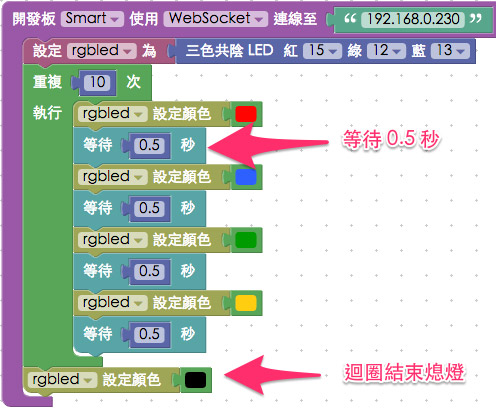

<!-- @@master  = ../../_layout.html-->

<!-- @@block  =  meta-->

<title>Dancing RGB LED with the Webduino Smart :::: Webduino = Web × Arduino</title>

<meta name="description" content="We have learned how to use the RGB LED with the Webduino Smart. In this tutorial, we will be using “Delay” and “Loop” blocks to have the RGB LED flash like a dance club light.">

<meta itemprop="description" content="We have learned how to use the RGB LED with the Webduino Smart. In this tutorial, we will be using “Delay” and “Loop” blocks to have the RGB LED flash like a dance club light.">

<meta property="og:description" content="We have learned how to use the RGB LED with the Webduino Smart. In this tutorial, we will be using “Delay” and “Loop” blocks to have the RGB LED flash like a dance club light.">

<meta property="og:title" content="Dancing RGB LED with the Webduino Smart" >

<meta property="og:url" content="https://webduino.io/tutorials/smart-04-rgbled.html">

<meta property="og:image" content="https://webduino.io/img/tutorials/smart-04-rgbled-s.jpg">

<meta itemprop="image" content="https://webduino.io/img/tutorials/smart-04-rgbled-s.jpg">

<include src="../_include-tutorials.html"></include>

<!-- @@close-->

<!-- @@block  =  preAndNext-->

<include src="../_include-tutorials-content.html"></include>

<!-- @@close-->

<!-- @@block  =  tutorials-->
# Dancing RGB LED with the Webduino Smart

We have learned [Using RGB LED with the Webduino Smart](smart-03-rgbled.html). In this tutorial, we will be using "Delay" and "Loop" blocks to have the RGB LED flash like a dance club light. 

	Kits with RGB LED: <a href="https://webduino.io/buy/webduino-package-plus.html" target="_blank">Webduino kit Plus (with support for the Mark 1 and Webduino Fly)</a>
	Webduino development board: <a href="https://webduino.io/buy/component-webduino-v1.html" target="_blank">Webduino Mark 1</a>、<a href="https://webduino.io/buy/component-webduino-fly.html" target="_blank">Webduino Fly</a>、<a href="https://webduino.io/buy/component-webduino-uno-fly.html" target="_blank">Webduino Fly + Arduino UNO</a>

## Instructions for using Webduino Blockly

First, place a "Board" block onto the workspace, choose WebSocket in the drop-down list, and fill in the IP address of your board. **Remember to use "http" protocol when you are using WebSocket, not "https".**

Add a RGB LED (common cathode) block from the "Components" menu to the stack. Set the pin numbers to 15 for red, 12 for green, and 13 for blue.

Add a "Repeat / do" block to the stack, and set the time of repeat to 10.

Add "Delay seconds" blocks in the loop, and set the delay times to 0.5 second, causing the RGB LED to change the color every 0.5 second. The loop will only run 10 times. We can turn off the LED by setting the color black once the loop finishes.

 

Click the red "Run Blocks" button when you want to run the stack. Now the RGB LED will switch colors automatically. Check your stack setup with this example here: [http://blockly.webduino.io/?lang=en#-KZtF0951DDGmhybbOHB](http://blockly.webduino.io/?lang=en#-KZtF0951DDGmhybbOHB)

 

## Instructions for using the Webduino Blockly

Include `webduino-all.min.js` in the header of HTML. The purpose is to allow the browser to support all the components of Web Components and Webduino. If the JavaScript is created by Blockly editing tools, `webduino-blockly.js` should be included.

	
	

JavaScript follows WebSocket mode: `{transport: 'websocket', url: '192.168.8.115'}` and we use `awit` to implement delay.

	(async function () {

	var rgbled;

	boardReady({transport: 'websocket', url: '192.168.8.115'}, async function (board) {
	  board.systemReset();
	  board.samplingInterval = 250;
	  rgbled = getRGBLedCathode(board, 15, 12, 13);
	  for (var count = 0; count < 10; count++) {
	    rgbled.setColor('#ffcc33');
	    await delay(0.5);
	    rgbled.setColor('#ff0000');
	    await delay(0.5);
	    rgbled.setColor('#3333ff');
	    await delay(0.5);
	    rgbled.setColor('#009900');
	    await delay(0.5);
	  }
	  rgbled.setColor('#000000');
	});

	}());

That's it for changing RGB LED colors with the Webduino Smart.
Webduino Bin: [http://bin.webduino.io/qivuj/edit?html,css,js,output](http://bin.webduino.io/qivuj/edit?html,css,js,output)
Stack setup: [http://blockly.webduino.io/?lang=en#-KZtFRWrm6B2sJqRZ94Y](http://blockly.webduino.io/?lang=en#-KZtFRWrm6B2sJqRZ94Y)

	Kits with RGB LED: <a href="https://webduino.io/buy/webduino-package-plus.html" target="_blank">Webduino kit Plus (with support for the Mark 1 and Webduino Fly)</a>
	Webduino development board: <a href="https://webduino.io/buy/component-webduino-v1.html" target="_blank">Webduino Mark 1</a>、<a href="https://webduino.io/buy/component-webduino-fly.html" target="_blank">Webduino Fly</a>、<a href="https://webduino.io/buy/component-webduino-uno-fly.html" target="_blank">Webduino Fly + Arduino UNO</a>

<!-- @@close-->