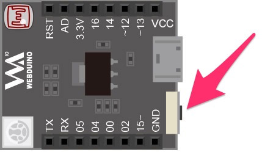

<!-- @@master  = ../../_layout.html-->

<!-- @@block  =  meta-->

<title>Button Switch of the Webduino Smart
 :::: Webduino = Web × Arduino</title>

<meta name="description" content="There is a built-in Micro button switch on the side of the Webduino Smart. We can use this button switch to execute “Pressed”, “Released”, or “Long-pressed” actions to further control electronic components or HTML elements.">

<meta itemprop="description" content="There is a built-in Micro button switch on the side of the Webduino Smart. We can use this button switch to execute “Pressed”, “Released”, or “Long-pressed” actions to further control electronic components or HTML elements.">

<meta property="og:description" content="There is a built-in Micro button switch on the side of the Webduino Smart. We can use this button switch to execute “Pressed”, “Released”, or “Long-pressed” actions to further control electronic components or HTML elements.">

<meta property="og:title" content="Button Switch of the Webduino Smart" >

<meta property="og:url" content="https://webduino.io/tutorials/smart-06-button.html">

<meta property="og:image" content="https://webduino.io/img/tutorials/smart-06-button-s.jpg">

<meta itemprop="image" content="https://webduino.io/img/tutorials/smart-06-button-s.jpg">

<include src="../_include-tutorials.html"></include>

<!-- @@close-->

<!-- @@block  =  preAndNext-->

<include src="../_include-tutorials-content.html"></include>

<!-- @@close-->

<!-- @@block  =  tutorials-->
# Button Switch of the Webduino Smart

There is a built-in Micro button switch on the side of the Webduino Smart. We can use this button switch to execute "Pressed", "Released", or "Long-pressed" actions to further control electronic components or HTML elements.

The button switch is connected to pin 4 by default. Pin 4 can be used for signal output when the button switch is not in use.

<!-- 

	按鈕開關相關套件：<a href="https://webduino.io/buy/webduino-package-plus.html" target="_blank">Webduino 基本套件 Plus ( 支援馬克 1 號、Fly )</a>
	Webduino 開發板：<a href="https://webduino.io/buy/component-webduino-v1.html" target="_blank">Webduino 馬克一號</a>、<a href="https://webduino.io/buy/component-webduino-fly.html" target="_blank">Webduino Fly</a>、<a href="https://webduino.io/buy/component-webduino-uno-fly.html" target="_blank">Webduino Fly + Arduino UNO</a>

 -->

## Instructions for using the Webduino Blockly

Open the [Webduino Blockly editor](https://blockly.webduino.io/index.html?lang=en). First, place a "Board" block onto the workspace, choose WebSocket in the drop-down list, and fill in the IP address of your board. **Remember to use the "http" protocol when you are using WebSocket, not "https".**

Add a "Button switch" block to the stack and set the pin to 4. The button switch on Smart is a pull-up button switch. 

Place three "When button / do" blocks into the stack. Then set three situations for when the button is "Pressed", "Released", and "Long Pressed". The corresponding text will show in the Web Demo Area.    

Click the red "Run Blocks" button to run the stack. When you long press the button switch, you will see the number in Web Demo Area change. (Check your stack setup with this example here: [http://blockly.webduino.io/?lang=en&tags=smart#-KZtXIhS8ixkzhWZ12qW](http://blockly.webduino.io/?lang=en&tags=smart#-KZtXIhS8ixkzhWZ12qW))

 

## Code Explanation

Include `webduino-all.min.js` in the header of HTML. The purpose is to allow the browser to support all the components of Web Components and Webduino. If the JavaScript is created by Blockly editing tools, `webduino-blockly.js` should be included.

	
	

We use WebSocket transport: `{transport: 'websocket', url: '192.168.8.115'}` here, with `.on()` to start listening to events. When it receives `pressed`, it means the button is pressed; When it receives `released`, it means the button is released; and when it receives `longPress`, it means the button is long-pressed. The function parameter after the event name is the callback that will be executed.

	var button;

	boardReady({board: 'Smart', transport: 'websocket', url: '192.168.8.115'}, function (board) {
	  board.systemReset();
	  board.samplingInterval = 50;
	  button = getPullupButton(board, 4);
	  button.on("pressed", function(){
	    console.log("pressed");
	      document.getElementById("demo-area-01-show").innerHTML = 'pressed';

	  });
	  button.on("released", function(){
	    console.log("released");
	      document.getElementById("demo-area-01-show").innerHTML = 'released';

	  });
	  button.on("longPress", function(){
	    console.log("longPress");
	      document.getElementById("demo-area-01-show").innerHTML = 'longPress';

	  });
	});

That's it for using button saitchl with the Webduino Smart.
Webduino Bin: [http://bin.webduino.io/zuyug/edit?html,js,output](http://bin.webduino.io/zuyug/edit?html,js,output)
Stack setup: [http://blockly.webduino.io/?lang=en&tags=smart#-KZtXIhS8ixkzhWZ12qW](http://blockly.webduino.io/?lang=en&tags=smart#-KZtXIhS8ixkzhWZ12qW)

<!-- 

	按鈕開關相關套件：<a href="https://webduino.io/buy/webduino-package-plus.html" target="_blank">Webduino 基本套件 Plus ( 支援馬克 1 號、Fly )</a>
	Webduino 開發板：<a href="https://webduino.io/buy/component-webduino-v1.html" target="_blank">Webduino 馬克一號</a>、<a href="https://webduino.io/buy/component-webduino-fly.html" target="_blank">Webduino Fly</a>、<a href="https://webduino.io/buy/component-webduino-uno-fly.html" target="_blank">Webduino Fly + Arduino UNO</a>

 -->

<!-- @@close-->