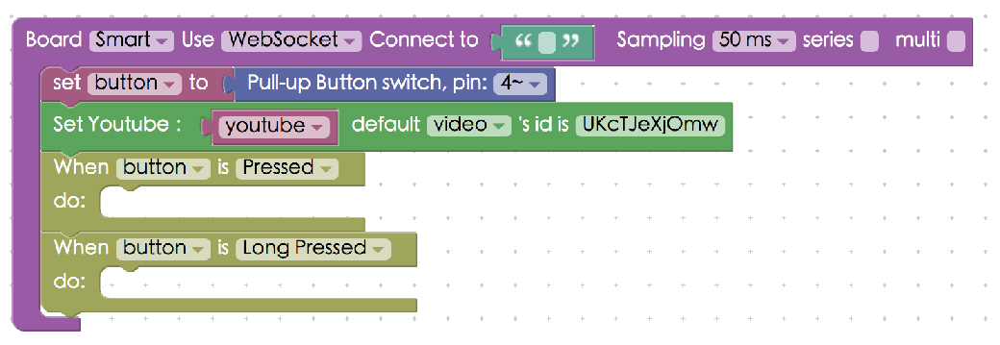
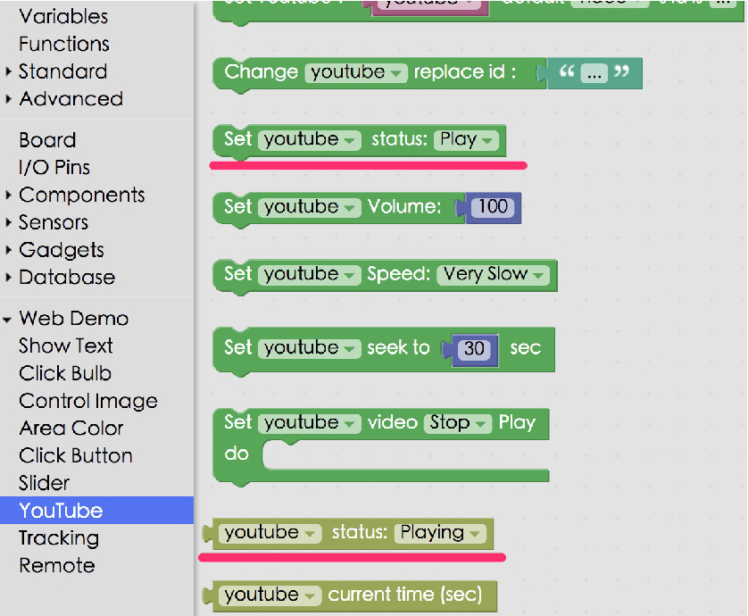
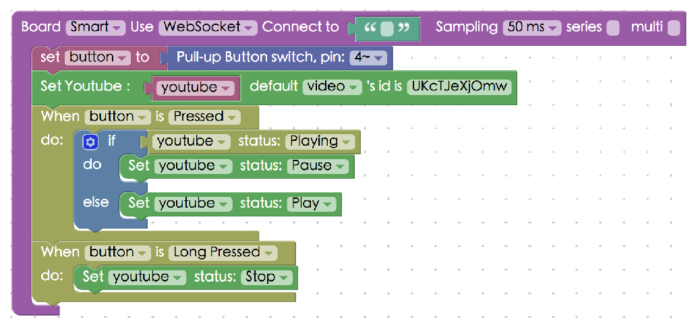
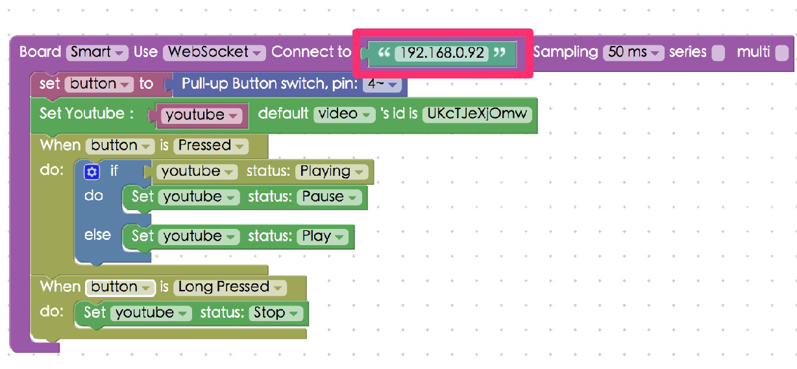
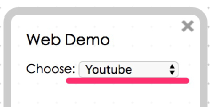

<!-- @@master  = ../../_layout.html-->

<!-- @@block  =  meta-->

<title>Using a Button Switch for Playing Youtube Videos :::: Webduino = Web × Arduino</title>

<meta name="description" content="In the previous tutorial, we learned the basic functions of the button switch with Webduino Smart. In this tutorial, we are going to learn an advanced application for the button switch, playing Youtube videos.">

<meta itemprop="description" content="In the previous tutorial, we learned the basic functions of the button switch with Webduino Smart. In this tutorial, we are going to learn an advanced application for the button switch, playing Youtube videos.">

<meta property="og:description" content="In the previous tutorial, we learned the basic functions of the button switch with Webduino Smart. In this tutorial, we are going to learn an advanced application for the button switch, playing Youtube videos.">

<meta property="og:title" content="Using a Button Switch for Playing Youtube Videos" >

<meta property="og:url" content="https://webduino.io/tutorials/smart-07-button-youtube.html">

<meta property="og:image" content="https://webduino.io/img/tutorials/smart-07-button-youtube-s.jpg">

<meta itemprop="image" content="https://webduino.io/img/tutorials/smart-07-button-youtube-s.jpg">

<include src="../_include-tutorials.html"></include>

<!-- @@close-->

<!-- @@block  =  preAndNext-->

<include src="../_include-tutorials-content.html"></include>

<!-- @@close-->

<!-- @@block  =  tutorials-->
# Using a Button Switch for Playing Youtube Videos

In the previous tutorial, we learned the basic functions of the button switch with Webduino Smart. In this tutorial, we are going to learn an advanced application for the button switch, playing Youtube videos.

<!-- 

	按鈕開關相關套件：<a href="https://webduino.io/buy/webduino-package-plus.html" target="_blank">Webduino 基本套件 Plus ( 支援馬克 1 號、Fly )</a>
	Webduino 開發板：<a href="https://webduino.io/buy/component-webduino-v1.html" target="_blank">Webduino 馬克一號</a>、<a href="https://webduino.io/buy/component-webduino-fly.html" target="_blank">Webduino Fly</a>、<a href="https://webduino.io/buy/component-webduino-uno-fly.html" target="_blank">Webduino Fly + Arduino UNO</a>

 -->

## Instructions for using the Webduino Blockly

Open the [Webduino Blockly editor](https://blockly.webduino.io/index.html?lang=en). First, place a "Board" block onto the workspace, choose WebSocket in the drop-down list, and fill in the IP address of your board. **Remember to use the "http" protocol when you are using WebSocket, not "https".**

Add a "Button switch" block to the stack and set the pin to 4. Because the button switch on the Smart is a "pull-up" button switch, use the "Pull-up button switch" block.

Since we will need to import a Youtube video, add the "Set youtube" block from the "Web Demo" menu into the stack.  

To import the video, we need to know its ID. Open a Youtube video, and copy the text after "?v=", this is the video's ID. The "?v=" should not be included in the ID.

 

Paste the ID into the ID box in the Youtube block.

Add two "When button" blocks in the stack. We only need to set up two different situations, one is for when the button is "pressed", and the other is when it is "long pressed".

To create a logic process, add "Set youtube status" and "Youtube status" blocks to the stack.

It is a simple logic process; when the button is pressed, the video will play if it is not playing. And it will pause if the video if it is playing.

Open the Web Demo Area, and choose Youtube in the drop-down list. Click the red "Run Blocks" button to run the stack, and you will see the Youtube video imported and start to play. Then you can control the video by pressing the button. (Check your stack setup with this example here: [http://blockly.webduino.io/?lang=en&tags=smart#-KZtiB8OL4LxIj6wSLoP](http://blockly.webduino.io/?lang=en&tags=smart#-KZtiB8OL4LxIj6wSLoP))

 

## Instructions for using the Webduino Blockly

Include `webduino-all.min.js` in the header of HTML. The purpose is to allow the browser to support all the components of Web Components and Webduino. If the JavaScript is created by Blockly editing tools, `webduino-blockly.js` should be included.

	
	

First of all, in HTML, we use a div with id="youtube" as the placeholder for the video that we will embed later on.

	

JavaScript codes starting with `boardReady` are basically the same, so we will start with the key parts that can be divided into sections.

In the first section, we load the Youtube module with the official JavaScript API, including parameters for width, height, autoPlay, and player control. The `events` object handles which video to play when the module is ready (with function `onReady()`), or what we want to do when the player's state is changed. (with function `onPlayerStateChange()`)

	var youtubePlay, youtubeStop, youtubePause;
	await new Promise(function (resolve) {
	  var tag = document.createElement("script");
	  tag.src = "https://www.youtube.com/iframe_api";
	  var scptTag = document.getElementsByTagName("script")[0];
	  scptTag.parentNode.insertBefore(tag, scptTag);
	  window.onYouTubeIframeAPIReady = function () {
	    youtube = new YT.Player("player", {
	      height: "240",
	      width: "96%",
	      playerVars: {
	        autoplay: 1,
	        controls: 1
	      },
	      events: {
	        onReady: function (evt) {
	          youtube.loadVideoById({
	            videoId:"UKcTJeXjOmw"
	          });
	          resolve();
	        },
	        onStateChange: onPlayerStateChange
	      }
	    });
	  };
	});

	function onPlayerStateChange(event) {
	  if(event.data == youtubeStop) {
	    youtubeStopCallback();
	  }else if(event.data == youtubePlay){
	    youtubePlayCallback();
	  }else if(event.data == youtubePause){
	    youtubePauseCallback();
	  }
	};

When a button is pressed, video will react the corresponding event, which is set in the `youtube.getPlayerState()`.

	button.on("pressed", async function(){
	  console.log("pressed");
	    if (youtube.getPlayerState() == 1) {
	    youtube.pauseVideo();
	  } else {
	    youtube.playVideo();
	  }

	});
	button.on("longPress", async function(){
	  console.log("longPress");
	    youtube.seekTo(0);
	  youtube.stopVideo();

	});

This is for playing Youtube video with a micro button switch of Webduino Smart. 
Webduino Bin: [http://bin.webduino.io/cute/edit?html,js,output](http://bin.webduino.io/cute/edit?html,js,output)
Stack Setup: [http://blockly.webduino.io/?lang=en&tags=smart#-KZtjXkX58sVSg4PhI9Q](http://blockly.webduino.io/?lang=en&tags=smart#-KZtjXkX58sVSg4PhI9Q)

<!-- 

	按鈕開關相關套件：<a href="https://webduino.io/buy/webduino-package-plus.html" target="_blank">Webduino 基本套件 Plus ( 支援馬克 1 號、Fly )</a>
	Webduino 開發板：<a href="https://webduino.io/buy/component-webduino-v1.html" target="_blank">Webduino 馬克一號</a>、<a href="https://webduino.io/buy/component-webduino-fly.html" target="_blank">Webduino Fly</a>、<a href="https://webduino.io/buy/component-webduino-uno-fly.html" target="_blank">Webduino Fly + Arduino UNO</a>

 -->

<!-- @@close-->