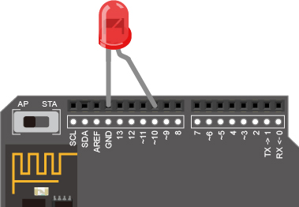
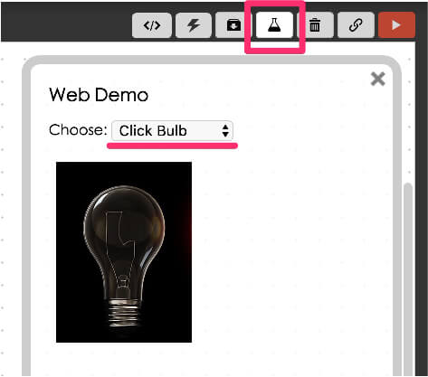
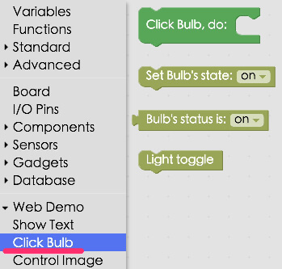
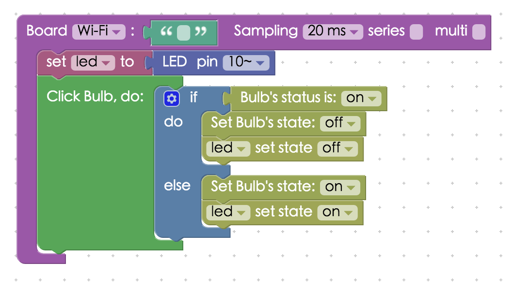

<!-- @@master  = ../../_layout.html-->

<!-- @@block  =  meta-->

<title>Project Example 1: Control a Single LED :::: Webduino = Web × Arduino</title>

<meta name="description" content="Controlling a single LED is easy and also useful for observing any programming mistakes. Therefore, we use the LED as our first Webduino tutorial.">

<meta itemprop="description" content="Controlling a single LED is easy and also useful for observing any programming mistakes. Therefore, we use the LED as our first Webduino tutorial.">

<meta property="og:description" content="Controlling a single LED is easy and also useful for observing any programming mistakes. Therefore, we use the LED as our first Webduino tutorial.">

<meta property="og:title" content="Project Example 1: Control a Single LED" >

<meta property="og:url" content="https://webduino.io/tutorials/tutorial-01-led.html">

<meta property="og:image" content="https://webduino.io/img/tutorials/tutorial-01-01s.jpg">

<meta itemprop="image" content="https://webduino.io/img/tutorials/tutorial-01-01s.jpg">

<include src="../_include-tutorials.html"></include>

<!-- @@close-->

<!-- @@block  =  preAndNext-->

<include src="../_include-tutorials-content.html"></include>

<!-- @@close-->

<!-- @@block  =  tutorials-->
# Project Example 1: Control a Single LED

Controlling a single LED is easy and also useful for observing any programming mistakes. Therefore, we use the LED as our first Webduino tutorial. 

## Video Tutorial

<!-- Open the Webduino Blockly for exclusive use of Project Example: [Webduino Blockly Chapter 1-2 : Click the image control LED](https://blockly.webduino.io/?lang=en&&page=tutorials/led-2#-KTOLwx9N81L7ng_37l4)   -->

Watch the video tutorial here:
<iframe class="youtube" src="https://www.youtube.com/embed/8k6Lqu-aqVM" frameborder="0" allowfullscreen></iframe>

## Wiring and Practice

There are long and short legs on an LED. The long leg should be connected to a "high potential" (a position with a number) and the short leg should be connect to a "low potential" (the GND or Ground). The only setup needed is to plug the LED legs into their positions on the Webduino board or with a breadboard or breadline. **Here the long leg goes into 10 and the short leg goes into GND.**

Webduino Mark 1 Circuit diagram:

Webduino Fly Circuit diagram:

Reference image:

## Instructions for using the Webduino Blockly

Open Webdunio Blockly: [https://blockly.webduino.io/?lang=en](https://blockly.webduino.io/?lang=en) For this tutorial, we will use a picture of a light bulb to control the LED. First, click the "Web Demo Area" button on the upper right side of the workspace. Then, select "Click Bulb" from the drop-down menu. A webpage with choices of light bulbs will appear.

Drag a "Board" block from the side menu into the workspace. Then type in the name of your Webduino board. Next, find the "Set LED" block under the "Components" menu and drop the block into the blank connection of "Board" block. Then set the "pin" to 10 (because the LED's long leg was connected to pin 10)  

The LED has to interact with a web page, so select "Click Bulb" under the "Web Demo Area" menu in the sidebar and drag the "Click Bulb", do block to the workspace. This is so you can switch the LED light on and off when you click the picture of the light bulb.

Now, find an "If / Do" logic block under the "Standard" menu and add it to the stack. This will create an "If / then" action for when the "Light Bulb" is clicked. You can edit the "Logic" options clicking the blue gear on the "If / Do" logic block.

If you use the setup shown below, when the "Bulb" is "on", the "Click Bulb" will turn off. When the "Bulb" is off, the "Click Bulb" will turn on. 

After you finish creating the block stack, check your device's status (Check [device's Status](https://webduino.io/device.html)) before you press the button "Run Blocks" on the upper right hand side.

You can easily control the intensity of the LED by clicking the picture of the light bulb in the "Web Demo Area". You can also select the "JavaScript" tab to review the original codes. Copy the codes and paste them to your own code editor and you can do the same exercise. 
Check your stack setup with this example here: [https://blockly.webduino.io/?lang=en#-KTONX73Xz695wEu03DI](https://blockly.webduino.io/?lang=en#-KTONX73Xz695wEu03DI)

## Code Explanation ([Check Webduino Bin](http://bin.webduino.io/nixad/edit?html,css,js,output), [Check Device Status](https://webduino.io/device.html))

Include `webduino-all.min.js` in the header of your html files in order to support all of the Webduino's components. If the codes are generated by Webduino Blockly, you also have to include `webduino-blockly.js` in your files.

	
	

In the body of HTML, insert a div for placing images with the ID: "demo-area-02-light". In order to show the light bulb changing, there are 2 images of light bulbs; one with the light on and the other on with the light off.

	

	  
	  
	

We use the CSS rule `display:none` to control the light-on and light-off images. Below are the CSS codes.

	#demo-area-02-light img{
	  height:200px;
	  display:none;
	}
	#demo-area-02-light.on #demo-area-02-on{
	  display:inline-block;
	}
	#demo-area-02-light.off #demo-area-02-off{
	  display:inline-block;
	}

For the most critical JavaScript step we start by using `boardReady()`. The callback function will be executed when the board goes on-line. Then, you must set up a variable named led and use `getLed()` to set the pin number to 10. Finally, bind the event by clicking the images to control the LED with its API.

	var led;

	boardReady('', function (board) {
	  board.samplingInterval = 20;
	  led = getLed(board, 10);
	  document.getElementById("demo-area-02-light").addEventListener("click",function(){
	    if (document.getElementById("demo-area-02-light").className == "on") {
	      document.getElementById("demo-area-02-light").className = "off";
	      led.off();
	    } else {
	      document.getElementById("demo-area-02-light").className = "on";
	      led.on();
	    }
	  });
	});

Because codes are automatically generated by Webduino Blockly, there might be some duplicated and superfluous codes. To simplify the codes, we replaced `document.getElementById("demo­area­02­light")` with one single variable: light.

	var led;
	var light;

	boardReady('', function (board) {
	  board.samplingInterval = 20;
	  led = getLed(board, 10);
		light = document.getElementById("demo-area-02-light");
	  light.addEventListener("click",function(){
	    if (light.className == "on") {
	      light.className = "off";
	      led.off();
	    } else {
	      light.className = "on";
	      led.on();
	    }
	  });
	});

This was the example of how to control an LED by clicking the picture of a light bulb. We hope you enjoyed it!
Webduino Bin: [http://bin.webduino.io/nixad/edit?html,css,js,output](http://bin.webduino.io/nixad/edit?html,css,js,output)  
Stack setup: [https://blockly.webduino.io/?lang=en#-KTOMwa9xRlCNapn4VUe](https://blockly.webduino.io/?lang=en#-KTOMwa9xRlCNapn4VUe)

<!-- ## Extension Tutorials of LED

[Webduino Blockly Chapter 1-1: LED ON](https://blockly.webduino.io/?lang=en&page=tutorials/led-1#-KTOMd8SXBiiJ21hoifg)  
[Webduino Blockly Chapter 1-2: Click the image control LED](https://blockly.webduino.io/?lang=en&page=tutorials/led-2#-KTOMnwjhojfCNNtlYue) -->

<!-- @@close-->