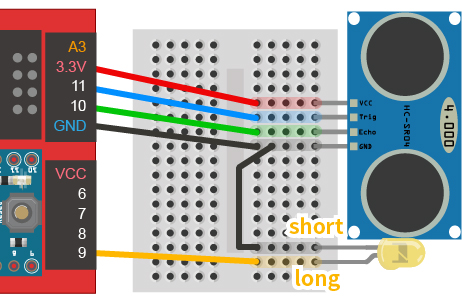
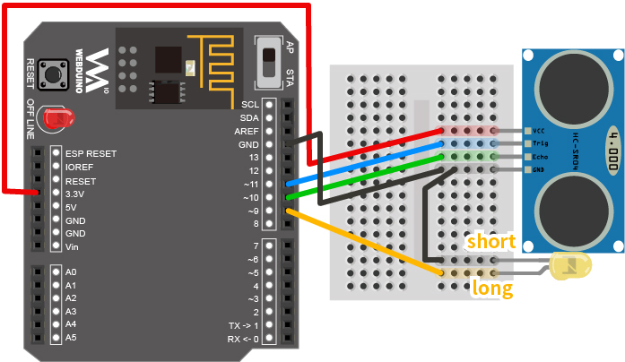
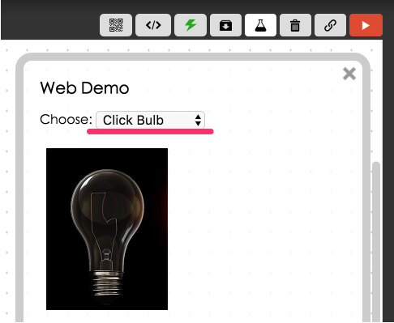

<!-- @@master  = ../../_layout.html-->

<!-- @@block  =  meta-->

<title>Project Example 7: Controlling LEDs with an Ultrasonic sensor :::: Webduino = Web × Arduino</title>

<meta name="description" content="For anyone writing C/C++ on Arduino, controlling an LED with an Ultrasonic sensor would be a no brainer, but connecting it to web? That's another story!If you've followed through the previous tutorials and have a good grasp on how the sensors work, you should be able to manipulate an LED with an Ultrasonic sensor pretty easily. Since everything is connected through the internet, whenever there is an action, the webpage you are interacting with will react such as changing the size of an image. This creates many possibilities  for future projects!">

<meta itemprop="description" content="For anyone writing C/C++ on Arduino, controlling an LED with an Ultrasonic sensor would be a no brainer, but connecting it to web? That's another story!If you've followed through the previous tutorials and have a good grasp on how the sensors work, you should be able to manipulate an LED with an Ultrasonic sensor pretty easily. Since everything is connected through the internet, whenever there is an action, the webpage you are interacting with will react such as changing the size of an image. This creates many possibilities  for future projects!">

<meta property="og:description" content="For anyone writing C/C++ on Arduino, controlling an LED with an Ultrasonic sensor would be a no brainer, but connecting it to web? That's another story!If you've followed through the previous tutorials and have a good grasp on how the sensors work, you should be able to manipulate an LED with an Ultrasonic sensor pretty easily. Since everything is connected through the internet, whenever there is an action, the webpage you are interacting with will react such as changing the size of an image. This creates many possibilities  for future projects!">

<meta property="og:title" content="Project Example 7: Controlling LEDs with an Ultrasonic sensor" >

<meta property="og:url" content="https://webduino.io/tutorials/tutorial-07-ultrasonic-led.html">

<meta property="og:image" content="https://webduino.io/img/tutorials/tutorial-07-01s.jpg">

<meta itemprop="image" content="https://webduino.io/img/tutorials/tutorial-07-01s.jpg">

<include src="../_include-tutorials.html"></include>

<!-- @@close-->

<!-- @@block  =  preAndNext-->

<include src="../_include-tutorials-content.html"></include>

<!-- @@close-->

<!-- @@block  =  tutorials-->
#Project Example 7: Controlling LEDs with an Ultrasonic sensor

For anyone writing C/C++ on Arduino, controlling an LED with an Ultrasonic sensor would be a no brainer, but connecting it to web? That's another story!

If you've followed through the previous tutorials and have a good grasp on how the sensors work, you should be able to manipulate an LED with an Ultrasonic sensor pretty easily. Since everything is connected through the internet, whenever there is an action, the webpage you are interacting with will react such as changing the size of an image. This creates many possibilities  for future projects!

<!-- 

	超音波傳感器與 LED 燈相關套件：<a href="https://webduino.io/buy/webduino-package-plus.html" target="_blank">Webduino 基本套件 Plus ( 支援馬克 1 號、Fly )</a>
	Webduino 開發板：<a href="https://webduino.io/buy/component-webduino-v1.html" target="_blank">Webduino 馬克一號</a>、<a href="https://webduino.io/buy/component-webduino-fly.html" target="_blank">Webduino Fly</a>、<a href="https://webduino.io/buy/component-webduino-uno-fly.html" target="_blank">Webduino Fly + Arduino UNO</a>

 -->

## Video Tutorial

Check the video tutorial here:
<iframe class="youtube" src="https://www.youtube.com/embed/pRMjbzPXWvw" frameborder="0" allowfullscreen></iframe>

## Wiring and Practice

We will be using the GND pin for both the Ultrasonic sensor and an LED, so grab a breadboard and some wires! Connect the VCC pin from the Ultrasonic sensor to 3.3v, Trig to 11, Echo to 10, GND to GND. Take another wire and connect the long leg of the LED to pin 9 and the short leg to GND. (Be very careful with this step and check your pins, since your Ultrasonic sensor may look different from the schematic shown here.)

Webduino Mark 1 Circuit diagram:

Webduino Fly Circuit diagram:

Reference image:

<!-- 

	超音波傳感器與 LED 燈相關套件：<a href="https://webduino.io/buy/webduino-package-plus.html" target="_blank">Webduino 基本套件 Plus ( 支援馬克 1 號、Fly )</a>
	Webduino 開發板：<a href="https://webduino.io/buy/component-webduino-v1.html" target="_blank">Webduino 馬克一號</a>、<a href="https://webduino.io/buy/component-webduino-fly.html" target="_blank">Webduino Fly</a>、<a href="https://webduino.io/buy/component-webduino-uno-fly.html" target="_blank">Webduino Fly + Arduino UNO</a>

 -->

## Instructions for using the Webduino Blockly

We will be using "Click Bulb", so that when the LED on the webpage lights up the actual LED will also light up. Open the [Webduino Blockly editor](https://blockly.webduino.io/?lang=en) and click the "Web Demo Area" button on the top-right, then choose "Click Bulb" from the drop-down menu and you will see an image of a light bulb. We will be manipulating this photo with the distance measured from the Ultrasonic sensor.

Place a "Board" block into the workspace, and select you Webduino board's name. Place a "Set Ultrasonic" block into the stack and set the name to ultrasonic, set Trig to 11 and Echo to 10. Then place a "Set LED" block under that, and set it to "led" and pin to 9.

Add an "Ultrasonic get distance" block to calculate the distance every 500 ms (milliseconds). Now add the "If do" "Logic" block and set it to "If do, else". Attach a "Logic" equation block to that and put in an "Ultrasonic's distance" block and  a number block set to 15. Make sure to set the logic equation to "Less than". Last, add "LED set state" blocks and "Set bulb's state" blocks to the "Do" and "Else" sections of the logic block. Set each block to "On" and "Off" respectively. This will make it so that when the distance measured is less than 15 cm the LED will light up, as will the light bulb photo on the screen.

After you're done building the stack make sure the board is online (click "[Check Device Status](https://webduino.io/device.html)"), then click on the red execute button "Run Blocks", wave your hands in front of the Ultrasonic sensor and you'll see the LED light up!
Solution: [https://blockly.webduino.io/?lang=en#-KYIQsWOluLmCzc7Mr7Q](https://blockly.webduino.io/?lang=en#-KYIQsWOluLmCzc7Mr7Q) 

## Code Explanation ([Check Webduino Bin](http://bin.webduino.io/jezuh/edit?html,css,js,output), [Check Device Status](https://webduino.io/device.html))

Include `webduino-all.min.js` in the header of your html files in order to support all of the Webduino's components. If the codes are generated by Webduino Blockly, you also have to include `webduino-blockly.js` in your files.

	
	

Inside the HTML code you will find two light bulb images, one on and one off, we will control them with CSS. 

	

	  
	  
	

CSS sets the light bulb to light up when we set on, and vice versa.

	#demo-area-02-light img {
	  height: 200px;
	  display: none;
	}

	#demo-area-02-light.on #demo-area-02-on {
	  display: inline-block;
	}

	#demo-area-02-light.off #demo-area-02-off {
	  display: inline-block;
	}

With JavaScript we have an `if-else` statement inside the main function `ping`, which sets `led.on()` when < 15.

	var ultrasonic;
	var led;

	boardReady('', function (board) {
	  board.samplingInterval = 20;
	  ultrasonic = getUltrasonic(board, 11, 10);
	  led = getLed(board, 9);
	  ultrasonic.ping(function(cm){
	    console.log(ultrasonic.distance);
	    if (ultrasonic.distance < 15) {
	      led.on();
	      document.getElementById("demo-area-02-light").className = "on";
	    } else {
	      led.off();
	      document.getElementById("demo-area-02-light").className = "off";
	    }
	  }, 500);
	});

There you have it, using Ultrasonic sensor to control LEDs to light up when a certain distance is sensed.  
Webduino Bin: [http://bin.webduino.io/suyey/edit?html,css,js,output](http://bin.webduino.io/suyey/edit?html,css,js,output)  
Stack setup: [https://blockly.webduino.io/?lang=en#-KYITizP-S9nNVnCOudj](https://blockly.webduino.io/?lang=en#-KYITizP-S9nNVnCOudj)

<!-- ## 超音波傳感器的延伸教學：

[Webduino Blockly 課程 3-2：超音波傳感器改變圖片大小](https://blockly.webduino.io/?lang=zh-hant&page=tutorials/ultrasonic-2#-JvS-qZVOxcFtjlMhYlP)  
[Webduino Blockly 課程 3-3：超音波傳感器改變音量大小](https://blockly.webduino.io/?lang=zh-hant&page=tutorials/ultrasonic-3#-JvS09LhPCGEY4M1-juO) 

	超音波傳感器與 LED 燈相關套件：<a href="https://webduino.io/buy/webduino-package-plus.html" target="_blank">Webduino 基本套件 Plus ( 支援馬克 1 號、Fly )</a>
	Webduino 開發板：<a href="https://webduino.io/buy/component-webduino-v1.html" target="_blank">Webduino 馬克一號</a>、<a href="https://webduino.io/buy/component-webduino-fly.html" target="_blank">Webduino Fly</a>、<a href="https://webduino.io/buy/component-webduino-uno-fly.html" target="_blank">Webduino Fly + Arduino UNO</a>

 -->

<!-- @@close-->