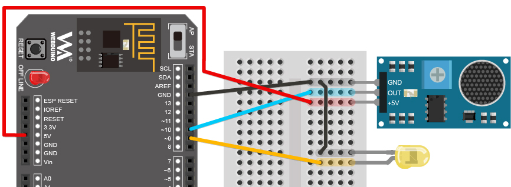
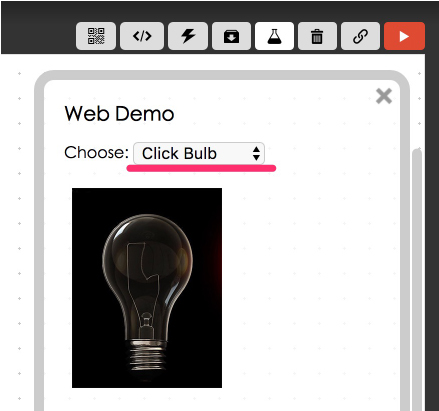
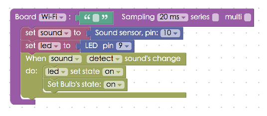
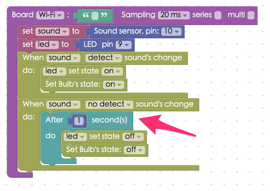

<!-- @@master  = ../../_layout.html-->

<!-- @@block  =  meta-->

<title>Project Example 12: Controlling an LED and web page image with a Sound Sensor :::: Webduino = Web × Arduino</title>

<meta name="description" content="A Sound Sensor is like a small microphone, but not as powerful. It is mostly used to detect if any noise is made near it. On the sound sensor there is a cross knob, you can adjust the sensitivity with a screwdriver. If the sensitivity is too high even a light breeze might be detected and with the sensitivity too low loud clapping might not be recognized. The sound sensor also has a time difference when transferring signals, so there might be a delay from the time the sound is made to when it is received. In this project example we will use a sound sensor to light up an LED and our Web Demo light bulb image when a sound is detected.
">

<meta itemprop="description" content="A Sound Sensor is like a small microphone, but not as powerful. It is mostly used to detect if any noise is made near it. On the sound sensor there is a cross knob, you can adjust the sensitivity with a screwdriver. If the sensitivity is too high even a light breeze might be detected and with the sensitivity too low loud clapping might not be recognized. The sound sensor also has a time difference when transferring signals, so there might be a delay from the time the sound is made to when it is received. In this project example we will use a sound sensor to light up an LED and our Web Demo light bulb image when a sound is detected.
">

<meta property="og:description" content="A Sound Sensor is like a small microphone, but not as powerful. It is mostly used to detect if any noise is made near it. On the sound sensor there is a cross knob, you can adjust the sensitivity with a screwdriver. If the sensitivity is too high even a light breeze might be detected and with the sensitivity too low loud clapping might not be recognized. The sound sensor also has a time difference when transferring signals, so there might be a delay from the time the sound is made to when it is received. In this project example we will use a sound sensor to light up an LED and our Web Demo light bulb image when a sound is detected.
">

<meta property="og:title" content="Project Example 12: Controlling an LED and web page image with a Sound Sensor" >

<meta property="og:url" content="https://webduino.io/tutorials/tutorial-12-sound-sensor.html">

<meta property="og:image" content="https://webduino.io/img/tutorials/tutorial-12-01s.jpg">

<meta itemprop="image" content="https://webduino.io/img/tutorials/tutorial-12-01s.jpg">

<include src="../_include-tutorials.html"></include>

<!-- @@close-->

<!-- @@block  =  preAndNext-->

<include src="../_include-tutorials-content.html"></include>

<!-- @@close-->

<!-- @@block  =  tutorials-->

# Project Example 12: Controlling an LED and web page image with a Sound Sensor

A Sound Sensor is like a small microphone, but not as powerful. It is mostly used to detect if any noise is made near it. On the sound sensor there is a cross knob, you can adjust the sensitivity with a screwdriver. If the sensitivity is too high even a light breeze might be detected and with the sensitivity too low loud clapping might not be recognized. The sound sensor also has a time difference when transferring signals, so there might be a delay from the time the sound is made to when it is received. In this project example we will use a sound sensor to light up an LED and our Web Demo light bulb image when a sound is detected.

<!-- 

	聲音偵測相關套件：<a href="https://webduino.io/buy/webduino-expansion-s.html" target="_blank">Webduino 擴充套件 S ( 支援馬克 1 號、Fly )</a>
	Webduino 開發板：<a href="https://webduino.io/buy/component-webduino-v1.html" target="_blank">Webduino 馬克一號</a>、<a href="https://webduino.io/buy/component-webduino-fly.html" target="_blank">Webduino Fly</a>、<a href="https://webduino.io/buy/component-webduino-uno-fly.html" target="_blank">Webduino Fly + Arduino UNO</a>

 -->

## Video Tutorial

<!-- 影片對應範例：[https://blockly.webduino.io/?page=tutorials/sound-2](https://blockly.webduino.io/?page=tutorials/sound-2)  -->
Check the video tutorial here: 
<iframe class="youtube" src="https://www.youtube.com/embed/0NFEsS-FvMw" frameborder="0" allowfullscreen></iframe>

## Wiring and Practice

First connect the sound sensor and LED to a breadboard. Connect the +5V from the sound sensor to VCC, GND to GND, and OUT to pin 10. Then connect GND to the shorter leg of the LED and finally connect the long leg to pin 9.

Webduino Mark 1 Circuit diagram:

Webduino Fly Circuit diagram:

Reference image:

<!-- 

	聲音偵測相關套件：<a href="https://webduino.io/buy/webduino-expansion-s.html" target="_blank">Webduino 擴充套件 S ( 支援馬克 1 號、Fly )</a>
	Webduino 開發板：<a href="https://webduino.io/buy/component-webduino-v1.html" target="_blank">Webduino 馬克一號</a>、<a href="https://webduino.io/buy/component-webduino-fly.html" target="_blank">Webduino Fly</a>、<a href="https://webduino.io/buy/component-webduino-uno-fly.html" target="_blank">Webduino Fly + Arduino UNO</a>

 -->

## Instructions for using the Webduino Blockly

Open the [Webduino Blocky editor](https://blockly.webduino.io/?lang=en). This example will use the "Click Bulb" to control the LED so open the Webduino Blocky Editor and click on the "Web Demo Area" button. Then choose "Click Bulb" from the drop down menu.

Place a "Board" block into workspace, fill in the name of your Webduino, place a "Sound Sensor" block into the stack ,and set name to sound and pin to 10. Then place an "LED" block in the stack and set the name to led and pin to 9.

Place a "When Sound's Change / do" block next in the stack, and add blocks so the LED turns on and the light bulb image changes, as well.

It is possible for the sensor to detect sound and then detect nothing, at the same time (you might only clap once and then there is silence right after). So place another "When Sound's Change / do" block into the stack to , Set it to "no detect" with a delay of 1 second. So if there is no sound detected after 1 second, the LED will turn off and the lightbulb will go off on the screen.

After all this is done, check to see if the board is online (click "[Check Device Status](https://webduino.io/device.html)") and click on the red execution button "Run Blocks". Make some noise and you will see the LED and light bulb on screen light up!
Solution: [https://blockly.webduino.io/?lang=en#-KZdTn-FkODZKDjCu7P-](https://blockly.webduino.io/?lang=en#-KZdTn-FkODZKDjCu7P-)

## Code Explanation ([Check Webduino Bin](http://bin.webduino.io/bitur/edit?html,css,js,output), [Check Device Status](https://webduino.io/device.html))

Include `webduino-all.min.js` in the header of your html files in order to support all of the Webduino's components. If the codes are generated by Webduino Blockly, you also have to include`webduino-blockly.js` in your files.

	
	

Inside the body of the HTML file, where there is an image section with the ID, demo-area-o2-light, there is a part where there are two different light bulb images, one on and one off, so when we click on the images they will change from one state to another.

	

	  
	  
	

We use CSS to control the light bulb image, here we use display:none; to control the changing of images, below is the CSS code.

	#demo-area-02-light img{
	  height:200px;
	  display:none;
	}
	#demo-area-02-light.on #demo-area-02-on{
	  display:inline-block;
	}
	#demo-area-02-light.off #demo-area-02-off{
	  display:inline-block;
	}

With JavaScript we use "on" to detect, with the first parameter `detected` meaning a sound is detected, then do the action below, if `ended` then turn the LED off and change the image to the unlit light bulb. The light bulb image on screen uses `className` to change between states.

	var sound;
	var led;

	boardReady('', function (board) {
	  board.samplingInterval = 20;
	  sound = getSound(board, 10);
	  led = getLed(board, 9);
	  sound.on("detected",function(){
	      led.on();
	    document.getElementById("demo-area-02-light").className = "on";

	  });
	  sound.on("ended",function(){
	    setTimeout(function(){
	      setTimeout(function () {
	      led.off();
	      document.getElementById("demo-area-02-light").className = "off";
	    }, 1000);

	    },300);
	  });
	});

This is how you control an LED and web page image with a Sound Sensor!  
Webduino Bin: [http://bin.webduino.io/bitur/edit?html,css,js,output](http://bin.webduino.io/bitur/edit?html,css,js,output)  
Stack setup: [https://blockly.webduino.io/?lang=en#-KZdXIYmALZE7Zg_UWNH](https://blockly.webduino.io/?lang=en#-KZdXIYmALZE7Zg_UWNH)

<!-- ## 聲音偵測傳感器的延伸教學：

[Webduino Blockly 課程 7-1：偵測聲音](https://blockly.webduino.io/?lang=zh-hant&page=tutorials/sound-1#-JvxeaQ60xcOYLuXKCke)

	聲音偵測相關套件：<a href="https://webduino.io/buy/webduino-expansion-s.html" target="_blank">Webduino 擴充套件 S ( 支援馬克 1 號、Fly )</a>
	Webduino 開發板：<a href="https://webduino.io/buy/component-webduino-v1.html" target="_blank">Webduino 馬克一號</a>、<a href="https://webduino.io/buy/component-webduino-fly.html" target="_blank">Webduino Fly</a>、<a href="https://webduino.io/buy/component-webduino-uno-fly.html" target="_blank">Webduino Fly + Arduino UNO</a>

 -->

<!-- @@close-->