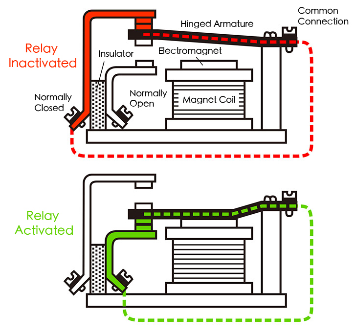
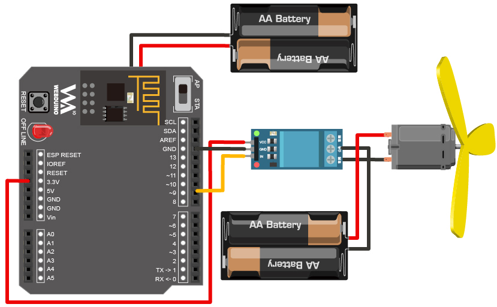
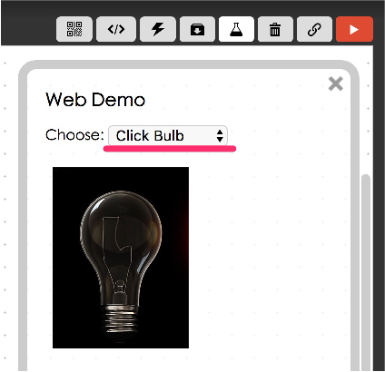
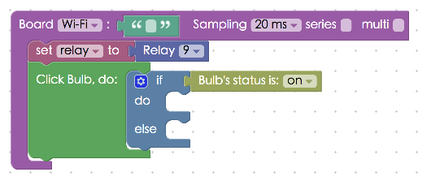
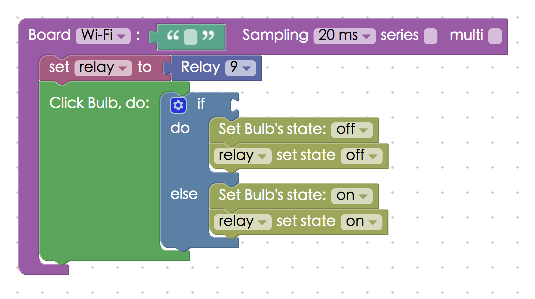

<!-- @@master  = ../../_layout.html-->

<!-- @@block  =  meta-->

<title>Project Example 14: Using a Relay to control a fan :::: Webduino = Web × Arduino</title>

<meta name="description" content="A relay is an electronic device commonly seen in automated systems. It uses a current or signal to open or close another circuit. They are used in circuits for voltage balancing, preventing equipment damage, and as switches. When we use a relay with the Webduino, we can easily make a smart electric socket or an automatic switch.">

<meta itemprop="description" content="A relay is an electronic device commonly seen in automated systems. It uses a current or signal to open or close another circuit. They are used in circuits for voltage balancing, preventing equipment damage, and as switches. When we use a relay with the Webduino, we can easily make a smart electric socket or an automatic switch.">

<meta property="og:description" content="A relay is an electronic device commonly seen in automated systems. It uses a current or signal to open or close another circuit. They are used in circuits for voltage balancing, preventing equipment damage, and as switches. When we use a relay with the Webduino, we can easily make a smart electric socket or an automatic switch.">

<meta property="og:title" content="Project Example 14: Using a Relay to control a fan" >

<meta property="og:url" content="https://webduino.io/tutorials/tutorial-14-relay.html">

<meta property="og:image" content="https://webduino.io/img/tutorials/tutorial-14-01s.jpg">

<meta itemprop="image" content="https://webduino.io/img/tutorials/tutorial-14-01s.jpg">

<include src="../_include-tutorials.html"></include>

<!-- @@close-->

<!-- @@block  =  preAndNext-->

<include src="../_include-tutorials-content.html"></include>

<!-- @@close-->

<!-- @@block  =  tutorials-->

# Project Example 14: Using a Relay to control a fan

A relay is an electronic device commonly seen in automated systems. It uses a current or signal to open or close another circuit. They are used in circuits for voltage balancing, preventing equipment damage, and as switches. When we use a relay with the Webduino, we can easily make a smart electric socket or an automatic switch.

<!-- 

	繼電器相關套件：<a href="https://webduino.io/buy/webduino-expansion-m.html" target="_blank">Webduino 擴充套件 M ( 支援馬克 1 號、Fly )</a>
	Webduino 開發板：<a href="https://webduino.io/buy/component-webduino-v1.html" target="_blank">Webduino 馬克一號</a>、<a href="https://webduino.io/buy/component-webduino-fly.html" target="_blank">Webduino Fly</a>、<a href="https://webduino.io/buy/component-webduino-uno-fly.html" target="_blank">Webduino Fly + Arduino UNO</a>

 -->

## Video Tutorial

Check the video tutorial here: 
<iframe class="youtube" src="https://www.youtube.com/embed/Z3x_qW7fXzM" frameborder="0" allowfullscreen></iframe>

## Wiring and Practice

Before we start to build anything, let's take a look at what a relay is. Inside a relay there is an electromagnet. When a relay is activated, the NO (Normally Open) contact connects to the COM (Common Connection) contact, and the circuit is connected; the circuit is disconnected when the relay is inactive.

When a relay is activated, the NC (Normally Closed) contact disconnects the circuit; the circuit is connected when the relay is inactive. Through this system, we can easily turn on/off an electric device.

Because we are using a low-power signal to control another circuit, we need to use two separate power outputs, one for our Webduino board and, the other for the relay. On one side of the relay we have 3 pins, connect VCC to 3.3V on the Webduino board, GND to GND, and IN to pin 9. The other side of the relay will require a screwdriver to connect the wires (normally this side is connected to electric devices with a higher current), we will connect one wire from the fan to the NO contact on the Relay and the other wire to the power output. Last, connect the power for the fan to the COM contact.

Webduino Mark 1 Circuit diagram:

Webduino Fly Circuit diagram:

Use a screwdriver to screw in the wires securely.

Reference image:

The relay will turn on a red light when it is inactivated, and will turn on a green light when it is activated.

<!-- 

	繼電器相關套件：<a href="https://webduino.io/buy/webduino-expansion-m.html" target="_blank">Webduino 擴充套件 M ( 支援馬克 1 號、Fly )</a>
	Webduino 開發板：<a href="https://webduino.io/buy/component-webduino-v1.html" target="_blank">Webduino 馬克一號</a>、<a href="https://webduino.io/buy/component-webduino-fly.html" target="_blank">Webduino Fly</a>、<a href="https://webduino.io/buy/component-webduino-uno-fly.html" target="_blank">Webduino Fly + Arduino UNO</a>

 -->

## Instructions for using the Webduino Blockly

Open the [Webduino Blocky editor](https://blockly.webduino.io/?lang=en) and click on the "Web Demo Area" button. We will be using "Click Bulb" to control the relay, so, choose "Click Bulb" from the drop down menu.

Place a "Board" block onto the workspace, fill in the name of your Webduino board and place a "Set relay to" block into the stack. Set the name to relay and the pin to 9.

Next, place a "Click bulb / do" block in the stack and a "if / do" block inside of that. So when the light bulb is on, there is a command given. And if the light bulb is off, there is another command.

Set up a logic equation so that if the light bulb is on and you click the image, the relay switches and the image of the light bulb turns off, and vise versa.

After finishing all of the above, check if the board is online (click "[Check Device Status](https://webduino.io/device.html)") and click on the red execution button "Run Blocks". Then you can use the light bulb image on the screen to control the relay and in turn, the fan.
Solution: [https://blockly.webduino.io/?lang=en#-KZeIYu4eufJ_GjB9J2C](https://blockly.webduino.io/?lang=en#-KZeIYu4eufJ_GjB9J2C)

## Code Explanation ([Check Webduino Bin](http://bin.webduino.io/lukoh/edit?html,css,js,output), [Check Device Status](https://webduino.io/device.html))

Include `webduino-all.min.js` in the header of your html files in order to support all of the Webduino's components. If the codes are generated by Webduino Blockly, you also have to include `webduino-blockly.js` in your files.

	
	

Inside the body of the HTML file, where there is an image section with the ID, demo-area-o2-light, there is a part where there are two different light bulb images, one on and one off, so when we click on the images they will change from one state to another.

	

	  
	  
	

We use CSS to control the light bulb image, here we use display:none; to control the changing of images, below is the CSS code.

	#demo-area-02-light img{
	  height:200px;
	  display:none;
	}
	#demo-area-02-light.on #demo-area-02-on{
	  display:inline-block;
	}
	#demo-area-02-light.off #demo-area-02-off{
	  display:inline-block;
	}

We can see in the JavaScript code that a relay is similar to an LED because it uses "on" and "off" for control. The light bulb image uses `className` as a switch.

	var relay;

	boardReady('', function (board) {
	  board.samplingInterval = 20;
	  relay = getRelay(board, 9);
	  document.getElementById("demo-area-02-light").addEventListener("click",function(){
	    if (document.getElementById("demo-area-02-light").className == "on") {
	      document.getElementById("demo-area-02-light").className = "off";
	      relay.off();
	    } else {
	      document.getElementById("demo-area-02-light").className = "on";
	      relay.on();
	    }
	  });
	});

And that's how you use a relay to control a fan! 
Webduino Bin: [http://bin.webduino.io/lukoh/edit?html,css,js,output](http://bin.webduino.io/lukoh/edit?html,css,js,output)  
Stack setup: [https://blockly.webduino.io/?lang=en#-KZeJOn7Z9s96DYU8jyn](https://blockly.webduino.io/?lang=en#-KZeJOn7Z9s96DYU8jyn)

<!-- ## 繼電器的延伸教學：

[Webduino Blockly 課程 11-1：控制繼電器](https://blockly.webduino.io/?lang=zh-hant&page=tutorials/relay-1#-K-WQYB34rMa4f2GgSam) 

	繼電器相關套件：<a href="https://webduino.io/buy/webduino-expansion-m.html" target="_blank">Webduino 擴充套件 M ( 支援馬克 1 號、Fly )</a>
	Webduino 開發板：<a href="https://webduino.io/buy/component-webduino-v1.html" target="_blank">Webduino 馬克一號</a>、<a href="https://webduino.io/buy/component-webduino-fly.html" target="_blank">Webduino Fly</a>、<a href="https://webduino.io/buy/component-webduino-uno-fly.html" target="_blank">Webduino Fly + Arduino UNO</a>

  -->

<!-- @@close-->