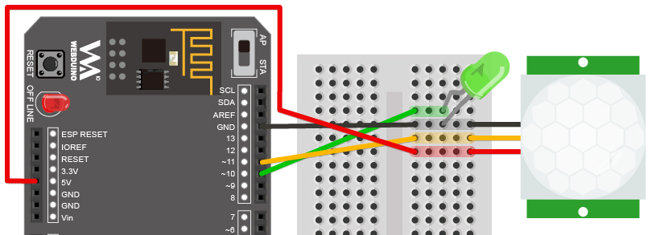
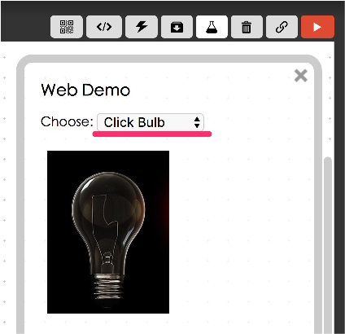

<!-- @@master  = ../../_layout.html-->

<!-- @@block  =  meta-->

<title>Project Example 15: PIR motion sensor :::: Webduino = Web × Arduino</title>

<meta name="description" content="The PIR (Passive Infrared Sensor) is an electronic sensor that measures infrared light radiating from objects. You can program it to perform certain actions when it senses infrared light radiating from the human body. In this example, using the Webduino, we will make an LED light up and show a lit light bulb on screen when the PIR sensor detects changes in infrared light.">

<meta itemprop="description" content="The PIR (Passive Infrared Sensor) is an electronic sensor that measures infrared light radiating from objects. You can program it to perform certain actions when it senses infrared light radiating from the human body. In this example, using the Webduino, we will make an LED light up and show a lit light bulb on screen when the PIR sensor detects changes in infrared light.">

<meta property="og:description" content="The PIR (Passive Infrared Sensor) is an electronic sensor that measures infrared light radiating from objects. You can program it to perform certain actions when it senses infrared light radiating from the human body. In this example, using the Webduino, we will make an LED light up and show a lit light bulb on screen when the PIR sensor detects changes in infrared light.">

<meta property="og:title" content="Project Example 15: PIR motion sensor" >

<meta property="og:url" content="https://webduino.io/tutorials/tutorial-15-pir-led.html">

<meta property="og:image" content="https://webduino.io/img/tutorials/tutorial-15-01s.jpg">

<meta itemprop="image" content="https://webduino.io/img/tutorials/tutorial-15-01s.jpg">

<include src="../_include-tutorials.html"></include>

<!-- @@close-->

<!-- @@block  =  preAndNext-->

<include src="../_include-tutorials-content.html"></include>

<!-- @@close-->

<!-- @@block  =  tutorials-->

# Project Example 15: PIR motion sensor

The PIR (Passive Infrared Sensor) is an electronic sensor that measures infrared light radiating from objects. You can program it to perform certain actions when it senses infrared light radiating from the human body. In this example, using the Webduino, we will make an LED light up and show a lit light bulb on screen when the PIR sensor detects changes in infrared light.

<!-- 

	人體紅外線偵測相關套件：<a href="https://webduino.io/buy/webduino-expansion-s.html" target="_blank">Webduino 擴充套件 S ( 支援馬克 1 號、Fly )</a>
	Webduino 開發板：<a href="https://webduino.io/buy/component-webduino-v1.html" target="_blank">Webduino 馬克一號</a>、<a href="https://webduino.io/buy/component-webduino-fly.html" target="_blank">Webduino Fly</a>、<a href="https://webduino.io/buy/component-webduino-uno-fly.html" target="_blank">Webduino Fly + Arduino UNO</a>

 -->

## Video Tutorial

<!-- 影片對應範例：[https://blockly.webduino.io/?page=tutorials/pir-2](https://blockly.webduino.io/?page=tutorials/pir-2)  -->
Check the video tutorial here: 
<iframe class="youtube" src="https://www.youtube.com/embed/3873nza-ywo" frameborder="0" allowfullscreen></iframe>

## Wiring and Practice

Connect the VCC pin on the PIR sensor to VCC on the Webduino board, GND to GND, and OUT to pin 11. Our LED will share a GND with the PIR sensor, and connect the longer leg to pin 10. On the PIR sensor there are two knobs, SX is for sensitivity and the TX is for trigger delay time. Both can be adjusted by hand or with a screw driver.

Webduino Mark 1 Circuit diagram:

Webduino Fly Circuit diagram:

Reference image:

<!-- 

	人體紅外線偵測相關套件：<a href="https://webduino.io/buy/webduino-expansion-s.html" target="_blank">Webduino 擴充套件 S ( 支援馬克 1 號、Fly )</a>
	Webduino 開發板：<a href="https://webduino.io/buy/component-webduino-v1.html" target="_blank">Webduino 馬克一號</a>、<a href="https://webduino.io/buy/component-webduino-fly.html" target="_blank">Webduino Fly</a>、<a href="https://webduino.io/buy/component-webduino-uno-fly.html" target="_blank">Webduino Fly + Arduino UNO</a>

 -->

## Instructions for using the Webduino Blockly

We will be using "Click Bulb" in Webduino Blocky so, open the [Webduino Blocky editor](https://blockly.webduino.io/?lang=en) and click the "Web Demo Area" button and select "Click Bulb" from the drop down menu.

Place a "Board" block into the workspace and fill in the name of your Webduino board. Then place a "PIR motion" block inside the stack and set the name to pir and the pin to 11. Set an "LED" block to led and the pin to 10.

Place two "When PIR's change / do" blocks into the stack, then place blocks that will turn the LED on/off and blocks to change the state of the light bulb image on screen.

Once you are done check if the board is online (click "[Check Device Status](https://webduino.io/device.html)") and click on the red execution button "Run Blocks". Place your hand in front of the PIR sensor and you will see the LED and the light bulb image both light up.
Solution: [https://blockly.webduino.io/?lang=en#-KZeZFgLzSu54-AmdJ5R](https://blockly.webduino.io/?lang=en#-KZeZFgLzSu54-AmdJ5R)

## Code Explanation ([Check Webduino Bin](http://bin.webduino.io/lofiv/edit?html,css,js,output), [Check Device Status](https://webduino.io/device.html))

Include `webduino-all.min.js` in the header of your html files in order to support all of the Webduino's components. If the codes are generated by Webduino Blockly, you also have to include `webduino-blockly.js` in your files.

	
	

Inside the body of the HTML file, where an image section with the ID, demo-area-o2-light, there is a part where there are two different light bulb images, one on and one off, so when we click on the images they will change from one state to another.

	

	  
	  
	

We use CSS to control the light bulb image, here we use display:none; to control the changing of images, below is the CSS code.

	#demo-area-02-light img{
	  height:200px;
	  display:none;
	}
	#demo-area-02-light.on #demo-area-02-on{
	  display:inline-block;
	}
	#demo-area-02-light.off #demo-area-02-off{
	  display:inline-block;
	}

JavaScript uses two main APIs for the PIR sensor: `detected` and `ended`, each meaning detected infrared light and ending detection, place the actions you would like to happen with each one. 

	var pir;
	var led;

	boardReady('', function (board) {
	  board.samplingInterval = 20;
	  pir = getPir(board, 11);
	  led = getLed(board, 10);
	  pir.on("detected",function(){
	    led.on();
	    document.getElementById("demo-area-02-light").className = "on";

	  });
	  pir.on("ended",function(){
	    led.off();
	    document.getElementById("demo-area-02-light").className = "off";

	  });
	});

Now, you can use a PIR motion sensor to detect changes in infrared light and control other devices!  
Webduino Bin: [http://bin.webduino.io/lofiv/edit?html,css,js,output](http://bin.webduino.io/lofiv/edit?html,css,js,output)  
Stack setup: [https://blockly.webduino.io/?lang=en#-KZeZhhnvCierqZJv1wh](https://blockly.webduino.io/?lang=en#-KZeZhhnvCierqZJv1wh)

<!-- ## 人體紅外線偵測傳感器的延伸教學：

[Webduino Blockly 課程 6-1：偵測人體紅外線](https://blockly.webduino.io/?lang=zh-hant&page=tutorials/pir-1#-JvxRwAXj4ccyigeuI8o) 

	人體紅外線偵測相關套件：<a href="https://webduino.io/buy/webduino-expansion-s.html" target="_blank">Webduino 擴充套件 S ( 支援馬克 1 號、Fly )</a>
	Webduino 開發板：<a href="https://webduino.io/buy/component-webduino-v1.html" target="_blank">Webduino 馬克一號</a>、<a href="https://webduino.io/buy/component-webduino-fly.html" target="_blank">Webduino Fly</a>、<a href="https://webduino.io/buy/component-webduino-uno-fly.html" target="_blank">Webduino Fly + Arduino UNO</a>

  -->

<!-- @@close-->