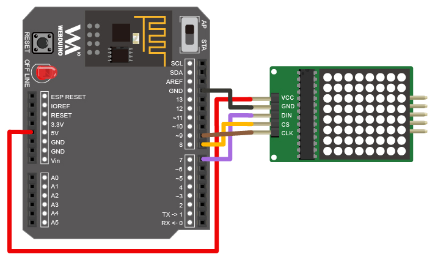
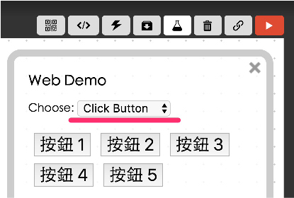
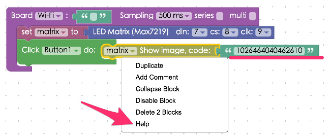
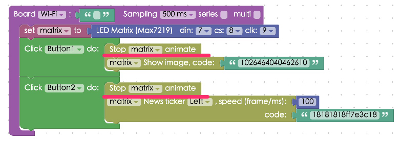

<!-- @@master  = ../../_layout.html-->

<!-- @@block  =  meta-->

<title>Project Example 18: Using an LED Matrix :::: Webduino = Web × Arduino</title>

<meta name="description" content="An LED matrix is basically a grid of LEDs. They are commonly seen on public transport, on train or bus station signs. Here we will be using an 8x8 LED matrix, model MAX7219, to create images and text.">

<meta itemprop="description" content="An LED matrix is basically a grid of LEDs. They are commonly seen on public transport, on train or bus station signs. Here we will be using an 8x8 LED matrix, model MAX7219, to create images and text.">

<meta property="og:description" content="An LED matrix is basically a grid of LEDs. They are commonly seen on public transport, on train or bus station signs. Here we will be using an 8x8 LED matrix, model MAX7219, to create images and text.">

<meta property="og:title" content="Project Example 18: Using an LED Matrix" >

<meta property="og:url" content="https://webduino.io/tutorials/tutorial-18-max7219.html">

<meta property="og:image" content="https://webduino.io/img/tutorials/tutorial-18-01s.jpg">

<meta itemprop="image" content="https://webduino.io/img/tutorials/tutorial-18-01s.jpg">

<include src="../_include-tutorials.html"></include>

<!-- @@close-->

<!-- @@block  =  preAndNext-->

<include src="../_include-tutorials-content.html"></include>

<!-- @@close-->

<!-- @@block  =  tutorials-->

# Project Example 18: Using an LED Matrix

An LED matrix is basically a grid of LEDs. They are commonly seen on public transport, on train or bus station signs. Here we will be using an 8x8 LED matrix, model MAX7219, to create images and text.

<!-- 

	LED 點矩陣相關套件：<a href="https://webduino.io/buy/webduino-package-plus.html" target="_blank">Webduino 基本套件 Plus ( 支援馬克 1 號、Fly )</a>
	Webduino 開發板：<a href="https://webduino.io/buy/component-webduino-v1.html" target="_blank">Webduino 馬克一號</a>、<a href="https://webduino.io/buy/component-webduino-fly.html" target="_blank">Webduino Fly</a>、<a href="https://webduino.io/buy/component-webduino-uno-fly.html" target="_blank">Webduino Fly + Arduino UNO</a>

 -->

## Video Tutorial

Check the video tutorial here:
<iframe class="youtube" src="https://www.youtube.com/embed/nY5zBP7BLdo" frameborder="0" allowfullscreen></iframe>

## Wiring and Practice

The MAX7219 LED Matrix has 5 pins, VCC, GND, DIN (DOUT), CS (Chip Selection), and CLK (clock). For this tutorial, connect DIN to 7, CS to 8, CLK to 9, VCC to VCC (make sure it is not connected to 3.3V), and GND to GND.

Webduino Mark 1 Circuit diagram:

Webduino Fly Circuit diagram:

Reference image:

<!-- 

	LED 點矩陣相關套件：<a href="https://webduino.io/buy/webduino-package-plus.html" target="_blank">Webduino 基本套件 Plus ( 支援馬克 1 號、Fly )</a>
	Webduino 開發板：<a href="https://webduino.io/buy/component-webduino-v1.html" target="_blank">Webduino 馬克一號</a>、<a href="https://webduino.io/buy/component-webduino-fly.html" target="_blank">Webduino Fly</a>、<a href="https://webduino.io/buy/component-webduino-uno-fly.html" target="_blank">Webduino Fly + Arduino UNO</a>

 -->

## Instructions for using the Webduino Blockly

Open the [Webduino Blockly editor](https://blockly.webduino.io/?lang=en). We will be using "Click Button" to show different images or animations using the LED Matrix. So, click on "Web Demo Area" on the upper right of the screen and choose "Click button" from the drop down menu. (Please check the [Arduino Firmware Download / Burn](https://webduino.io/tutorials/info-07-arduino-ino.html) tutorial, and choose the driver with MaxMatrix)

Place a "Board" into the workspace and fill in the name of your Webduino board. Place an "LED matrix" block in the stack and set it to "matrix", and set the pins to 7, 8 and 9.

Next, place a "Click button / do" block from the "Web Demo" menu into the stack. When you click on button 1, the LED matrix will show an image encoded by **8 sets of 2 hexadecimal digits. You can use more but they must come in pairs.** If you are using an image to create a code, **right click on the block and select "help"**. This will bring you to the code generator ( [http://webduinoio.github.io/demo/max7219/](http://webduinoio.github.io/demo/max7219/) ).

In the LED matrix code generator, you can click on the image of an LED to draw an icon, or you can click on the drop-down menu to load pre-set text, numbers, or icons. Click "Copy" when you're done and paste it back into the image code block in the Blockly editor. You can also program the website to interact directly with your LED matrix. Just fill in your device's ID on the top of the page where it says "Board:". Then the image you draw will show up on the LED matrix. ( Check out the video tutorial here: [https://www.youtube.com/watch?v=U3jEqpWve8I](https://www.youtube.com/watch?v=U3jEqpWve8I)

Now we will set up the actions for button 2. We use the "News ticker" block to program the icon to go left or right. Because the code can be more than 16 hexadecimal letters or numbers **(always in pairs of 2)**, we can draw a very long line of icons and use the LED matrix to create a marquee. (Copy and paste this following code into the Blockly editor and run it, see what happens! : "0c1e3e7c3e1e0c000c12224422120c00")

Before we run our code we have an important step, since the marquee uses an animation like effect, we will need to stop the marquee from moving when we change buttons. So, in each "Click button / do" stack  place a "Stop / animate" block to stop the previous animation when we click the other button.

The marquee we just made can only go left or right. If we try to make more complex animations, we will need to create a "List" using a "Create list with" block connected to button 3. Use the "create list with" block to play 3 different animations. The 4th button will turn the LED matrix off.

Once you've created this stack, check if the board is online (click "[Check Device Status](https://webduino.io/device.html)") and click on the red execution button "Run Blocks", click on the different buttons and you will see the LED matrix light up, showing different icons or animations. 
Solution: [https://blockly.webduino.io/?lang=en#-KZQR4lZyEsYPTKK1OYs](https://blockly.webduino.io/?lang=en#-KZQR4lZyEsYPTKK1OYs)

##Code Explanation ([Check Webduino Bin](http://bin.webduino.io/liqut/edit?html,css,js,output), [Check Device Status](https://webduino.io/device.html))

Include `webduino-all.min.js` in the header of your html files in order to support all of the Webduino's components. If the codes are generated by Webduino Blockly, you also have to include `webduino-blockly.js` in your files.

	
	

There are 5 different buttons inside the HTML code so you can control the size and the look of the buttons here.

	<button id="demo-area-05-btn1" class="db5">按鈕 1</button>
	<button id="demo-area-05-btn2" class="db5">按鈕 2</button>
	<button id="demo-area-05-btn3" class="db5">按鈕 3</button>
	<button id="demo-area-05-btn4" class="db5">按鈕 4</button>
	<button id="demo-area-05-btn5" class="db5">按鈕 5</button>

As for JavaScript, the method to stop the animation is `animateStop()` the way to show an image is `on`, and the animations are made by using `animate` to play a list, the list has all the codes we just filled in, such as `['080c0effff0e0c08', '183c7eff18181818', '103070ffff707010']`. As for the marquee, here we use `split`, `splice` and `push` to change them into a matrix and play with `animate` to achieve this effect. 

	var matrix;

	boardReady('', function (board) {
	  board.samplingInterval = 500;
	  matrix = getMax7219(board, 7, 8, 9);
	  document.getElementById("demo-area-05-btn1").addEventListener("click",function(){
	    matrix.animateStop();
	    matrix.on('1026464040462610');
	  });
	  document.getElementById("demo-area-05-btn2").addEventListener("click",function(){
	    matrix.animateStop();
	    var a = '0c1e3e7c3e1e0c000c12224422120c00';
	    var b = a.split("");
	    var d = [];
	    for(var i=0; i<a.length/2; i++){
	      aa(i);
	    }
	    function aa(j){
	      var c=b.splice(0,2);
	      b.push(c[0],c[1]);
	      d[j] = b.join("");
	    }
	    console.log(d);
	    matrix.animate(d,100);
	  });
	  document.getElementById("demo-area-05-btn3").addEventListener("click",function(){
	    matrix.animateStop();
	    var varData = ['080c0effff0e0c08', '183c7eff18181818', '103070ffff707010'];
	    matrix.animate(varData,100);
	  });
	  document.getElementById("demo-area-05-btn4").addEventListener("click",function(){
	    matrix.off();
	  });
	});

This is how you use an LED matrix to create an icon or animation by clicking on different buttons.  
Webduino Bin: [http://bin.webduino.io/hajuv/edit?html,css,js,output](http://bin.webduino.io/hajuv/edit?html,css,js,output)  
Stack setup: [https://blockly.webduino.io/?lang=en#-KZQSIW_ewp3JaCWXlqE](https://blockly.webduino.io/?lang=en#-KZQSIW_ewp3JaCWXlqE)

<!-- ## LED 點矩陣的延伸教學：

[Webduino Blockly 課程 13-1：點矩陣顯示圖形](https://blockly.webduino.io/?lang=zh-hant&page=tutorials/max7219-1#-K0opTxaF_E2ncQkc6JC)  
[Webduino Blockly 課程 13-2：點矩陣製作動畫](https://blockly.webduino.io/?lang=zh-hant&page=tutorials/max7219-2#-K0os-k9zK8b2uN9iOMK)  
[Webduino Blockly 課程 13-3：點矩陣跑馬燈效果](https://blockly.webduino.io/?lang=zh-hant&page=tutorials/max7219-3#-K0ou2rmQYkM46jiooWV)    
[Webduino Blockly 課程 13-4：點選按鈕切換點矩陣效果](https://blockly.webduino.io/?lang=zh-hant&page=tutorials/max7219-4#-K0p0BGifwqYvndb35GK)    
[Webduino Blockly 課程 13-5：利用超音波傳感器改變點矩陣圖形](https://blockly.webduino.io/?lang=zh-hant&page=tutorials/max7219-5#-K0p4uO2W-zcVOU7FF0A) 

	LED 點矩陣相關套件：<a href="https://webduino.io/buy/webduino-package-plus.html" target="_blank">Webduino 基本套件 Plus ( 支援馬克 1 號、Fly )</a>
	Webduino 開發板：<a href="https://webduino.io/buy/component-webduino-v1.html" target="_blank">Webduino 馬克一號</a>、<a href="https://webduino.io/buy/component-webduino-fly.html" target="_blank">Webduino Fly</a>、<a href="https://webduino.io/buy/component-webduino-uno-fly.html" target="_blank">Webduino Fly + Arduino UNO</a>

  -->

<!-- @@close-->