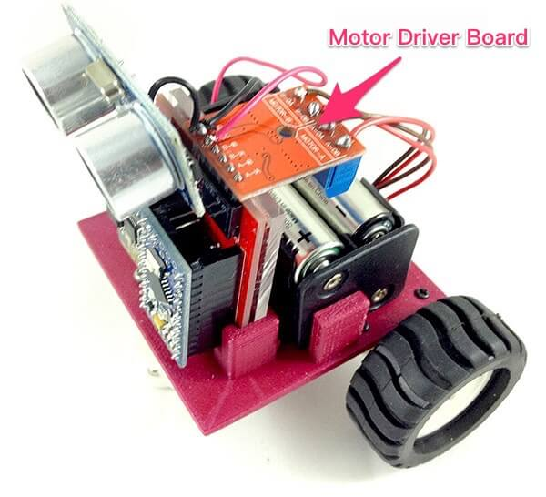
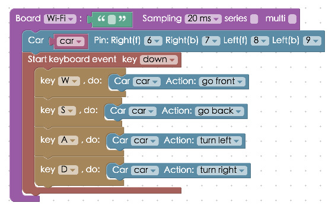
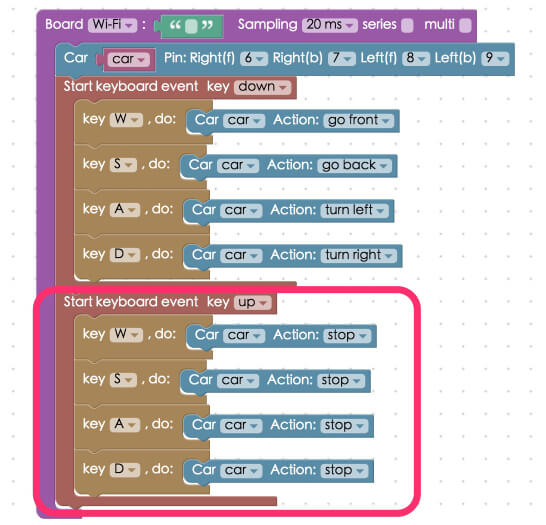

<!-- @@master  = ../../_layout.html-->

<!-- @@block  =  meta-->

<title>Project Example 21: Control a Robot Car :::: Webduino = Web × Arduino</title>

<meta name="description" content="The Webduino Robot Car is a self-driving robotic car designed by the Webduino Team. The Webduino Mark 1 is the brain for this gadget, enabling it to autonomously navigate and avoid obstacles using the ultrasonic sensor. In this tutorial, you will learn how to use keyboard controls to run the Robot Car.">

<meta itemprop="description" content="The Webduino Robot Car is a self-driving robotic car designed by the Webduino Team. The Webduino Mark 1 is the brain for this gadget, enabling it to autonomously navigate and avoid obstacles using the ultrasonic sensor. In this tutorial, you will learn how to use keyboard controls to run the Robot Car.">

<meta property="og:description" content="The Webduino Robot Car is a self-driving robotic car designed by the Webduino Team. The Webduino Mark 1 is the brain for this gadget, enabling it to autonomously navigate and avoid obstacles using the ultrasonic sensor. In this tutorial, you will learn how to use keyboard controls to run the Robot Car.">

<meta property="og:title" content="Project Example 21: Control a Robot Car" >

<meta property="og:url" content="https://webduino.io/tutorials/tutorial-21-toycar.html">

<meta property="og:image" content="https://webduino.io/img/tutorials/tutorial-21-01s.jpg">

<meta itemprop="image" content="https://webduino.io/img/tutorials/tutorial-21-01s.jpg">

<include src="../_include-tutorials.html"></include>

<!-- @@close-->

<!-- @@block  =  preAndNext-->

<include src="../_include-tutorials-content.html"></include>

<!-- @@close-->

<!-- @@block  =  tutorials-->

# Project Example 21: Control a Robot Car

The "Webduino Robot Car" is a self-driving robotic car designed by the Webduino Team. The Webduino Mark 1 is the brain for this gadget, enabling it to autonomously navigate and avoid obstacles using the ultrasonic sensor. In this tutorial, you will learn how to use keyboard controls to run the Robot Car.

<!-- 

	自走車相關套件：<a href="https://webduino.io/buy/webduino-package-toycar.html" target="_blank">Webduino 公仔自走車 ( 電子材料包 )</a>
	Webduino 開發板：<a href="https://webduino.io/buy/component-webduino-v1.html" target="_blank">Webduino 馬克 1 號</a>

 -->

## Video Tutorial

Check the video tutorial here:
<iframe class="youtube" src="https://www.youtube.com/embed/0JT1KAHkMsk" frameborder="0" allowfullscreen></iframe>

## The Circuit 

We will begin by unboxing the pieces of the Robot Car. The package includes 1 3D printed motor shield, 2 wheels, 1 switch, 1 battery case, 1 motor driver board, 1 ultrasonic sensor, and Webduino Mark 1. The assemble is simple, just follow the instructions below.

First, insert 4 AA batteries into the case and place the case on the Robot Car.

Next, insert the Webduino Mark 1 into the front slot.

Then, insert the ultrasonic sensor into the left port on the Webduino Mark 1. Make sure Trig is connected to pin 11 and Echo to pin 10.

Finally, insert the motor driver board into the right port. Except with the 3.3V, you will see that the motor board has an extra pin soldered on. It has been soldered with a line, so it can be connected to the board.

Once you place the micro switch in it's position the assembly is finished. Now use the micro switch to turn it on and you can start start using your Robot Car!

Final look:

<!-- 

	自走車相關套件：<a href="https://webduino.io/buy/webduino-package-toycar.html" target="_blank">Webduino 公仔自走車 ( 電子材料包 )</a>
	Webduino 開發板：<a href="https://webduino.io/buy/component-webduino-v1.html" target="_blank">Webduino 馬克 1 號</a>

 -->

## Instruction of Webduino Blockly 

Open the Webduino Blockly page by typing the address: [https://blockly.webduino.io/?lang=en](https://blockly.webduino.io/?lang=en) into your web browser. Now we can start using Webduino Blockly to control your Robot Car.

Drag a "Board" block onto the workspace, and type in the name of your board. Find the "Car" block under "Gadgets", and combine it with the board. Then, make sure the name is set to "Car" and the pins are set to 6, 7, 8, and 9, respectively.

In the side menu, under "Advanced" you will find the "Keyboard" blocks.

If you want to comand your Robot Car to move, you will need to combine 3 blocks. First, combine the "Start keyboard event" and "Key..., do" blocks to the stack. Set the start keyboard event to "Down", and "key W, do". Finally, place the "Car" block "Car, Action …:" and set it to "go front". So now, when you press W on your keyboard, the Robot Car will go forwards.

Using the same logic, you can comand the car to go multiple different dirrections by adding more blocks in the same manner.

It is important that the Robot Car stops, as well. So, right-click the "Start keyboard event" block stack, and select "Duplicate". A copy of those blocks will appear. Place the copied blocks under the first section.

Finally, set the start keyboard event to "Up" and the car action to "Stop". Now the Robot Car will stop when you stop pressing a key.

After you finish creating the block stack, check your "[device's status](https://webduino.io/device.html)" before you "Run" all of the blocks. Then you can start using your Robot Car!
Check your stack setup with this example here: [https://blockly.webduino.io/?lang=en#-KTOU3TF1GtBhb0kfhv-](https://blockly.webduino.io/?lang=en#-KTOU3TF1GtBhb0kfhv-)

##Code Explanation ([Check Webduino Bin](https://bin.webduino.io/pehev/1/edit?html,css,js,output), [Check Device Status](https://webduino.io/device.html)

Include `webduino-all.min.js` in the header of your html files in order to support all the Webduino's components. If the codes are generated by Webduino Blockly, you also have to include `webduino-blockly.js` in your files.

	
	

The code is mainly for using the keyboard. Every key on the keyboard generates a corresponding `keyCode` when it is pressed. **We use a switch statement to do different things according to the keyCodes.** In most cases, keyCodes remain consistent for all alphabets, however, they may vary for keyboards with or without a numeric pad, or on a Mac operating systems.

	var car;

	boardReady('', async function (board) {
	  board.systemReset();
	  board.samplingInterval = 20;
	  car = getToyCar(board,6,7,8,9);
	  document.onkeydown = async function(e){
	    console.log(e.keyCode);
	    switch(e.keyCode){
	      case 87:
	        car.goFront();
	      break;
	      case 83:
	        car.goBack();
	      break;
	      case 65:
	        car.turnLeft();
	      break;
	      case 68:
	        car.turnRight();
	      break;
	    }
	  };
	  document.onkeyup = async function(e2){
	    console.log(e2.keyCode);
	    switch(e2.keyCode){
	      case 87:
	        car.stop();
	      break;
	      case 83:
	        car.stop();
	      break;
	      case 65:
	        car.stop();
	      break;
	      case 68:
	        car.stop();
	      break;
	    }
	  };
	});

This was the example of how to use keyboard keys to control your Robot Car, we hope you enjoyed it!    
Webduino Bin: [https://bin.webduino.io/pehev/1/edit?html,css,js,output](https://bin.webduino.io/pehev/1/edit?html,css,js,output)  
Stack setup: [https://blockly.webduino.io/?lang=en#-KTOTUox9NoWndV__mj_](https://blockly.webduino.io/?lang=en#-KTOTUox9NoWndV__mj_)

<!-- ## 自走車的延伸教學：

[Webduino Blockly 課程：操控自走車](https://blockly.webduino.io/?lang=zh-hant#-KGMmvTNDxkWIiIklD7I)  
[Webduino Blockly 課程：超音波避障自走車](https://blockly.webduino.io/?lang=zh-hant#-KGMn222ejGP0edhX-KL)  
[Webduino Blockly 課程：語音聲控自走車](https://blockly.webduino.io/?lang=zh-hant#-KGMn7k6rIv8_1om2-xa)  -->    

<!-- 

	自走車相關套件：<a href="https://webduino.io/buy/webduino-package-toycar.html" target="_blank">Webduino 公仔自走車 ( 電子材料包 )</a>
	Webduino 開發板：<a href="https://webduino.io/buy/component-webduino-v1.html" target="_blank">Webduino 馬克 1 號</a>

 -->

<!-- @@close-->