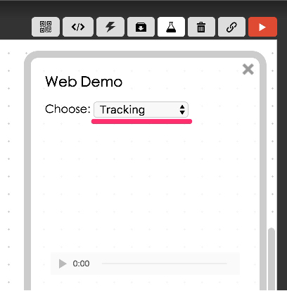
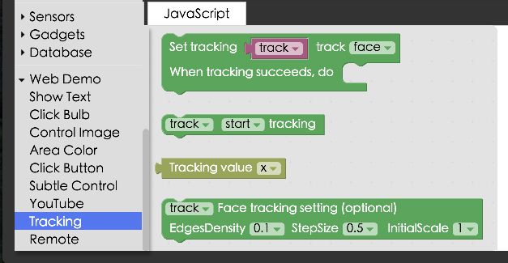
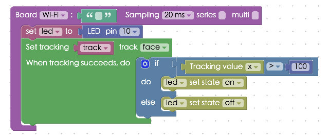
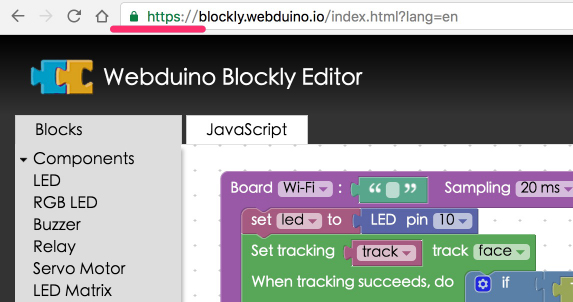
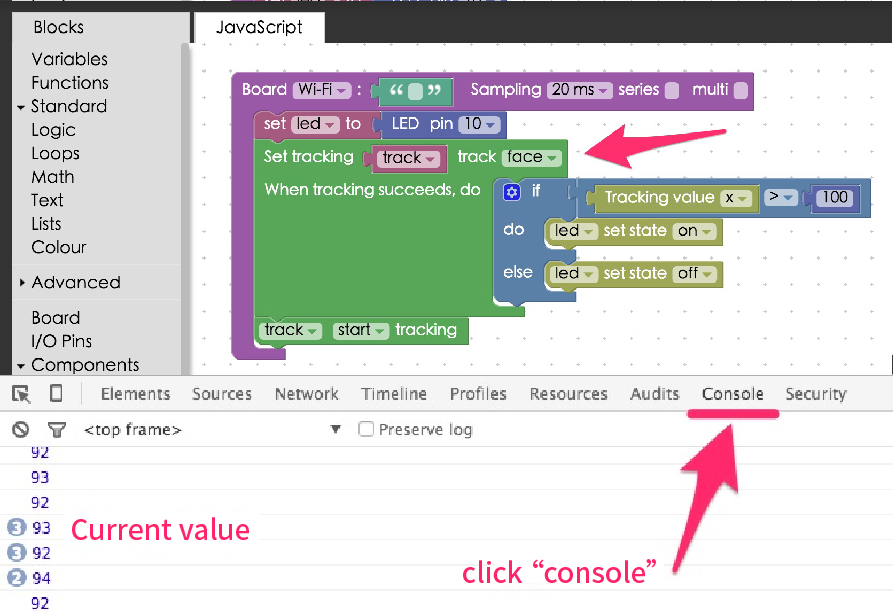

<!-- @@master  = ../../_layout.html-->

<!-- @@block  =  meta-->

<title>Project Example 27: Controlling LEDs with face tracking :::: Webduino = Web × Arduino</title>

<meta name="description" content="With web browsers evolving, we can use new web technology to satisfy a once distant dream! In this tutorial, we will be using a webcam for facial recognition and tracking, and controlling LEDs according to its position.">

<meta itemprop="description" content="With web browsers evolving, we can use new web technology to satisfy a once distant dream! In this tutorial, we will be using a webcam for facial recognition and tracking, and controlling LEDs according to its position.">

<meta property="og:description" content="With web browsers evolving, we can use new web technology to satisfy a once distant dream! In this tutorial, we will be using a webcam for facial recognition and tracking, and controlling LEDs according to its position.">

<meta property="og:title" content="Project Example 27: Controlling LEDs with face tracking" >

<meta property="og:url" content="https://webduino.io/tutorials/tutorial-27-tracking-face.html">

<meta property="og:image" content="https://webduino.io/img/tutorials/tutorial-27-01s.jpg">

<meta itemprop="image" content="https://webduino.io/img/tutorials/tutorial-27-01s.jpg">

<include src="../_include-tutorials.html"></include>

<!-- @@close-->

<!-- @@block  =  preAndNext-->

<include src="../_include-tutorials-content.html"></include>

<!-- @@close-->

<!-- @@block  =  tutorials-->

# Project Example 27: Controlling LEDs with face tracking

With web browsers evolving, we can use new web technology to satisfy a once distant dream! In this tutorial, we will be using a webcam for facial recognition and tracking, and controlling LEDs according to its position.

<!-- 

	LED 相關套件：<a href="https://webduino.io/buy/webduino-package-plus.html" target="_blank">Webduino 基本套件 Plus ( 支援馬克 1 號、Fly )</a>
	Webduino 開發板：<a href="https://webduino.io/buy/component-webduino-v1.html" target="_blank">Webduino 馬克一號</a>、<a href="https://webduino.io/buy/component-webduino-fly.html" target="_blank">Webduino Fly</a>、<a href="https://webduino.io/buy/component-webduino-uno-fly.html" target="_blank">Webduino Fly + Arduino UNO</a>

 -->

## Video Tutorial

Watch the video tutorial here:
<iframe class="youtube" src="https://www.youtube.com/embed/GxOh2Gv9GJA" frameborder="0" allowfullscreen></iframe>

## Wiring and Practice

This tutorial only uses one LED. Plug the LED directly into the board or use a breadboard and jumper wires. In this tutorial, **connect the longer leg to 10 and the shorter leg to GND**.

Webduino Mark 1 Circuit diagram:

Webduino Fly Circuit diagram:

Reference image:

<!-- 

	LED 相關套件：<a href="https://webduino.io/buy/webduino-package-plus.html" target="_blank">Webduino 基本套件 Plus ( 支援馬克 1 號、Fly )</a>
	Webduino 開發板：<a href="https://webduino.io/buy/component-webduino-v1.html" target="_blank">Webduino 馬克一號</a>、<a href="https://webduino.io/buy/component-webduino-fly.html" target="_blank">Webduino Fly</a>、<a href="https://webduino.io/buy/component-webduino-uno-fly.html" target="_blank">Webduino Fly + Arduino UNO</a>

 -->

## Instructions for using the Webduino Blockly

Open the [Webduino Blockly editor](https://blockly.webduino.io/index.html?lang=en), click on "Web Demo Area" on the upper right corner, and choose "Tracking" from the drop-down list.

Place a "Board" block onto the workspace and enter the Webduino board name. Then place a "Set LED to" block inside and set the name to led, pin to 10.

We will be using the "Tracking" blocks from the "Web Demo" menu for this stack.

First place a "Set tracking" block in the stack, it can set it to track "face" or "color", here we set it to "face". 

Inside the tracking block add an "If Do Else" block from "Logic" menu, with a logic equation block connected. Place a "Tracking value" block inside the equation set to "Greater than" and the number set to 100. Add two "LED Set state" blocks to the "Do" and "Else" sections of the logic block. Set them to "On" and "Off" respectively. This will turn the LED on when the x-axis is greater than 100, and turn off when it is less than 100.

If you click on the drop-down menu, you can see that it allows us to track the x-axis, y-axis, width, height, total and color.

Last, add the "Track start tracking" block to the bottom of the stack. Confirm that the board is online (click "[Check Device Status](https://webduino.io/device.html)"), click on the red execution button "Run Blocks", and you will see images streaming from your webcam onto the Web Demo area on the right hand side of your screen.

If you don't see anything, your browser may be trying to protect you from privacy or safety issues, so the webcam will be disabled, A simple fix would be to change your protocol identifier in your web browser's address bar from http to https.

If you'd like to know the values currently being tracked, we can use the "Console" block from the "Advanced" menu with a "Tracking value" block connected to it placed inside of the "Set tracking" block. You will need your browser's console to be open as well, press F12 if you are using windows or option + command + i for Macs.

Now you can use face tracking! 
Solution: [https://blockly.webduino.io/?lang=en#-KYkzZOoD6aAOhnTKxGy](https://blockly.webduino.io/?lang=en#-KYkzZOoD6aAOhnTKxGy)

##Code Explanation ([Check Webduino Bin](https://bin.webduino.io/famar/1/edit?html,css,js,output), [Check Device Status](https://webduino.io/device.html))

Include `webduino-all.min.js` in the header of your html files in order to support all of the Webduino's components. If the codes are generated by Webduino Blockly, you also have to include `webduino-blockly.js` in your files.

	
	

Aside from the 2 pieces of JavaScript code above, we've used 2 Open Source programs, tracking-min.js and face-min.js. We can only use face tracking after we've imported these two.

	
	

Inside HTML there are video and canvas, both on the same side, we use video to show the streamed video and canvas to analyze and detect faces, using a red box to define the face.

	

	  <video id="demo-area-08-video" preload="" autoplay="" loop="" muted="" controls=""></video>
	  <canvas id="demo-area-08-canvas"></canvas>
	

CSS is used to define the size for video and canvas.

	#demo-area-08-content {
	  position: relative;
	  width: 100%;
	  max-width: 300px;
	  height: 200px;
	}

	#demo-area-08-video {
	  top: 0;
	  left: 0;
	  position: absolute;
	  width: 100%;
	  height: 100%;
	}

	#demo-area-08-canvas {
	  top: 0;
	  left: 0;
	  position: absolute;
	  width: 100%;
	  height: 100%;
	}

We use a bit more of JavaScript here, mostly for tracking. There is also some settings: `setInitialScale`, `setStepSize`, `setEdgesDensity`, each representing scale, frequency, and depth. If we use higher settings, our computer will need more CPU and memory power, if we are looking for speed, then we could use lower settings, but then the accuracy of the tracking will also be lower. (Details can be found here: [https://trackingjs.com/](https://trackingjs.com/))  

If you'd like to set the box color, you can change `strokeStyle`, which defaults to red #f00. Use a simple if-else statement that takes into account the x-axis, y-axis, width, height, and total from the data. Note that there is no total when we use color.

	var led;
	var track;

	boardReady('', function (board) {
	  board.samplingInterval = 20;
	  led = getLed(board, 10);
	  track = {};
	  track.canvas = document.getElementById("demo-area-08-canvas");
	  track.context = track.canvas.getContext("2d");
	  track.myTracker = new tracking.ObjectTracker("face");
	  track.myTracker.setInitialScale(4);
	  track.myTracker.setStepSize(0.5);
	  track.myTracker.setEdgesDensity(0.1);

	  track.myTracker.on("track", function(event) {
	    if (event.data.length === 0) {
	      track.context.clearRect(0, 0, track.canvas.width, track.canvas.height);
	    } else {
	      track.context.clearRect(0, 0, track.canvas.width, track.canvas.height);
	      event.data.forEach(function(data) {
	        console.log(data.x);
	    if (data.x > 100) {
	      led.on();
	    } else {
	      led.off();
	    }
	        if(data.color){
	          track.context.strokeStyle = track.storkColor[data.color];
	        }else{
	          track.context.strokeStyle = "#f00";
	        }
	        track.context.lineWidth = 5;
	        track.context.strokeRect(data.x, data.y, data.width, data.height-30);
	        track.context.font = "11px Helvetica";
	        track.context.fillStyle = "#fff";
	      });
	    }
	  });
	  track.trackerTask = tracking.track("#demo-area-08-video", track.myTracker, {
	    camera: true
	  });

	  track.context.clearRect(0, 0, track.canvas.width, track.canvas.height);
	  track.trackerTask.run();
	});

Now this is how you do face tracking with the Webduino Blockly!  
Webduino Bin: [https://bin.webduino.io/famar/1/edit?html,css,js,output](https://bin.webduino.io/famar/1/edit?html,css,js,output)  
Stack setup: [https://blockly.webduino.io/?lang=en#-KYl132eWIGsHKjvCQYA](https://blockly.webduino.io/?lang=en#-KYl132eWIGsHKjvCQYA)

<!-- 

	LED 相關套件：<a href="https://webduino.io/buy/webduino-package-plus.html" target="_blank">Webduino 基本套件 Plus ( 支援馬克 1 號、Fly )</a>
	Webduino 開發板：<a href="https://webduino.io/buy/component-webduino-v1.html" target="_blank">Webduino 馬克一號</a>、<a href="https://webduino.io/buy/component-webduino-fly.html" target="_blank">Webduino Fly</a>、<a href="https://webduino.io/buy/component-webduino-uno-fly.html" target="_blank">Webduino Fly + Arduino UNO</a>

 -->

<!-- @@close-->