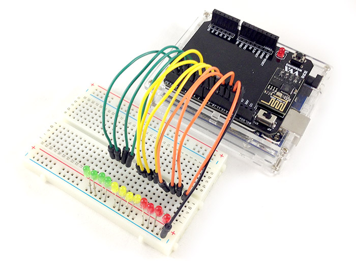
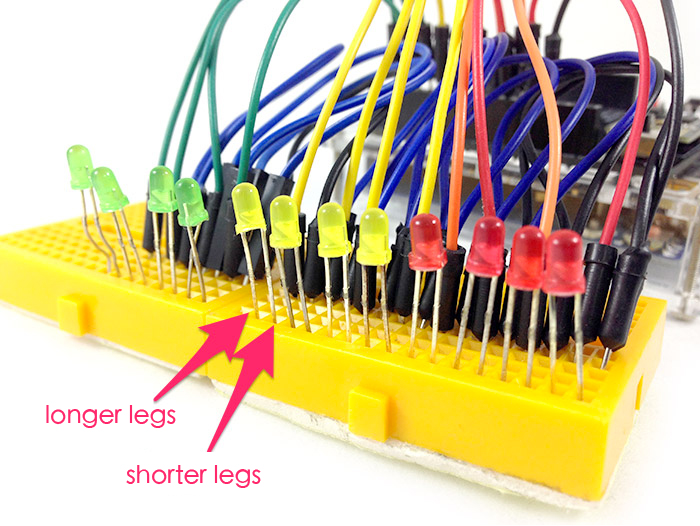
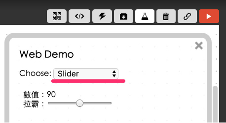
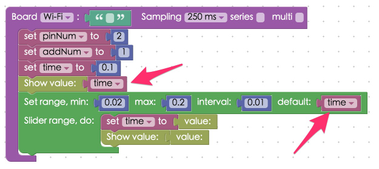
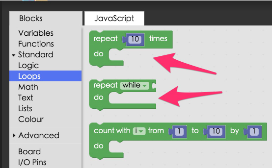
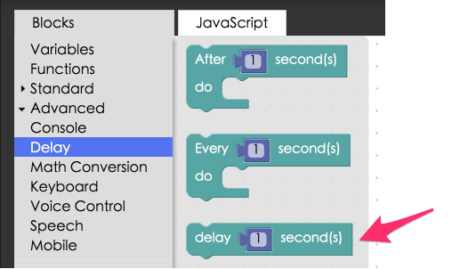

<!-- @@master  = ../../_layout.html-->

<!-- @@block  =  meta-->

<title>Project Example 28: Knight Rider scanner lights (12 LEDs and for loops) :::: Webduino = Web × Arduino</title>

<meta name="description" content="Everyone who learns code will eventually realize the beauty of “for loops”! In this tutorial, we will be using this simple technique to light up 12 LEDs alternately, controlling the speed of their flashing, and creating an effect like KITT's red scanner light from the Knight Rider TV show. (Ask your mom or dad if you've never heard of this famous American show from the 1980s. You might even need to ask your grandparents!)">

<meta itemprop="description" content="Everyone who learns code will eventually realize the beauty of “for loops”! In this tutorial, we will be using this simple technique to light up 12 LEDs alternately, controlling the speed of their flashing, and creating an effect like KITT's red scanner light from the Knight Rider TV show. (Ask your mom or dad if you've never heard of this famous American show from the 1980s. You might even need to ask your grandparents!)">

<meta property="og:description" content="Everyone who learns code will eventually realize the beauty of “for loops”! In this tutorial, we will be using this simple technique to light up 12 LEDs alternately, controlling the speed of their flashing, and creating an effect like KITT's red scanner light from the Knight Rider TV show. (Ask your mom or dad if you've never heard of this famous American show from the 1980s. You might even need to ask your grandparents!)">

<meta property="og:title" content="Project Example 28: Knight Rider scanner lights (12 LEDs and for loops)" >

<meta property="og:url" content="https://webduino.io/tutorials/tutorial-28-dancing-leds.html">

<meta property="og:image" content="https://webduino.io/img/tutorials/tutorial-28-01s.jpg">

<meta itemprop="image" content="https://webduino.io/img/tutorials/tutorial-28-01s.jpg">

<include src="../_include-tutorials.html"></include>

<!-- @@close-->

<!-- @@block  =  preAndNext-->

<include src="../_include-tutorials-content.html"></include>

<!-- @@close-->

<!-- @@block  =  tutorials-->

# Project Example 28: Knight Rider scanner lights (12 LEDs and for loops)

Everyone who learns code will eventually realize the beauty of "for loops"! In this tutorial, we will be using this simple technique to light up 12 LEDs alternately, controlling the speed of their flashing, and creating an effect like KITT's red scanner light from the Knight Rider TV show. (Ask your mom or dad if you've never heard of this famous American show from the 1980s. You might even need to ask your grandparents!)

<!-- 

	LED 相關套件：<a href="https://webduino.io/buy/webduino-package-plus.html" target="_blank">Webduino 基本套件 Plus ( 支援馬克 1 號、Fly )</a>
	Webduino 開發板：<a href="https://webduino.io/buy/component-webduino-fly.html" target="_blank">Webduino Fly</a>、<a href="https://webduino.io/buy/component-webduino-uno-fly.html" target="_blank">Webduino Fly + Arduino UNO</a>

 -->

## Video Tutorial

Check the video tutorial here:
<iframe class="youtube" src="https://www.youtube.com/embed/wwnmfd5Mc-Y" frameborder="0" allowfullscreen></iframe>

## Wiring and Practice

We will be using 12 LEDs in this tutorial, the longer legs will use pins 2 to 13, and the shorter legs all be connected to GND.

Reference image:

<!-- 

	LED 相關套件：<a href="https://webduino.io/buy/webduino-package-plus.html" target="_blank">Webduino 基本套件 Plus ( 支援馬克 1 號、Fly )</a>
	Webduino 開發板：<a href="https://webduino.io/buy/component-webduino-fly.html" target="_blank">Webduino Fly</a>、<a href="https://webduino.io/buy/component-webduino-uno-fly.html" target="_blank">Webduino Fly + Arduino UNO</a>

 -->

## Instructions for using the Webduino Blockly

Open the [Webduino Blockly Editor](https://blockly.webduino.io/?lang=en), click the "Web Demo Area" on the upper right hand corner, and choose "Slider" from the drop down menu.

Place a board onto the workspace and enter your Webduino board’s name. Place three "Set to" blocks from "Variables" menu into the stack. Set the first variable to "pinNum" to represent the starting pin. The second variable should be set to "addNum". This is the amount added each time a pin is changed (if the variable is set to 1, each pin in the sequence will only light up after the last pin turns off) The third variable must be set to "time" which is our change speed (here we will use 0.1 seconds).
Be careful at this step, **the variables we set here have not been linked to a specific LED yet. We will use these variables later on when we perform the links**. For pin 2 to change to pin 13, we need a variable to keep count.

Next we set the "Slider" in the Web Demo menu. When we move the slider, it changes the value of "time" (this is why we set "time" as a variable, allowing us to change it dynamically.) Connect a "Variable" block set to "Time" to the "Show value" block. Then we set the minimum range value to 0.02 seconds and the maximum value to 0.2 seconds with an interval of 0.01 seconds. Also add another "Time" variable block as the 'default' in the block. Last, within the "Set range" block, add "Set Time to" and "Show value" blocks with a "Value" block connected to each of them.

Next we will use the "Loops" blocks found under the "Standard" menu, and a "Delay" block found under "Advanced".

Setting the outermost "Loop" "Repeat do" block to "while" means it will continue to repeat until something happens. Unless a condition is set, it becomes an infinite loop. Because we want our Knight Rider scanner lights to loop endlessly, we won't set a condition for it to stop so we must leave the connection point empty. The second "Loop" block "Repeat # times" is set to 11. This means that the stack within it, setup as shown in the picture, will run 11 times. After it has run 11 times, it will set addNum to a negative. AddNum, which is +1, would become -1, allowing the scanner light to go from 2 to 13 and then 13 to 2. When it has finished its sequence, it will return to the outer Loop and come back again to run 11 times again, indefinitely.

Now, inside the the inner "Repeat" loop block, place three "Set pin to" blocks, from the "I/O Pins" menu. Remember that pinNum is a number that will constantly change, we've just set the default to 2. Then set the second to "Next" and the pin to be "pinNum" + "addNum" using a "Math" equation block. Add two "Write value" blocks from the "I/O Pins" menu and set the first to "pin" and 0, and the second to "next" and 1. This will make it so that when the LED 2 goes off the LED 3 turns on. Place the "Delay" block next in the stack, with the variable also set to "time". For the last, "Set to" I/O block set the "addNum" to negative "addNum". So now, when the loop finishes the next time LED 3 will turn off and LED 4 will light up, etc.

If you're not familiar with the "I/O Pins" blocks, check out: [Webduino Board Pin Manipulation](info-10-pin.html).

Now we've finished programming KITT's scanner lights from Knight Rider! Check if the board is online by clicking "[Check Device Status](https://webduino.io/device.html)". When you click on the red execution button "Run Blocks", you will see the scanner lights sequentially move back and forth! You are also able to control the speed with the slider.
Solution: [http://blockly.webduino.io/?lang=en#-KZVjQFlRnrGBPjI14SU](http://blockly.webduino.io/?lang=en#-KZVjQFlRnrGBPjI14SU)

##Code Explanation ([Check Webduino Bin](https://bin.webduino.io/xijim/edit?html,css,js,output), [Check Device Status](https://webduino.io/device.html))

Include `webduino-all.min.js` in the header of your html files in order to support all of the Webduino's components. If the codes are generated by Webduino Blockly, you also have to include `webduino-blockly.js` in your files. Because we are using async/await syntax in this tutorial, please include `runtime.min.js` in the header for supporting other browsers.

	
	
	

Inside the HTML we see a span showing the value of the "Subtle Control" and a range "Subtle Control".

	Value：90 
	Slider：<input type="range" min="0" max="180" step="5" value="90" id="demo-area-06-input">

JavaScript uses "while" and "for" loop to synchronize the "for loops", if you will be using it on your own device, remember to select JavaScript from the drop-down menu on our ES6/Babel, and you’ll see the actual code.
	

	(async function () {

	var pinNum;
	var addNum;
	var time;
	var pin;
	var next;

	boardReady('', async function (board) {
	  board.samplingInterval = 250;
	  pinNum = 2;
	  addNum = 1;
	  time = 0.1;
	  document.getElementById("demo-area-06-input-value").innerHTML = time;
	  document.getElementById("demo-area-06-input").setAttribute("min",0.02);
	  document.getElementById("demo-area-06-input").setAttribute("max",0.2);
	  document.getElementById("demo-area-06-input").setAttribute("step",0.01);
	  document.getElementById("demo-area-06-input").setAttribute("value",time);
	  document.getElementById("demo-area-06-input").oninput = async function(_value){
	    _value = this.value;
	    time = _value;
	    document.getElementById("demo-area-06-input-value").innerHTML = _value;
	  };
	  while (!false) {
	    for (var count = 0; count < 11; count++) {
	      pin = getPin(board, pinNum);
	      next = getPin(board, (pinNum + addNum));
	      pin.write(0);
	      next.write(1);
	      await delay(time);
	      pinNum = pinNum + addNum;
	    }
	    addNum = -addNum;
	  }
	});

	}());

Now you know how to create KITT's scanner light from Knight Rider using 12 LEDs, controlled by "Slider".  
Webduino Bin: [https://bin.webduino.io/xijim/edit?html,css,js,output](https://bin.webduino.io/xijim/edit?html,css,js,output)  
Stack setup: [http://blockly.webduino.io/?lang=en#-KZVjxhqel2z22IvelEU](http://blockly.webduino.io/?lang=en#-KZVjxhqel2z22IvelEU)

<!-- 

	LED 相關套件：<a href="https://webduino.io/buy/webduino-package-plus.html" target="_blank">Webduino 基本套件 Plus ( 支援馬克 1 號、Fly )</a>
	Webduino 開發板：<a href="https://webduino.io/buy/component-webduino-fly.html" target="_blank">Webduino Fly</a>、<a href="https://webduino.io/buy/component-webduino-uno-fly.html" target="_blank">Webduino Fly + Arduino UNO</a>

 -->

<!-- @@close-->