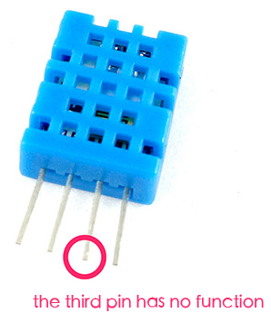
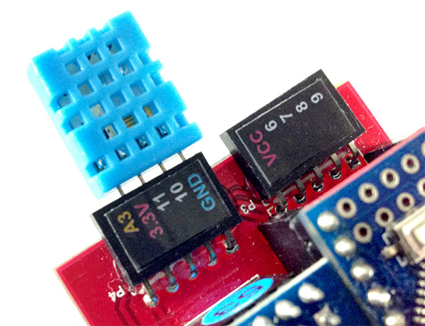
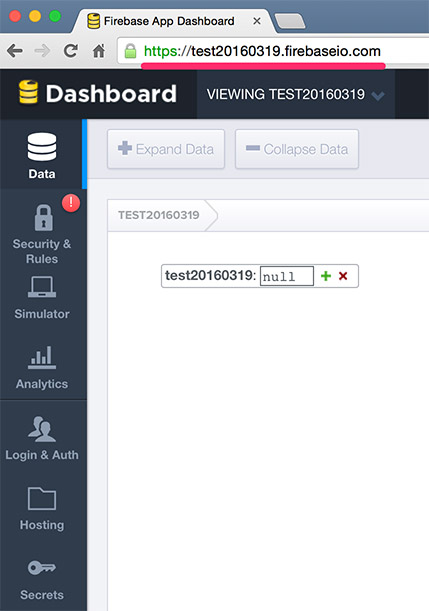
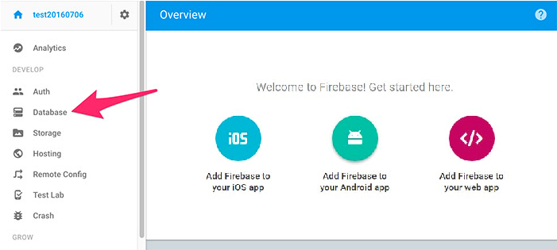
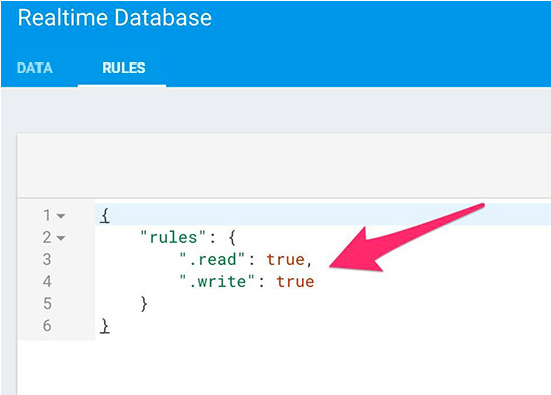
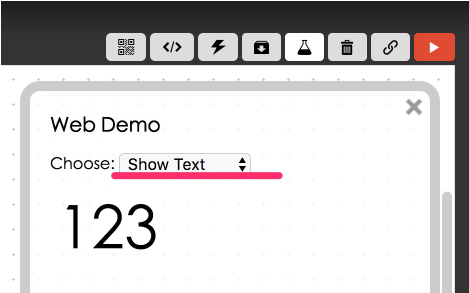
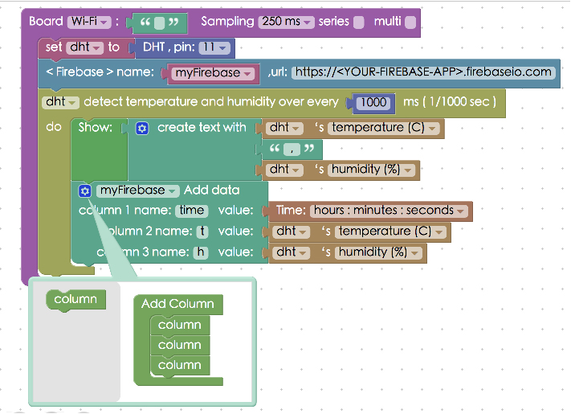

<!-- @@master  = ../../_layout.html-->

<!-- @@block  =  meta-->

<title>Project Example 29: Using Firebase to record temperature and humidity data :::: Webduino = Web × Arduino</title>

<meta name="description" content="After learning how to use the DHT” sensor to read the temperature and humidity of an environmental, the next step will be to save that information using a database. We will be using Google's Firebase in this tutorial, and with Webduino Blockly we can easily save our temperature and humidity information into a cloud based database system.">

<meta itemprop="description" content="After learning how to use the “DHT” sensor to read the temperature and humidity of an environmental, the next step will be to save that information using a database. We will be using Google's Firebase in this tutorial, and with Webduino Blockly we can easily save our temperature and humidity information into a cloud based database system.">

<meta property="og:description" content="After learning how to use the “DHT” sensor to read the temperature and humidity of an environmental, the next step will be to save that information using a database. We will be using Googles Firebase in this tutorial, and with Webduino Blockly we can easily save our temperature and humidity information into a cloud based database system.">

<meta property="og:title" content="Project Example 29: Using Firebase to record temperature and humidity data" >

<meta property="og:url" content="https://webduino.io/tutorials/tutorial-29-firebase-dht.html">

<meta property="og:image" content="https://webduino.io/img/tutorials/tutorial-29-01s.jpg">

<meta itemprop="image" content="https://webduino.io/img/tutorials/tutorial-29-01s.jpg">

<include src="../_include-tutorials.html"></include>

<!-- @@close-->

<!-- @@block  =  preAndNext-->

<include src="../_include-tutorials-content.html"></include>

<!-- @@close-->

<!-- @@block  =  tutorials-->

# Project Example 29: Using Firebase to record temperature and humidity data

After learning how to use the "DHT" sensor to read the temperature and humidity of an environmental, the next step will be to save that information using a database. We will be using Google's Firebase in this tutorial, and with Webduino Blockly we can easily save our temperature and humidity information into a cloud based database system.

<!-- 

	溫濕度傳感器：<a href="https://webduino.io/buy/webduino-expansion-s.html" target="_blank">Webduino 擴充套件 S ( 支援馬克 1 號、Fly )</a>
	Webduino 開發板：<a href="https://webduino.io/buy/component-webduino-v1.html" target="_blank">Webduino 馬克一號</a>、<a href="https://webduino.io/buy/component-webduino-fly.html" target="_blank">Webduino Fly</a>、<a href="https://webduino.io/buy/component-webduino-uno-fly.html" target="_blank">Webduino Fly + Arduino UNO</a>

 -->

## Video Tutorial

Check the video tutorial here: 
<iframe class="youtube" src="https://www.youtube.com/embed/g2vcIGukV6k" frameborder="0" allowfullscreen></iframe>

## Wiring and Practice

The DHT sensor has 4 pins, the first pin starting from the left is V and will be connected to 3.3v, the second pin is Data and will be connected to 10, the third pin has no function, and the fourth one is the GND.

We can connect the DHT sensor to the Webduino Mark 1 directly, or use a breadboard and jumper wires.

Webduino Mark 1 Circuit diagram:

Webduino Fly Circuit diagram:

Reference image:

<!-- 

	溫濕度傳感器：<a href="https://webduino.io/buy/webduino-expansion-s.html" target="_blank">Webduino 擴充套件 S ( 支援馬克 1 號、Fly )</a>
	Webduino 開發板：<a href="https://webduino.io/buy/component-webduino-v1.html" target="_blank">Webduino 馬克一號</a>、<a href="https://webduino.io/buy/component-webduino-fly.html" target="_blank">Webduino Fly</a>、<a href="https://webduino.io/buy/component-webduino-uno-fly.html" target="_blank">Webduino Fly + Arduino UNO</a>

 -->

## 註冊 Firebase

To use Firebase we'll have to sign up for the service first. To do this go to the Firebase official site: [https://www.firebase.com/](https://www.firebase.com/).

After you've signed up with Firebase, you can create your own projects. The projects shown here, are our databases, every database has it's own web address.

Click on 'Manage App' and you can check on your projects and configure the settings. Firebase uses JSON to save its data. If you're interested in learning more about Firebase, check out their Docs here: [https://www.firebase.com/docs/web/api/](https://www.firebase.com/docs/web/api/). As for our tutorial, all we will need is the database address, and we can continue to record our temperature and humidity data!

First, choose "database" from the left menu.

Choose "Rules" and you will see the default setting is "not null", or in code "!= null".

Set both "read" and "write" to true.

	{
		"rules": {
			".read": true,
			".write": true
		}
	}

## Instructions for using the Webduino Blockly

Open the [Webduino Blockly editor](https://blockly.webduino.io/?lang=en), click the "Ｗeb Demo Area" button on the upper right, select "Show Text" from the pull-down menu.

Place a "Board" block onto the workspace then enter the name of your Webduino board, place a "DHT" block, from the "Sensors" menu, inside and set the name to dht and pin to 11.

Then place a "Firebase" block from "Database" menu and paste the database address from earlier into the url space. Next place a "DHT" block that will detect temperature and humidity set to every 1000 milliseconds (1 second).

Make sure for the "Firebase" block is not placed inside the "DHT detect" block, otherwise the database will be imported every second, which you do not want.

Inside the "DHT detect" block, place a "Show" block from the "Show Text" menu then connect a "Create Text With" block from "Text" menu so the temperature and humidity information will be shown on the right hand side. You can add spaces for more blocks to be connected by clicking on the blue gear icon. Fill in the names and place time, temperature, and humidity blocks into the stack.

Now that we've finished creating the stack to make Firebase record temperature and humidity data, check to see if your board is online (click "[Check Device Status](https://webduino.io/device.html)"). When you click on the red execution button "Run Blocks", go to the Firebase website and you will see information coming in. (Solution: [http://blockly.webduino.io/?lang=en#-KZZUdAMTJpimQ1ZNEh_](http://blockly.webduino.io/?lang=en#-KZZUdAMTJpimQ1ZNEh_))

##Code Explanation ([Check Webduino Bin](https://bin.webduino.io/vohen/1/edit?html,css,js,output), [Check Device Status](https://webduino.io/device.html))

Include `webduino-all.min.js` in the header of your html files in order to support all of the Webduino's components. If the codes are generated by Webduino Blockly, you also have to include `webduino-blockly.js` in your files.

	
	

Since we are using Firebase, so we will need to import JaveScript from Firebase. (See "quickstart" from the official page: [https://www.firebase.com/docs/web/quickstart.html](https://www.firebase.com/docs/web/quickstart.html) )

	

HTML has a span that shows the temperature and humidity values.

	123

The first function inside JavaScript is to get the current time, so when we call it we willhave it. In boardReady, we use the FIRbase API, using push to record our data to the database.	

	var dht;
	var myFirebase;

	function get_time(t) {
	  var varTime = new Date(),
	    varHours = varTime.getHours(),
	    varMinutes = varTime.getMinutes(),
	    varSeconds = varTime.getSeconds();
	  var varNow;
	  if (t == "hms") {
	    varNow = varHours + ":" + varMinutes + ":" + varSeconds;
	  } else if (t == "h") {
	    varNow = varHours;
	  } else if (t == "m") {
	    varNow = varMinutes;
	  } else if (t == "s") {
	    varNow = varSeconds;
	  }
	  return varNow;
	}

	boardReady('', async function (board) {
	  board.samplingInterval = 250;
	  dht = getDht(board, 11);
	  myFirebase = new Firebase("https://<YOUR-FIREBASE-APP>.firebaseio.com");
	  dht.read(function(evt){
	    document.getElementById("demo-area-01-show").innerHTML = ([dht.temperature,' , ',dht.humidity].join(''));
	    myFirebase.push({
	      time:get_time("hms"),
	      t:dht.temperature,
	      h:dht.humidity
	    });
	  }, 1000);
	});

This is how to use Firebase to record temperature and humidity data!   
Webduino Bin: [https://bin.webduino.io/vohen/1/edit?html,css,js,output](https://bin.webduino.io/vohen/1/edit?html,css,js,output)  
Stack setup: [http://blockly.webduino.io/?lang=en#-KZZVRBqhmzK00B0Weci](http://blockly.webduino.io/?lang=en#-KZZVRBqhmzK00B0Weci)

<!-- 

	溫濕度傳感器：<a href="https://webduino.io/buy/webduino-expansion-s.html" target="_blank">Webduino 擴充套件 S ( 支援馬克 1 號、Fly )</a>
	Webduino 開發板：<a href="https://webduino.io/buy/component-webduino-v1.html" target="_blank">Webduino 馬克一號</a>、<a href="https://webduino.io/buy/component-webduino-fly.html" target="_blank">Webduino Fly</a>、<a href="https://webduino.io/buy/component-webduino-uno-fly.html" target="_blank">Webduino Fly + Arduino UNO</a>

 -->

<!-- @@close-->