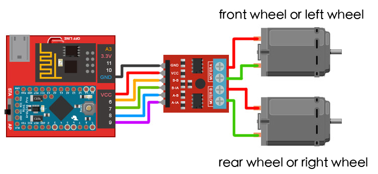
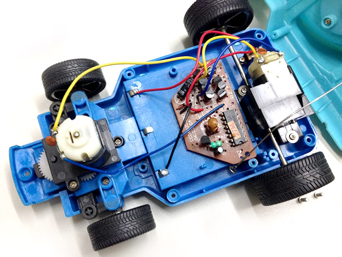
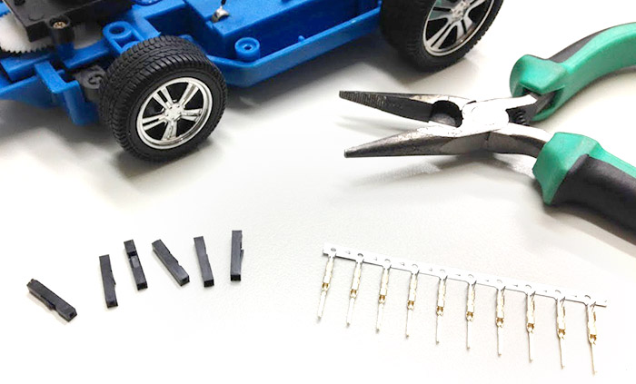
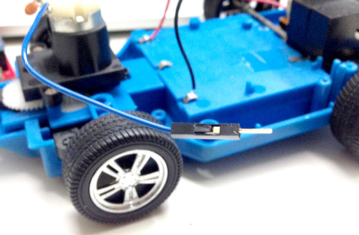
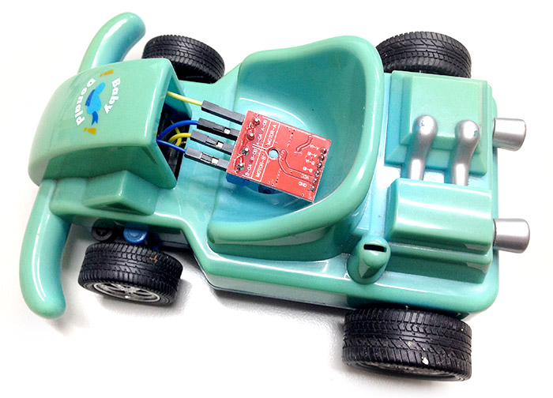
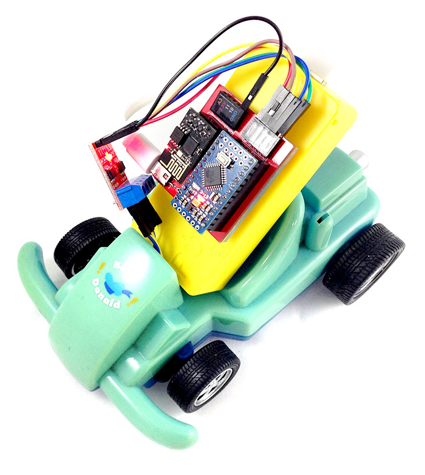
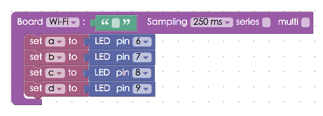
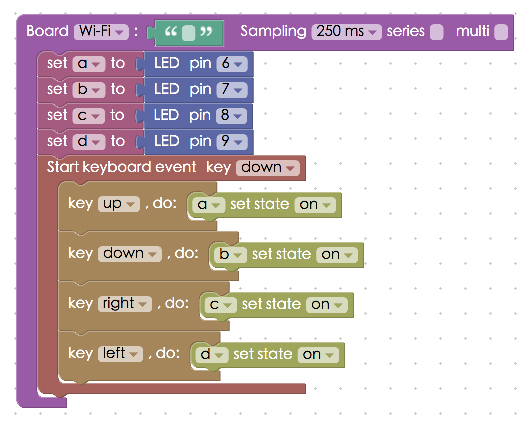
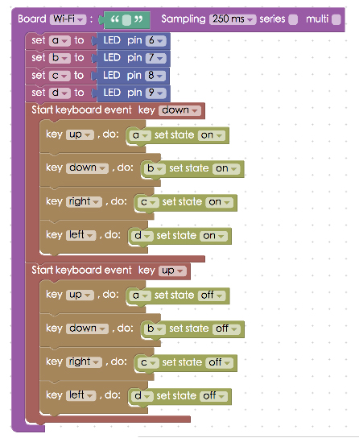
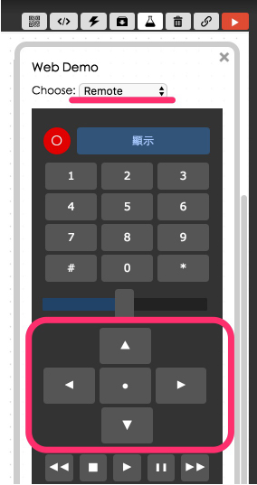

<!-- @@master  = ../../_layout.html-->

<!-- @@block  =  meta-->

<title>Project Example 30: Toy Car hack – Using a Dual Channel Motor Driver Module :::: Webduino = Web × Arduino</title>

<meta name="description" content="Using the L9110S Dual Channel Motor Driver Module, we can connect a normal toy car to the Webduino board and control it over Wi-Fi. Just a few simple steps and we can connect a toy car to our phones, computers, and even control multiple cars from a distance! Your friends will think you spent a fortune on this hack! Any toy with two motors will work with this example.">

<meta itemprop="description" content="Using the L9110S Dual Channel Motor Driver Module, we can connect a normal toy car to the Webduino board and control it over Wi-Fi. Just a few simple steps and we can connect a toy car to our phones, computers, and even control multiple cars from a distance! Your friends will think you spent a fortune on this hack! Any toy with two motors will work with this example.">

<meta property="og:description" content="Using the L9110S Dual Channel Motor Driver Module, we can connect a normal toy car to the Webduino board and control it over Wi-Fi. Just a few simple steps and we can connect a toy car to our phones, computers, and even control multiple cars from a distance! Your friends will think you spent a fortune on this hack! Any toy with two motors will work with this example.">

<meta property="og:title" content="Project Example 30: Toy Car hack – Using a Dual Channel Motor Driver Module" >

<meta property="og:url" content="https://webduino.io/tutorials/tutorial-30-motor-ic.html">

<meta property="og:image" content="https://webduino.io/img/tutorials/tutorial-30-01s.jpg">

<meta itemprop="image" content="https://webduino.io/img/tutorials/tutorial-30-01s.jpg">

<include src="../_include-tutorials.html"></include>

<!-- @@close-->

<!-- @@block  =  preAndNext-->

<include src="../_include-tutorials-content.html"></include>

<!-- @@close-->

<!-- @@block  =  tutorials-->

# Project Example 30: Toy Car hack – Using a Dual Channel Motor Driver Module

Using the L9110S Dual Channel Motor Driver Module, we can connect a normal toy car to the Webduino board and control it over Wi-Fi. Just a few simple steps and we can connect a toy car to our phones, computers, and even control multiple cars from a distance! Your friends will think you spent a fortune on this hack! Any toy with two motors will work with this example. 

<!-- 

	L9110S 馬達驅動模組：<a href="https://webduino.io/buy/webduino-expansion-m.html" target="_blank">Webduino 擴充套件 M ( 支援馬克 1 號、Fly )</a>
	Webduino 開發板：<a href="https://webduino.io/buy/component-webduino-v1.html" target="_blank">Webduino 馬克一號</a>

 -->

## Video Tutorial

Check the video tutorial here:
<iframe class="youtube" src="https://www.youtube.com/embed/twdVMSYF4rQ" frameborder="0" allowfullscreen></iframe>

## Wiring and Practice

The L9110S Dual Channel Motor Driver Module has two sides. One side has four ports where you can connect wires with a screwdriver. They are labeled "MOTOR A" and "MOTOR B" on top, and each is connected to a motor. The other side has 6 pins, you will need some jumper wires (female to male) to connect them to the Webduino board. GND connects to GND, VCC to VCC (or 5V), MOTOR A to A-B and A-IA, and MOTOR B to B-B and B-IA.

## Reference image

In this example we will use a cheap, toy, we bought a long time ago.

Take the toy apart and you will see two motors. The front motor controls the front wheels, moving them left or right. The motor in the back controls forward and reverse. Since this is a remote controlled car, you will see a chip inside that receives a signal.

Cut the wires, but keep them attached to the toy with as much as possible.

Here we've prepared some jumper wire connectors, female to male crimp pins, and male to male connectors.

As shown below, we can transform the wires we just cut to connect easily with our Webduino board. This way you won't need to solder the wires together. If you're connecting them to the Driver Module, you could also just screw them in.

Connect the motors to the L9110S Dual Channel Motor Driver Module.

Reconnect the car's cover but find a way to leave the module on the outside so we can wire it to other things.

Connect it to the Webduino Mark 1. GND connects to GND, VCC to VCC(or 5V), MOTOR A to A-B and A-IA, and MOTOR B to B-B and B-IA.

Once you've done this, attach the boards to the toy car. Now you have your very own WiFi controlled toy car!

<!-- 

	L9110S 馬達驅動模組：<a href="https://webduino.io/buy/webduino-expansion-m.html" target="_blank">Webduino 擴充套件 M ( 支援馬克 1 號、Fly )</a>
	Webduino 開發板：<a href="https://webduino.io/buy/component-webduino-v1.html" target="_blank">Webduino 馬克一號</a>

 -->

## Instructions for using the Webduino Blockly

Open the [Webduino Blockly editor](https://blockly.webduino.io/?lang=en), place a "Board" block onto the workspace and fill in the name of your Webduino board. We need to control pin 1 or 0, the easiest way to do this is to use an "LED" block. Since 2 motors have 4 lines, place 4 "LED" blocks into the stack. 

Use the "Start Keyboard Event Key" block and set it to "Down". Add up, down, left, and right "Key / do" blocks. Set "a" to be "on" when we press "up" and "b" to be "on" when we press "down", and so on.

Then, place another "Start Keyboard Event Key" block into the stack and set it to "Up". Place the 4 directions inside of it and set the state to "off".

The idea behind this is that when a motor has one line "on" and the other "off", it is as if the positive of the battery is connected to "on" and the negative is connected to "off". This makes the motor turn clockwise. If it is connected in reverse, the motor with turn counterclockwise. So using this stack setup we make the car turn left and right and go forward and backwards.

After all this is done, check if the board is online (click "[Check Device Status](https://webduino.io/device.html)") and click on the red execution button "Run Blocks". You can now control the toy car! If the direction isn’t matching your commands, you need to change the code or swap the wiring. 
Solution: [https://blockly.webduino.io/?lang=en#-KZet8MHvY6pBxCY-gLM](https://blockly.webduino.io/?lang=en#-KZet8MHvY6pBxCY-gLM)

If you'd like to control the car with your smartphone, open the "Web Demo Area" and find "Remote" in the drop down menu. Then set the directions here. Follow this tutorial if you'd like to learn how. (Click: [The 10 Most Useful Features of Webduino Blockly](info-11-feature.html))

##Code Explanation ([Check Webduino Bin](https://bin.webduino.io/vohen/1/edit?html,css,js,output), [Check Device Status](https://webduino.io/device.html))

Include `webduino-all.min.js` in the header of your html files in order to support all of the Webduino's components. If the codes are generated by Webduino Blockly, you also have to include `webduino-blockly.js` in your files.

	
	

JavaScript uses `onkeydown` and `onkeyup` to determine if the button is pressed or released, by using different keycode mapping to different actions, we create a function that allows keyboard control.

	var a;
	var b;
	var c;
	var d;

	boardReady('', function (board) {
	  board.systemReset();
	  board.samplingInterval = 250;
	  a = getLed(board, 6);
	  b = getLed(board, 7);
	  c = getLed(board, 8);
	  d = getLed(board, 9);
	  document.onkeydown = function(e){
	    console.log(e.keyCode);
	    if(e.keyCode == 38){
	        a.on();
	    }
	    if(e.keyCode == 40){
	        b.on();
	    }
	    if(e.keyCode == 39){
	        c.on();
	    }
	    if(e.keyCode == 37){
	        d.on();
	    }
	  };
	  document.onkeyup = function(e){
	    console.log(e.keyCode);
	    if(e.keyCode == 38){
	        a.off();
	    }
	    if(e.keyCode == 40){
	        b.off();
	    }
	    if(e.keyCode == 39){
	        c.off();
	    }
	    if(e.keyCode == 37){
	        d.off();
	    }
	  };
	});

Now that's how you use a Dual Channel Motor Driver Module to hack a toy car and make it remote controlled!   
Webduino Bin: [https://bin.webduino.io/nibud/edit?html,css,js,output](https://bin.webduino.io/nibud/edit?html,css,js,output)  
Stack setup: [https://blockly.webduino.io/?lang=en#-KZfBBvKTFepxLQL8UtK](https://blockly.webduino.io/?lang=en#-KZfBBvKTFepxLQL8UtK)

<!-- 

	L9110S 馬達驅動模組：<a href="https://webduino.io/buy/webduino-expansion-m.html" target="_blank">Webduino 擴充套件 M ( 支援馬克 1 號、Fly )</a>
	Webduino 開發板：<a href="https://webduino.io/buy/component-webduino-v1.html" target="_blank">Webduino 馬克一號</a>

 -->

<!-- @@close-->