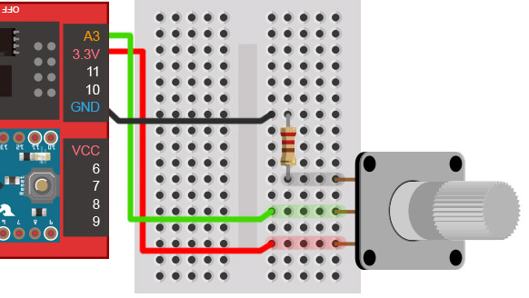
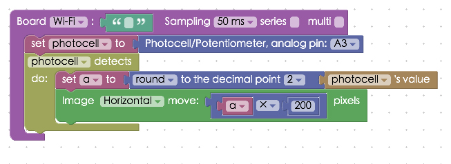

<!-- @@master  = ../../_layout.html-->

<!-- @@block  =  meta-->

<title>Project Example 34: Changing image position with a Potentiometer :::: Webduino = Web × Arduino</title>

<meta name="description" content="In “教學範例 17：光敏電阻獲取亮度數值” we introduced how to use a photocell. The Potentiometer block uses a similar method, in this tutorial we change the position of an image by turning a knob on a Potentiometer.">

<meta itemprop="description" content="In “教學範例 17：光敏電阻獲取亮度數值” we introduced how to use a photocell. The Potentiometer block uses a similar method, in this tutorial we change the position of an image by turning a knob on a Potentiometer.">

<meta property="og:description" content="In “教學範例 17：光敏電阻獲取亮度數值” we introduced how to use a photocell. The Potentiometer block uses a similar method, in this tutorial we change the position of an image by turning a knob on a Potentiometer.">

<meta property="og:title" content="Project Example 34: Changing image position with a Potentiometer" >

<meta property="og:url" content="https://webduino.io/tutorials/tutorial-34-vr-image.html">

<meta property="og:image" content="https://webduino.io/img/tutorials/tutorial-34-01s.jpg">

<meta itemprop="image" content="https://webduino.io/img/tutorials/tutorial-34-01s.jpg">

<include src="../_include-tutorials.html"></include>

<!-- @@close-->

<!-- @@block  =  preAndNext-->

<include src="../_include-tutorials-content.html"></include>

<!-- @@close-->

<!-- @@block  =  tutorials-->

# Project Example 34: Changing image position with a Potentiometer

In [教學範例 17：光敏電阻獲取亮度數值](tutorial-17-photocell.html) we introduced how to use a photocell. The Potentiometer block uses a similar method, in this tutorial we change the position of an image by turning a knob on a Potentiometer. 

<!-- 

	可變電阻旋鈕：<a href="https://webduino.io/buy/webduino-expansion-m.html" target="_blank">Webduino 擴充套件 M ( 支援馬克 1 號、Fly )</a>
	Webduino 開發板：<a href="https://webduino.io/buy/component-webduino-v1.html" target="_blank">Webduino 馬克一號</a>、<a href="https://webduino.io/buy/component-webduino-fly.html" target="_blank">Webduino Fly</a>、<a href="https://webduino.io/buy/component-webduino-uno-fly.html" target="_blank">Webduino Fly + Arduino UNO</a>

 -->

## Video Tutorial

Watch the video tutorial here:
<iframe class="youtube" src="https://www.youtube.com/embed/Q5ErAOdnfCo" frameborder="0" allowfullscreen></iframe>

## Wiring and Practice

A Potentiometer has three pins, when the pins are facing away from you the one on the left is connected to 3.3V and the one on the right is connect to the GND, remember to use a resistor to prevent a short circuit, which will happen when you have very low resistance. The pin in the middle is an analog signal pin, and will be connected to A3. (If your 3.3V and GND pins are connected in reverse, the values produced will be reversed when you turn the knob on the Potentiometer)

Webduino Mark 1 Circuit Diagram:

Webduino Fly Circuit Diagram:

Reference image:

<!-- 

	可變電阻旋鈕：<a href="https://webduino.io/buy/webduino-expansion-m.html" target="_blank">Webduino 擴充套件 M ( 支援馬克 1 號、Fly )</a>
	Webduino 開發板：<a href="https://webduino.io/buy/component-webduino-v1.html" target="_blank">Webduino 馬克一號</a>、<a href="https://webduino.io/buy/component-webduino-fly.html" target="_blank">Webduino Fly</a>、<a href="https://webduino.io/buy/component-webduino-uno-fly.html" target="_blank">Webduino Fly + Arduino UNO</a>

 -->

## Instructions for using the Webduino Blockly

Open the [Webduino Blockly editor](https://blockly.webduino.io/?lang=en), and place a "Board" block into the workspace. Select the Webduino board name, then from the "Sensor" menu, place a Potentiometer block in the stack and set the pin to A3.

From the same menu place a "detects / do" block in the stack. We will round to the second decimal (a number between 0 to 1) and multiply it by 200, which will make the image's movements easier to see. To do this, add the blocks "set to" (from the "Variable" menu), a "round decimal point" (from the "Math" menu), and a "photocell's value" (from the "Photocell / Potentiometer" menu) to the stack. Set the first block to "a" to detect the value the sensor returns. Then set the second block to round to "2". Next add a "Image move" block from the "Control image menu". Place a Math block inside of that with a "Variable" block set to "a" multiplied by 200. 

Once you confirm the board is online (click "[Check Device Status](https://webduino.io/device.html)"), click on the red "Run Blocks" button to execute the stack, and turn the knob of the Potentiometer and you will see the image move horizontally.

Solution [http://blockly.webduino.io/?lang=en#-KYMH1nlaq9jlcoNbGIw](http://blockly.webduino.io/?lang=en#-KYMH1nlaq9jlcoNbGIw)

If your image is not moving the way you would want it to, here are a few troubleshooting tips.

One: reverse the 3.3v and GND pins. 

Two: use a "Math" block to make 1 minus the value that is sensed by the potentiometer, giving you a reverse number in the range of 0 to 1.

##Code Explanation ([Check Webduino Bin](https://bin.webduino.io/fayu/edit?html,css,js,output), [Check Device Status](https://webduino.io/device.html))

Include `webduino-all.min.js` in the header of your html files in order to support all of the Webduino's components. If the codes are generated by Webduino Blockly, you also have to include `webduino-blockly.js` in your files.

	
	

Inside the HTML file we have an image, if you'd like to use your own image, place it after "src=".

	

	  
	

The way the image changes is because our image "position" is set to "absolute", so we will need to set that as well.

	#demo-area-03-container {
	  position: relative;
	  width: 150px;
	  height: 150px;
	}

	#demo-area-03-image {
	  position: absolute;
	  top: 0;
	  left: 0;
	  width: 150px;
	  height: 150px;
	  transition: .3s;
	  -webkit-transition: .3s;
	  -moz-transition: .3s;
	  transform-origin: 75px 75px;
	  -webkit-transform-origin: 75px 75px;
	  -moz-transform-origin: 75px 75px;
	}

As for JavaScript, we receive data with "on" and return a "val".	

	var photocell;
	var a;

	boardReady('', function (board) {
	  board.systemReset();
	  board.samplingInterval = 50;
	  photocell = getPhotocell(board, 3);
	  photocell.on(function(val){
	    photocell.detectedVal = val;
	    a = (Math.round((photocell.detectedVal)*100))/100;
	    document.getElementById("demo-area-03-image").style.left = (a * 200)+"px";
	  });
	});

Now you can change the position of an image when you turn the knob of a Potentiometer! 
Webduino Bin: [https://bin.webduino.io/fayu/edit?html,css,js,output](https://bin.webduino.io/fayu/edit?html,css,js,output)  
Stack setup: [http://blockly.webduino.io/?lang=en#-KYMHC-LWxdjQ63HX-r_](http://blockly.webduino.io/?lang=en#-KYMHC-LWxdjQ63HX-r_)

<!-- 

	可變電阻旋鈕：<a href="https://webduino.io/buy/webduino-expansion-m.html" target="_blank">Webduino 擴充套件 M ( 支援馬克 1 號、Fly )</a>
	Webduino 開發板：<a href="https://webduino.io/buy/component-webduino-v1.html" target="_blank">Webduino 馬克一號</a>、<a href="https://webduino.io/buy/component-webduino-fly.html" target="_blank">Webduino Fly</a>、<a href="https://webduino.io/buy/component-webduino-uno-fly.html" target="_blank">Webduino Fly + Arduino UNO</a>

 -->

<!-- @@close-->